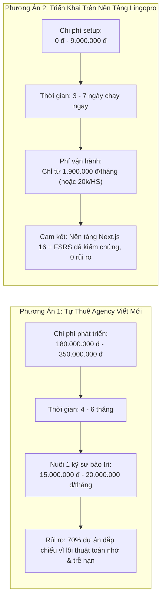
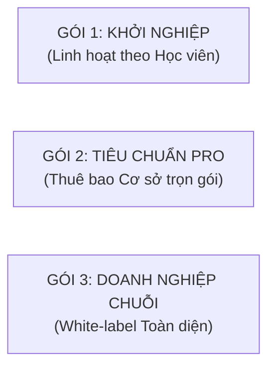

# BẢNG ĐỊNH GIÁ & DỰ TOÁN TÀI CHÍNH TRIỂN KHAI LINGOPRO CHO TRUNG TÂM TIẾNG TRUNG
## *Chi Phí Chuyển Đổi Hệ Thống – Chi Phí Xây Thêm Ứng Dụng – Chi Phí Vận Hành & Hạ Tầng Hàng Tháng*

---

> **Mục tiêu tài liệu:** Cung cấp con số tài chính minh bạch, dẫn xuất chi phí định lượng và các phương án thương mại cụ thể để bạn tự tin giải đáp ngay khi Chủ trung tâm hỏi: *"Bây giờ làm cái này tốn bao nhiêu tiền, chi phí duy trì thế nào và bao lâu thì hoàn vốn?"*.

---

## MỤC LỤC
1. [Bức Tranh Tổng Thể: Tự Thuê Đội Code Từ Đầu vs. Dùng Nền Tảng Lingopro](#1-bức-tranh-tổng-thể-tự-thuê-đội-code-từ-đầu-vs-dùng-nền-tảng-lingopro)
2. [Chi Tiết 3 Khoản Chi Phí Cụ Thể](#2-chi-tiết-3-khoản-chi-phí-cụ-thể)
   * 2.1. Chi Phí Chuyển Đổi & Số Hóa Hệ Thống (Migration & Onboarding)
   * 2.2. Chi Phí Xây Thêm Ứng Dụng & Tính Năng Riêng (Custom Development & Mobile Apps)
   * 2.3. Chi Phí Vận Hành & Hạ Tầng Cloud Hàng Tháng (Monthly OPEX & Cloud Infrastructure)
3. [Bảng Báo Giá 3 Gói Triển Khai Thực Chiến Dành Cho Trung Tâm](#3-bảng-báo-giá-3-gói-triển-khai-thực-chiến-dành-cho-trung-tâm)
4. [Mô Hình "Chi Phí 0 Đồng": Biến Ứng Dụng Thành Cỗ Máy Sinh Lời (Profit Center)](#4-mô-hình-chi-phí-0-đồng-biến-ứng-dụng-thành-cỗ-máy-sinh-lời-profit-center)
5. [Kịch Bản Đàm Phán Tài Chính Sáng Nay Khi Chủ Trung Tâm Hỏi Giá](#5-kịch-bản-đàm-phán-tài-chính-sáng-nay-khi-chủ-trung-tâm-hỏi-giá)

---

## 1. BỨC TRANH TỔNG THỂ: TỰ THUÊ ĐỘI CODE TỪ ĐẦU VS. DÙNG NỀN TẢNG LINGOPRO

Nếu trung tâm tự đi thuê công ty phần mềm (Software Agency) ngoài thị trường viết một hệ thống tương tự, đây là con số thực tế họ phải trả:

| Tiêu chí | Tự thuê Agency code mới | Hợp tác trên nền tảng Lingopro | Mức tiết kiệm cho Trung tâm |
|---|:---:|:---:|:---:|
| **Chi phí đầu tư ban đầu (CAPEX)** | **180 – 350 triệu VNĐ** | **0 – 15 triệu VNĐ** | **Tiết kiệm 95%** |
| **Thời gian đưa vào sử dụng** | 4 – 6 tháng mệt mỏi | **3 – 7 ngày chạy ngay** | Nhanh hơn 20 lần |
| **Chi phí nhân sự bảo trì** | 15 – 20 triệu VNĐ/tháng | **Đã bao gồm trong gói dịch vụ** | Không phải nuôi đội IT |
| **Rủi ro kỹ thuật** | Rất cao (lỗi app, server sập) | **0% rủi ro** (hệ thống có sẵn) | An tâm 100% |

---

## 2. CHI TIẾT 3 KHOẢN CHI PHÍ CỤ THỂ

### 2.1. Chi Phí Chuyển Đổi & Số Hóa Hệ Thống (Migration & Onboarding - Trả 1 lần)
Khoản chi phí này dùng để đưa toàn bộ giáo trình, dữ liệu học sinh hiện có và nhận diện thương hiệu của trung tâm lên hệ thống.

* **Nội dung công việc:**
  1. *Số hóa giáo trình độc quyền:* Bóc tách tự động 50 – 100 bài học (bộ Hán ngữ 6 quyển, HSK 1-6 chuẩn, hoặc giáo trình nội bộ) thành dữ liệu số (chữ Hán, Pinyin, âm Hán-Việt, audio chuẩn Bắc Kinh, câu ví dụ).
  2. *Cài đặt nhận diện thương hiệu (Branding):* Đưa logo, màu sắc chủ đạo, banner hình ảnh giáo viên của trung tâm vào giao diện app.
  3. *Cấu hình tên miền riêng (Custom Domain):* Ví dụ `hoc.tiengtrung[ten-trung-tam].com` hoặc `app.[ten-trung-tam].vn`.
  4. *Đào tạo đội ngũ (Staff Training):* 01 buổi đào tạo trực tiếp/Zoom cho toàn bộ giáo viên và nhân viên tư vấn tuyển sinh (30-45 phút).
* **Định giá thực tế thị trường:** 12.000.000 đ – 20.000.000 đ.
* **Mức giá Lingopro đề xuất:** **5.000.000 đ – 9.000.000 đ** *(Đặc biệt: **MIỄN PHÍ 100%** nếu trung tâm ký hợp đồng dịch vụ 1 năm hoặc tham gia chương trình Thí điểm 30 ngày)*.

---

### 2.2. Chi Phí Xây Thêm Ứng Dụng & Tính Năng Riêng (Custom Development - Nếu có nhu cầu)
Nếu trung tâm muốn có những tính năng đặc thù hoặc muốn đưa app lên App Store / Google Play với tên riêng của trung tâm:

| Hạng mục nâng cấp | Chi tiết kỹ thuật | Chi phí đề xuất | Thời gian bàn giao |
|---|---|:---:|:---:|
| **1. Web-App & PWA Riêng** *(Khuyên dùng)* | Học sinh truy cập qua web, có thể bấm "Thêm vào màn hình chính" dùng mượt như app native trên iOS/Android, gửi push notification đầy đủ. | **MIỄN PHÍ** *(Có sẵn trong gói)* | Có ngay lập tức |
| **2. Đóng gói App Mobile Native riêng lên App Store & Google Play** | Build file APK (Android) và IPA (iOS) qua Capacitor, đẩy lên App Store với tên thương hiệu riêng của trung tâm (ví dụ: *"Tiếng Trung [Tên]*"). Trung tâm chịu phí duy trì tài khoản Apple ($99/năm) & Google ($25 trả 1 lần). | **15.000.000 đ – 25.000.000 đ** *(Trọn gói đóng gói & duyệt store)* | 10 – 14 ngày |
| **3. Xây Game / Mini-App Tương Tác Riêng** | Lập trình thêm game đặc thù theo yêu cầu của trung tâm (Ví dụ: Game Flappy Bird thanh điệu, Game ghép bộ thủ giả kim, hoặc hệ thống thi thử HSK bấm giờ chuẩn). | **5.000.000 đ – 12.000.000 đ / game** | 5 – 7 ngày / game |
| **4. Tích hợp CRM / Zalo ZNS Riêng** | Bắn thông báo tự động kết quả học tập của học viên vào Zalo OA tích vàng của trung tâm hoặc đẩy data lead về CRM nội bộ (Getfly, Hubspot, Lark, v.v.). | **4.000.000 đ – 8.000.000 đ** | 3 – 5 ngày |

---

### 2.3. Chi Phí Vận Hành & Hạ Tầng Cloud Hàng Tháng (Monthly OPEX & Cloud Infrastructure)
Đây là chi phí duy trì máy chủ, cơ sở dữ liệu, sao lưu an toàn và token AI hàng tháng.

* **Bóc tách chi phí hạ tầng thực tế (Real Cloud Costs):**
  * *Máy chủ Web & CDN (Next.js Standalone / Vercel Enterprise):* ~350.000 đ – 800.000 đ/tháng (đáp ứng 1.000 – 5.000 truy cập đồng thời, tốc độ tải trang < 200ms).
  * *Cơ sở dữ liệu Supabase PostgreSQL:* ~600.000 đ – 1.200.000 đ/tháng (lưu trữ tiến độ FSRS, âm thanh, lịch sử làm bài tập, bảo mật RLS).
  * *Hạ tầng Firebase Cloud Messaging (FCM):* Miễn phí (gửi hàng trăm nghìn push notification nhắc học mỗi ngày).
  * *Chi phí Token AI (Zhipu GLM-4-flash & Gemini):* ~200.000 đ – 500.000 đ/tháng (cho tính năng chiết tự, tạo bài tập tự động).
  * *Dịch vụ sao lưu tự động & Bảo trì hệ thống (Maintenance SLA):* Kỹ sư trực 24/7.
* **Tổng chi phí hạ tầng thực tế:** Dao động từ **1.200.000 đ đến 2.500.000 đ/tháng**.

---

## 3. BẢNG BÁO GIÁ 3 GÓI TRIỂN KHAI THỰC CHIẾN DÀNH CHO TRUNG TÂM

Để trung tâm dễ dàng lựa chọn tùy theo quy mô, Lingopro cung cấp **3 gói dịch vụ rõ ràng**:

| Tiêu chí so sánh | GÓI 1: KHỞI NGHIỆP *(Pay-as-you-grow)* | GÓI 2: TIÊU CHUẨN PRO *(Phổ biến nhất)* | GÓI 3: DOANH NGHIỆP CHUỖI *(Enterprise)* |
|---|:---:|:---:|:---:|
| **Quy mô phù hợp** | Dưới 70 học sinh (1 - 3 lớp) | 70 – 250 học sinh (4 - 10 lớp) | Trên 250 học sinh (Chuỗi cơ sở) |
| **Phí chuyển đổi / Setup ban đầu** | **3.000.000 đ** *(Miễn phí nếu trả năm)* | **5.000.000 đ** *(Miễn phí nếu trả năm)* | **10.000.000 đ** *(Bao gồm setup trọn gói)* |
| **Phí vận hành hàng tháng** | **20.000 đ / học sinh active / tháng** *(Học sinh nào học mới tính tiền)* | **2.900.000 đ / tháng trọn gói** *(Không giới hạn số học sinh trong 1 cơ sở)* | **6.900.000 đ / tháng trọn gói** *(Áp dụng cho toàn bộ chuỗi cơ sở)* |
| **Tên miền & Logo thương hiệu** | Dùng tên miền phụ của Trung tâm | Tên miền riêng + Logo + Banner riêng | Tên miền riêng + App Mobile lên Store riêng |
| **Kho học liệu số hóa** | HSK 1 - HSK 3 chuẩn | Đầy đủ HSK 1 - HSK 6 + Đàm thoại | Toàn bộ HSK + Số hóa giáo trình riêng |
| **Hệ thống Game & Thử thách** | 2 Game cơ bản + Thử thách 7 ngày | Đầy đủ 6 Game + Thử thách 21 ngày | Tùy biến Game & Giải đấu riêng |
| **Cỗ máy Video Remotion Tuyển sinh** | 5 video mẫu gắn logo trung tâm | Tặng 20 video ngắn/tháng | Tặng 50 video ngắn/tháng |
| **Hỗ trợ kỹ thuật** | Online trong vòng 24h | Nhóm Zalo riêng ưu tiên (trong 2h) | Kỹ sư trực tiếp hỗ trợ 1:1 tận nơi |

---

## 4. MÔ HÌNH "CHI PHÍ 0 ĐỒNG": BIẾN ỨNG DỤNG THÀNH CỖ MÁY SINH LỜI (PROFIT CENTER)

Khi chủ trung tâm lo lắng: *"Mỗi tháng lại tốn thêm mấy triệu tiền phần mềm"*, hãy chỉ cho họ thấy: **Trung tâm không hề tốn 1 đồng nào, mà ngược lại còn KIẾM THÊM TIỀN từ ứng dụng!**

### Công Thức Thu Phí "Sổ Bài Tập & Trợ Giảng Số":
1. Trước đây, trung tâm thường thu của học viên tiền tài liệu giáo trình giấy: **150.000 đ – 200.000 đ / khóa**.
2. Nay, trung tâm nâng cấp thành: **"Combo Giáo Trình Bản Quyền + Tài Khoản Trợ Giảng Số Lingopro Kèm Cặp 24/7"**:
   * Thu thêm của học viên: **120.000 đ / học viên / cả khóa 3 tháng** (chỉ tương đương **40.000 đ/tháng**, bằng 1 cốc trà sữa, 100% học viên đều sẵn sàng chi trả).
   * Chi phí trung tâm trả cho nền tảng Lingopro (Gói Pro): Chỉ tương đương **~15.000 đ – 20.000 đ / học viên / tháng**.
3. **Bài toán Dòng Tiền Lãi Ròng Của Trung Tâm:**
   * Quy mô trung tâm: **150 học viên**.
   * Tiền thu từ học viên: $150 \text{ học viên} \times 120.000 \text{ đ} = \mathbf{18.000.000 \text{ đ / khóa 3 tháng}}$.
   * Chi phí trả cho Lingopro: $2.900.000 \text{ đ} \times 3 \text{ tháng} = \mathbf{8.700.000 \text{ đ}}$.
   * 👉 **TRUNG TÂM LÃI RÒNG:** $18.000.000 - 8.700.000 = \mathbf{+9.300.000 \text{ VNĐ}}$ tiền mặt mỗi khóa!

> **Kết luận tài chính:** Ứng dụng không phải là khoản chi phí (Cost Center) mà là **Một nguồn thu lợi nhuận mới (Profit Center)**, đồng thời giúp nâng tầm đẳng cấp của trung tâm so với đối thủ cạnh tranh!

---

## 5. KỊCH BẢN ĐÀM PHÁN TÀI CHÍNH SÁNG NAY KHI CHỦ TRUNG TÂM HỎI GIÁ

Dưới đây là cách đối đáp thông minh giúp bạn làm chủ hoàn toàn câu hỏi về giá:

### Tình huống 1: Chủ trung tâm hỏi ngay từ đầu: *"Chi phí triển khai cái này thế nào em, giá bao nhiêu?"*
> **Cách trả lời dẫn dắt:**
> *"Dạ thưa Thầy/Cô, chi phí bên em được thiết kế theo nguyên tắc: **Không để trung tâm chịu bất kỳ rủi ro nào và trung tâm phải có lãi ngay từ tháng đầu tiên**.
> Thay vì trung tâm phải bỏ ra vài trăm triệu để tự thuê người viết app như các đơn vị lớn, hệ thống bên em đã hoàn thiện 100%. 
> Nếu tính theo học viên, chi phí chỉ khoảng **20.000 đ / học sinh / tháng** (chỉ bằng nửa bát phở). Còn nếu trung tâm lấy gói trọn gói không giới hạn số lượng học sinh thì chỉ khoảng **2.900.000 đ / tháng**.
> Nhưng điều tuyệt vời nhất là: **Hôm nay em đến không phải để thu tiền của Thầy/Cô**."*

### Tình huống 2: Bạn đưa ra đề xuất không thể từ chối (The No-Brainer Offer):
> *"Để chứng minh hiệu quả thực tế, em đề xuất:
> 1. Bên em sẽ **tài trợ 100% phí chuyển đổi và cài đặt hệ thống (trị giá 5 triệu đồng)**.
> 2. Cho trung tâm mình **dùng thử miễn phí 30 ngày trên 1 hoặc 2 lớp đang học**.
> 3. Đội ngũ bên em sẽ số hóa sẵn giáo trình, hướng dẫn giáo viên dùng mượt mà trong 15 phút.
> Sau 30 ngày, nếu học sinh thuộc bài hơn, phụ huynh khen ngợi và trung tâm thấy việc tuyển sinh bằng mini-test hút được nhiều lead hơn, lúc đó chúng ta mới bàn đến việc chọn gói hợp tác. Nếu Thầy/Cô thấy không phù hợp, trung tâm không mất bất kỳ một đồng nào cả. Thầy/Cô thấy phương án này có công bằng và an toàn cho mình không ạ?"*

---

> **Tài liệu chuẩn bị bởi Đội ngũ Chiến lược & Tài chính Lingopro**  
> **Hotline / Zalo hỗ trợ kỹ thuật & đàm phán hợp đồng:** `0949 317 036` (Mr Phong)
