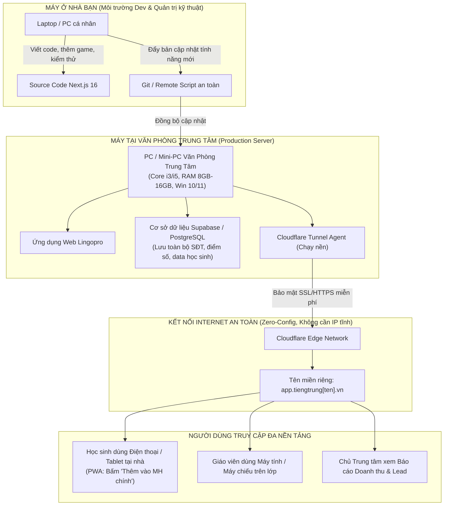
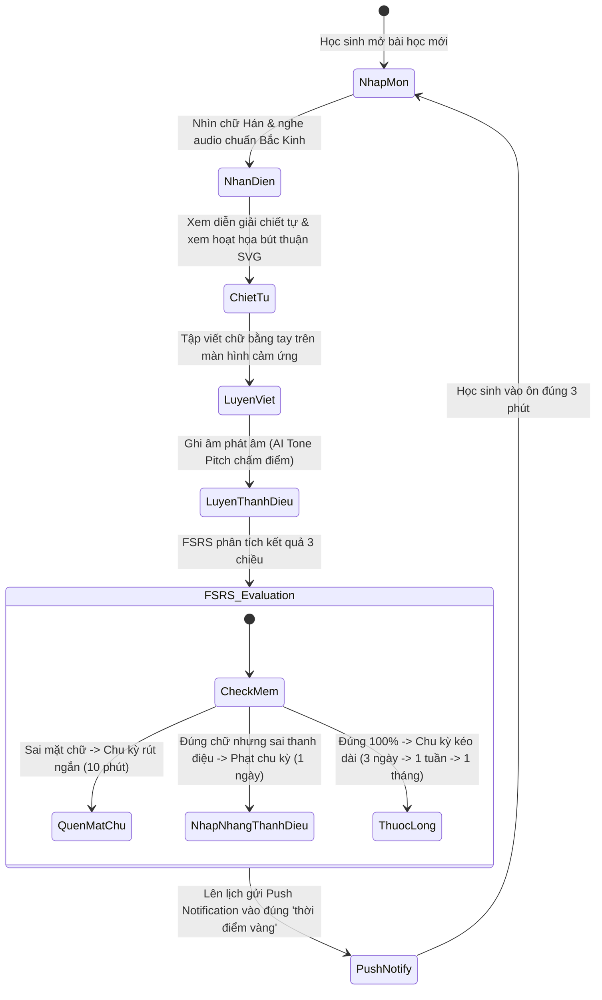
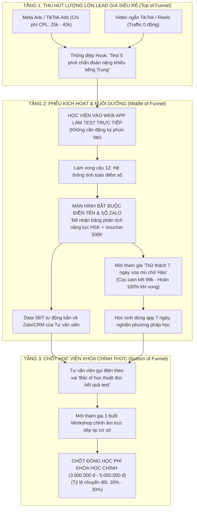
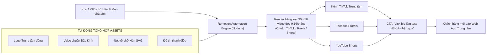
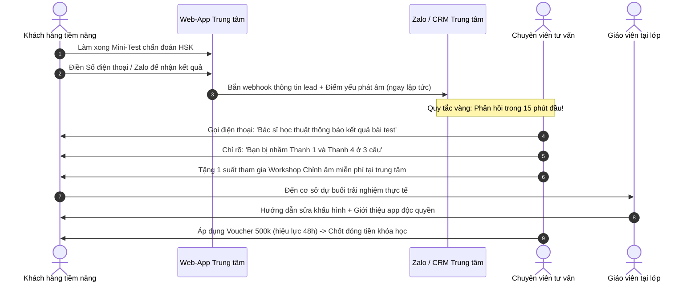
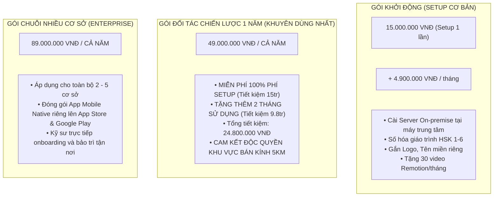
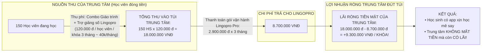
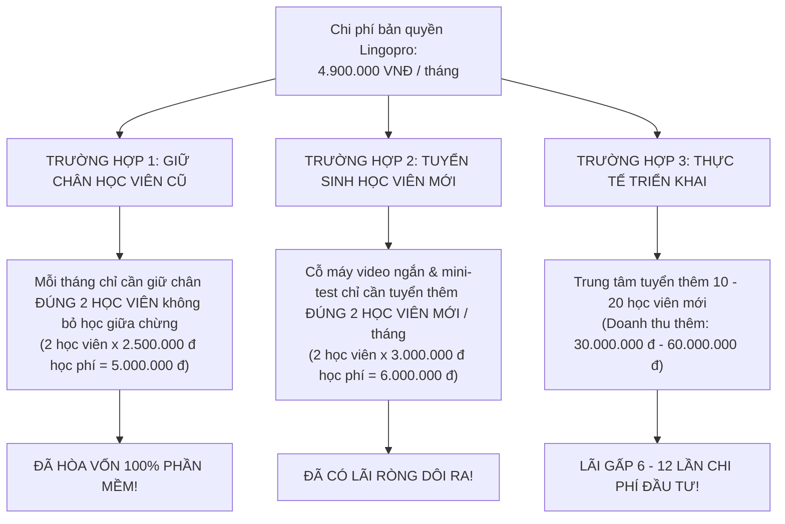

# TỔNG HỢP CÁC SƠ ĐỒ HỆ THỐNG: TỔNG QUAN APP – CHIẾN LƯỢC MARKETING – BÀI TOÁN GIÁ & DÒNG TIỀN
## *Bộ Visual Toàn Diện Dành Cho Buổi Đàm Phán & Trình Chiếu Với Chủ Trung Tâm Tiếng Trung*

---

## MỤC LỤC
1. [HỆ THỐNG SƠ ĐỒ VỀ APP & CÔNG NGHỆ](#1-hệ-thống-sơ-đồ-về-app--công-nghệ)
   * 1.1. Sơ đồ Kiến trúc Máy chủ On-premise tại Trung tâm
   * 1.2. Sơ đồ Hệ sinh thái 4 Trụ cột Công nghệ Lingopro
   * 1.3. Sơ đồ Vòng lặp Học tập & Thuật toán FSRS 3 Chiều
2. [HỆ THỐNG SƠ ĐỒ VỀ MARKETING & HÚT LEAD](#2-hệ-thống-sơ-đồ-về-marketing--hút-lead)
   * 2.1. Sơ đồ Phễu Tuyển sinh 3 Tầng: Thử Thách & Mini-Test
   * 2.2. Sơ đồ Cỗ máy Sản xuất Video Remotion 0 Đồng & Phủ Đa Kênh
   * 2.3. Sơ đồ Luồng Chuyển đổi Lead thành Học viên (Telesales SLA 15 Phút)
3. [HỆ THỐNG SƠ ĐỒ VỀ GIÁ, ROI & DÒNG TIỀN](#3-hệ-thống-sơ-đồ-về-giá-roi--dòng-tiền)
   * 3.1. Sơ đồ Ma trận 3 Gói Giá Cao Cấp
   * 3.2. Sơ đồ Dòng tiền "Chi phí 0 đồng" (Profit Center Flow)
   * 3.3. Sơ đồ Cân bằng Điểm Hòa Vốn (Breakeven Analysis)

---

## 1. HỆ THỐNG SƠ ĐỒ VỀ APP & CÔNG NGHỆ

### 1.1. Sơ đồ Kiến trúc Máy chủ On-premise (Máy Trung Tâm + Cloudflare + Máy ở Nhà)

---

### 1.2. Sơ đồ Hệ sinh thái 4 Trụ cột Công nghệ Lingopro

```mermaid
graph TD
    Lingopro["HỆ THỐNG LINGOPRO ENTERPRISE"]

    Lingopro --> P1["1. CÔNG NGHỆ HÁN TỰ FSRS"]
    Lingopro --> P2["2. AI CONTENT STUDIO"]
    Lingopro --> P3["3. LMS & AT-RISK RADAR"]
    Lingopro --> P4["4. GAME HÓA 3-TRONG-1"]

    P1 --> P1_1["Mô hình nhớ 3 chiều: Nhận diện - Thanh điệu - Bút thuận"]
    P1 --> P1_2["Hệ số D0 = 7.42 tối ưu riêng cho chữ tượng hình"]
    P1 --> P1_3["Thông báo đẩy (Push FCM) nhắc ôn trước khi quên"]

    P2 --> P2_1["1-Click bóc tách giáo trình Boyan / HSK giấy thành data số"]
    P2 --> P2_2["Hoạt họa nét vẽ SVG chuẩn MakeMeAHanzi"]
    P2 --> P2_3["Giải nghĩa Chiết tự bằng AI (Visual Mnemonics)"]

    P3 --> P3_1["Dashboard tiến độ học tập thời gian thực của cả lớp"]
    P3 --> P3_2["Radar cảnh báo đỏ học sinh có nguy cơ bỏ học sau 3 ngày"]
    P3 --> P3_3["Báo cáo kết quả tự động gửi phụ huynh qua Zalo"]

    P4 --> P4_1["Flappy Bird Thanh điệu (chơi bằng giọng nói)"]
    P4 --> P4_2["Thuật Giả kim (kéo thả ghép bộ thủ)"]
    P4 --> P4_3["Hanzi Battle Royale (đối kháng trực tiếp trên lớp)"]
```

---

### 1.3. Sơ đồ Vòng lặp Học tập & Thuật toán FSRS 3 Chiều

---

## 2. HỆ THỐNG SƠ ĐỒ VỀ MARKETING & HÚT LEAD

### 2.1. Sơ đồ Phễu Tuyển sinh 3 Tầng (The Challenge & Mini-Test Funnel)

---

### 2.2. Sơ đồ Cỗ máy Sản xuất Video Remotion 0 Đồng & Phủ Đa Kênh

---

### 2.3. Sơ đồ Luồng Chuyển đổi Lead (Telesales SLA 15 Phút)

---

## 3. HỆ THỐNG SƠ ĐỒ VỀ GIÁ, ROI & DÒNG TIỀN

### 3.1. Sơ đồ Ma trận 3 Gói Giá Cao Cấp (High-Ticket)

---

### 3.2. Sơ đồ Dòng tiền "Chi phí 0 đồng" (Profit Center Flowchart)

---

### 3.3. Sơ đồ Cân bằng Điểm Hòa Vốn (Breakeven Analysis)

---

> **Tài liệu trực quan biên soạn bởi Đội ngũ Kiến trúc sư & Chiến lược Lingopro**  
> **Hotline / Zalo hỗ trợ kỹ thuật:** `0949 317 036` (Mr Phong)
