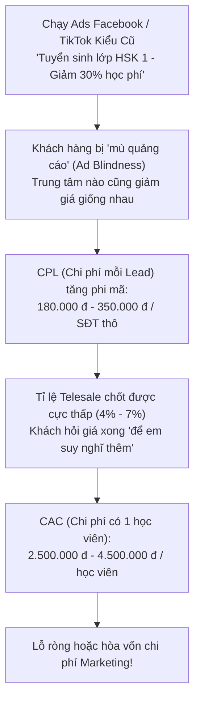
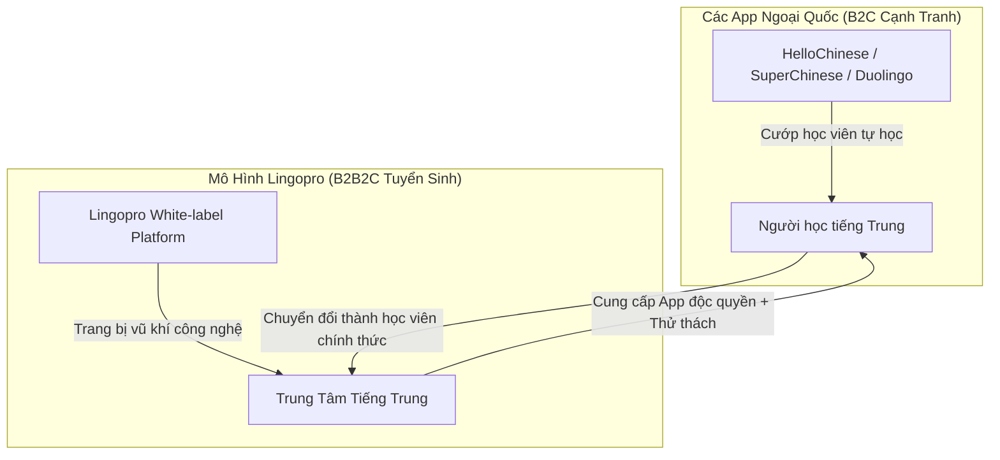
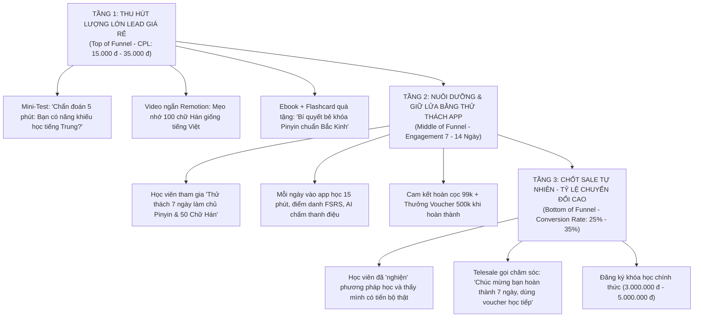

# CHIẾN LƯỢC ĐỘT PHÁ TUYỂN SINH: GIẢI MÃ BÀI TOÁN HÚT LEAD, ADS & CONTENT VIRAL CHO TRUNG TÂM TIẾNG TRUNG
## *X3 Học Viên Mới, Giảm 60% Chi Phí Quảng Cáo Với Hệ Thống Phễu Thử Thách & Nội Dung Tự Động Hóa*

---

> **Dành riêng cho buổi làm việc sáng nay với Chủ Trung Tâm Tiếng Trung:**
> Khi chủ trung tâm đang "đuối khâu kiếm lead", đừng vội nói về quản lý học sinh hay lớp học nội bộ. Hãy đánh thẳng vào **tử huyệt sống còn của họ: Khách hàng tiềm năng (Leads) & Doanh thu mới**. 
> Tài liệu này cung cấp toàn bộ luận điểm, dữ liệu định lượng, ma trận so sánh app đối thủ và kịch bản thực chiến giúp bạn biến Lingopro thành **"Cỗ máy kéo học viên độc quyền"** cho trung tâm.

---

## MỤC LỤC
1. [Khủng Hoảng Tuyển Sinh 2026: Vì Sao Trung Tâm Tiếng Trung Đang Đuối Lead?](#1-khủng-hoảng-tuyển-sinh-2026-vì-sao-trung-tâm-tiếng-trung-đang-đuối-lead)
2. [Ma Trận So Sánh Các App Tiếng Trung Trên Thị Trường (Competitor Benchmark)](#2-ma-trận-so-sánh-các-app-tiếng-trung-trên-thị-trường-competitor-benchmark)
3. [Khoảng Trống Thị Trường: Lingopro Là "Đồng Minh Tuyển Sinh", Không Phải Đối Thủ](#3-khoảng-trống-thị-trường-lingopro-là-đồng-minh-tuyển-sinh-không-phải-đối-thủ)
4. [Cỗ Máy Hút Lead 3 Tầng Cho Trung Tâm Tiếng Trung](#4-cỗ-máy-hút-lead-3-tầng-cho-trung-tâm-tiếng-trung)
5. [Chuyên Sâu 4 Vũ Khí Kéo Khách Thực Chiến](#5-chuyên-sâu-4-vũ-khí-kéo-khách-thực-chiến)
   * 5.1. Lead Magnet Sát Thủ: Mini-Test Chuẩn Đoán Năng Lực 5 Phút (CPL < 35.000 đ)
   * 5.2. Thử Thách Kỷ Luật 7 Ngày / 14 Ngày Làm Chủ Pinyin & 100 Chữ Hán
   * 5.3. Remotion Video Machine: Tự Động Hóa 50 Video Ngắn Tuyển Sinh/Tháng (Traffic 0 Đồng)
   * 5.4. Viral Referral Loop: Kéo Bạn Cùng Lớp Tham Gia Thử Thách
6. [Bảng So Sánh Hiệu Quả Tài Chính: Ads Truyền Thống vs. Phễu Thử Thách Lingopro](#6-bảng-so-sánh-hiệu-quả-tài-chính-ads-truyền-thống-vs-phễu-thử-thách-lingopro)
7. [Kịch Bản Đàm Phán Trực Diện Sáng Nay (Mở Lời Bằng Nỗi Đau Kiếm Lead)](#7-kịch-bản-đàm-phán-trực-diện-sáng-nay-mở-lời-bằng-nỗi-đau-kiếm-lead)

---

## 1. KHỦNG HOẢNG TUYỂN SINH 2026: VÌ SAO TRUNG TÂM TIẾNG TRUNG ĐANG ĐUỐI LEAD?

Hầu hết các trung tâm ngoại ngữ hiện nay đang rơi vào cái bẫy **"Chạy Ads Càng Ngày Càng Đắt Nhưng Lead Ngày Càng Lạnh"**:

### 3 Nguyên Nhân Cốt Lõi Khiến Lead Tiếng Trung Khó Chốt:
1. **Rào cản tâm lý sợ khó:** Học viên rất thích tiếng Trung (xem phim, kinh doanh, đi du lịch), nhưng vừa nhìn thấy chữ Hán là sợ không học nổi. Khi trung tâm giục đóng 3 – 5 triệu tiền học ngay từ đầu, khách hàng sẽ trì hoãn.
2. **Thiếu trải nghiệm "Thử trước khi mua" (Try-before-you-buy):** Đa số trung tâm chỉ có buổi học thử offline (bất tiện đi lại) hoặc tư vấn qua điện thoại khô khan.
3. **Content quảng cáo nhàm chán:** Chỉ chụp ảnh lớp học, bảng chữ cái, hoặc banner giảm giá. Không có nội dung tương tác (interactive content) để giữ chân học viên trên mạng xã hội.

---

## 2. MA TRẬN SO SÁNH CÁC APP TIẾNG TRUNG TRÊN THỊ TRƯỜNG (COMPETITOR BENCHMARK)

Hiện nay trên thị trường có nhiều ứng dụng tiếng Trung, nhưng **100% đều là app B2C phục vụ người học tự do, KHÔNG HỖ TRỢ TRUNG TÂM TUYỂN SINH**:

| Ứng dụng | Mô hình & Chi phí | Điểm mạnh vượt trội | Điểm yếu chí mạng | Vì sao KHÔNG giúp trung tâm tuyển sinh? |
|---|---|---|---|---|
| **HelloChinese** | Freemium + Sub (1.500.000 đ/năm) | Giao diện thân thiện, lộ trình chuẩn HSK 1-3 cho người mới bắt đầu. | Không có giáo viên thật, không có quản trị lớp, nội dung đóng cứng, người học dễ nản sau 3 tuần. | Là **đối thủ cạnh tranh** cướp học viên của trung tâm; không gắn được thương hiệu của trung tâm. |
| **SuperChinese** | Subscription (1.300.000 đ/năm) | Nhận diện giọng nói AI tốt, giao diện 3D hiện đại. | Quá đắt cho học sinh VN, bài học máy móc, không có ngữ cảnh Hán-Việt. | Thuần túy B2C, trung tâm không có quyền can thiệp hay lấy data học viên. |
| **Hanzii Dict** | Miễn phí có ads + VIP (eJoy) | Tra cứu Hán-Việt số 1 VN, phân tích bộ thủ, ngữ pháp chi tiết. | Chỉ là **từ điển tra cứu**, không có lộ trình học bài bản từ số 0, nhiều quảng cáo phiền toái. | Không có cơ chế phễu thử thách, không kết nối lớp học. |
| **Migii HSK** | Trả phí theo gói thi | Kho đề thi thử HSK 1-6 phong phú, phân tích lỗi sai chi tiết. | Khô khan, chỉ phù hợp luyện thi nước rút, hoàn toàn không phù hợp cho người mới bắt đầu. | Không dùng làm phễu hút lead giai đoạn vỡ lòng (HSK 1-2). |
| **Pleco** | Miễn phí + Mua add-on đắt đỏ | Bộ từ điển kinh điển, quét ảnh OCR cực mạnh. | Giao diện cổ lỗ sĩ (thập niên 90), ngôn ngữ Anh-Trung, cực kỳ khó dùng cho người mới. | Không có gamification, không dùng để marketing được. |
| **Duolingo Chinese** | Freemium | Game hóa vui nhộn, thương hiệu phổ biến toàn cầu. | Dịch câu máy móc ngớ ngẩn, **không dạy bản chất chữ Hán, không có bút thuận, không có âm Hán-Việt**. | Học viên học 6 tháng không nói nổi 1 câu thực tế, không có giá trị thi HSK. |

---

## 3. KHOẢNG TRỐNG THỊ TRƯỜNG: LINGOPRO LÀ "ĐỒNG MINH TUYỂN SINH", KHÔNG PHẢI ĐỐI THỦ

### 3 Lợi Thế Độc Quyền Của Lingopro Giúp Trung Tâm Thắng Tuyệt Đối:
1. **Gắn Thương Hiệu Riêng Của Trung Tâm:** Học sinh tải app/web thấy logo và hình ảnh giảng viên của trung tâm, tạo niềm tin tuyệt đối về sự chuyên nghiệp và quy mô.
2. **Cầu Nối Âm Hán - Việt Độc Quyền:** Các app nước ngoài (HelloChinese, Duolingo) bắt người Việt học chữ Hán như người Tây (thuần Pinyin). Lingopro tận dụng kho tàng **70% từ Hán Việt tương đồng**, giúp học viên học 1 biết 10, tự tin ngay từ ngày đầu tiên.
3. **Đóng Vai Trò Là Phễu Tuyển Sinh (Lead Generation Machine):** Biến việc học thử thành một hành trình trải nghiệm số (Digital Experience) có đo lường, tự động thu thập Số điện thoại/Zalo để đội ngũ tư vấn chốt sale dễ dàng.

---

## 4. CỖ MÁY HÚT LEAD 3 TẦNG CHO TRUNG TÂM TIẾNG TRUNG

Thay vì đốt tiền chạy ads bán khóa học đắt tiền trực tiếp, chúng ta áp dụng **Chiến lược Phễu Thử Thách Kỷ Luật (The Challenge Funnel)**:

---

## 5. CHUYÊN SÂU 4 VŨ KHÍ KÉO KHÁCH THỰC CHIẾN

### 5.1. Lead Magnet Sát Thủ: Mini-Test Chuẩn Đoán Năng Lực 5 Phút (CPL < 35.000 đ)
* **Ý tưởng:** Tâm lý con người luôn tò mò về bản thân. Đừng bảo họ *"Mua khóa học tiếng Trung đi"*, hãy mời họ: *"Làm trắc nghiệm 5 phút xem bạn mất bao lâu để giao tiếp tiếng Trung trôi chảy?"*.
* **Cơ chế trên Web-app Lingopro:**
  * Bài test gồm 8 câu hỏi ngắn: Thử nghe phân biệt 2 thanh điệu, thử nhìn 3 chữ Hán tương đồng chữ Hán Việt (như 太阳 Thái dương, 银行 Ngân hàng), thử chọn mục tiêu học tập.
  * Cuối bài test: Hệ thống hiển thị biểu đồ phân tích năng lực cá nhân + **Bắt buộc nhập Tên & Số Zalo** để nhận lộ trình học tập cá nhân hóa và bộ tài liệu HSK miễn phí.
* **Hiệu quả định lượng:** CPL của dạng quảng cáo Interactive Test chỉ từ **15.000 đ – 30.000 đ/lead** (rẻ hơn 80% so với ads bán khóa học truyền thống).

### 5.2. Thử Thách Kỷ Luật: "7 Ngày Làm Chủ Pinyin & 100 Chữ Hán Đầu Tiên"
* **Cách thức triển khai:**
  * Trung tâm mở chiến dịch: *"Thử thách 7 ngày lột xác tiếng Trung cùng Huấn luyện viên số Lingopro"*.
  * **Chính sách cam kết:** Học viên đặt cọc tượng trưng **99.000 đ** (hoặc trung tâm tài trợ 100% vé mời).
  * **Luật chơi:** Mỗi ngày app mở 1 bài học 15 phút. Học viên phải:
    1. Luyện phát âm 5 âm pinyin khó (AI Tone Visualizer chấm điểm).
    2. Viết đúng bút thuận 10 chữ Hán trên màn hình cảm ứng.
    3. Ôn thẻ FSRS trước 23h59 đêm.
  * **Phần thưởng:** Hoàn thành đủ 7 ngày $\rightarrow$ **Hoàn lại 100% tiền cọc 99k + Nhận Voucher giảm 500.000 đ khi đăng ký lớp offline của trung tâm**.
* **Tại sao tỉ lệ chốt sale lại cực cao (25% - 35%)?**
  * Trong 7 ngày, học viên đã được trải nghiệm sự tận tâm của trung tâm và thấy rõ bản thân *học được, nhớ được chữ Hán* chứ không khó như họ tưởng tượng.
  * Voucher 500k có hạn dùng trong 48h tạo hiệu ứng khan hiếm (FOMO), kích hoạt quyết định đóng học phí ngay lập tức.

### 5.3. Remotion Video Machine: Tự Động Hóa 50 Video Ngắn Tuyển Sinh/Tháng (Traffic 0 Đồng)
Một trong những nỗi đau lớn nhất của trung tâm là: **Muốn xây kênh TikTok/Reels nhưng không có tiền thuê ekip quay dựng và giáo viên thì ngại lên hình**.
* **Giải pháp Remotion của Lingopro:**
  * Hệ thống mã nguồn tự động hóa việc render hàng loạt video ngắn 9:16 chuẩn chuẩn TikTok/Reels.
  * **3 Series Video "Hút View & Kéo Lead" cực mạnh:**
    1. *Series "Bắt bài chữ Hán giống tiếng Việt":* Video tự động vẽ nét chữ Hán, phát âm chuẩn Bắc Kinh và đối chiếu âm Hán-Việt (Ví dụ: 简单 Giản đơn = Đơn giản; 态度 Thái độ; 结婚 Kết hôn).
    2. *Series "Sai thanh điệu - Bi kịch hài hước":* Ví dụ phát âm nhầm giữa *Wèn (Hỏi)* và *Wěn (Hôn)*; *Shuìjiào (Đi ngủ)* và *Shuǐjiào (Sủi cảo)*.
    3. *Series "Chiết tự chữ Hán kỳ thú":* Hoạt họa tách nét chữ Hán và kể câu chuyện nguồn gốc.
  * **CTA cuối video:** *"Muốn làm chủ 300 chữ Hán như thế này trong 7 ngày? Bấm vào link bio làm bài test nhận học bổng miễn phí của Trung tâm [Tên Trung Tâm]!"*.
  * **Chi phí sản xuất:** Gần như **0 đồng tiền nhân sự quay dựng**.

### 5.4. Viral Referral Loop: "Học Chung Có Đôi - Nhân Đôi Ưu Đãi"
* Học viên khi tham gia thử thách hoặc làm bài test sẽ có link giới thiệu riêng.
* Nếu mời thêm 1 người bạn cùng tham gia thử thách 7 ngày: Cả 2 cùng được tặng thêm "Khiên bảo vệ chuỗi Streak" + Tặng cuốn sổ tay luyện viết chữ Hán của trung tâm khi đến nhận tại quầy.
* Giúp trung tâm nhân bản lượng lead tự nhiên mà không tốn thêm 1 đồng chi phí quảng cáo nào.

---

## 6. BẢNG SO SÁNH HIỆU QUẢ TÀI CHÍNH

### Giả lập ngân sách Marketing: 20.000.000 VNĐ / Tháng

| Chỉ số đo lường | Phương án Cũ (Chạy Ads Bán Khóa Học) | Phương án Mới (Phễu Thử Thách & App Lingopro) | Mức độ cải thiện |
|---|:---:|:---:|:---:|
| **Góc tiếp cận quảng cáo** | "Giảm 30% khóa HSK 1" | "Mini-Test chẩn đoán & Thử thách 7 ngày" | Hấp dẫn, tò mò hơn |
| **Chi phí mỗi Lead (CPL)** | 220.000 đ / lead | **35.000 đ / lead** | **Rẻ hơn gấp 6.2 lần** |
| **Tổng số Lead thu về** | ~90 leads | **~570 leads** | **Tăng gấp 6.3 lần** |
| **Chất lượng tương tác** | Lạnh, hỏi giá xong im lặng | Ấm, đã trải nghiệm học app 7 ngày | Độ tin tưởng cực cao |
| **Tỉ lệ chuyển đổi chốt khóa học** | 6% (chốt được 5 - 6 học viên) | **20% từ nhóm hoàn thành thử thách** (~25 - 30 học viên) | **Tăng gấp 5 lần** |
| **Doanh thu khóa học mang lại** *(3.000.000 đ/học viên)* | ~16.500.000 đ *(Lỗ ngân sách ads)* | **~85.000.000 đ** *(Lãi đậm)* | **Doanh thu gấp 5 lần** |
| **Chi phí có 1 học viên mới (CAC)** | **3.600.000 đ / học viên** | **~680.000 đ / học viên** | **Giảm 81% chi phí tuyển sinh** |

---

## 7. KỊCH BẢN ĐÀM PHÁN TRỰC DIỆN SÁNG NAY VỚI CHỦ TRUNG TÂM

Khi bước vào buổi gặp, hãy chuyển dịch hoàn toàn cuộc trò chuyện từ *"bán phần mềm quản lý"* sang **"bàn chiến lược cứu cánh khâu tuyển sinh"**:

### Bước 1: Mở lời trực diện vào nỗi đau (Hook)
> *"Chào Thầy/Cô, trước khi gặp Thầy/Cô hôm nay, em có tìm hiểu kỹ về thị trường đào tạo tiếng Trung hiện tại. Em thấy hầu hết các trung tâm đều đang gặp một bài toán chung rất đau đầu: **Chi phí chạy quảng cáo Facebook/TikTok ngày càng đắt, trước đây có khi vài chục nghìn 1 số điện thoại, nay lên tới 200k - 300k mà khách hỏi giá xong đa phần im lặng**. Không biết trung tâm mình đợt này tuyển sinh có đang bị ảnh hưởng bởi tình trạng này không ạ?"*
> *(Chắc chắn chủ trung tâm sẽ thở dài và bắt đầu chia sẻ về việc chi phí ads cao, thiếu lead).*

### Bước 2: Chỉ ra nguyên nhân vì sao cách cũ không còn hiệu quả (Agitate)
> *"Dạ đúng rồi Thầy/Cô. Khách hàng bây giờ họ sợ: sợ học chữ Hán khó, sợ đóng 3-4 triệu xong không theo nổi, và trung tâm nào cũng quảng cáo 'giảm học phí' giống hệt nhau. Muốn tuyển sinh được bây giờ, mình không thể bắt họ 'cưới' ngay lần hẹn đầu tiên, mà phải cho họ 'hẹn hò thử' qua một **trải nghiệm số thú vị** mà đối thủ xung quanh không ai có."*

### Bước 3: Đưa ra giải pháp Phễu Thử Thách & App Lingopro (Solve)
> *"Hôm nay em đến đây không phải để giới thiệu thêm một phần mềm quản lý lớp học. Em mang đến cho trung tâm mình một **Cỗ máy hút lead tuyển sinh**:
> 1. Bên em trang bị cho trung tâm một bài **Mini-Test chẩn đoán năng lực 5 phút** và **Thử thách 7 ngày làm chủ chữ Hán** mang thương hiệu riêng của Trung tâm.
> 2. Khách hàng làm test và học thử trên app hoàn toàn tự động. Mỗi ngày app nhắc họ học 15 phút, AI chấm phát âm thanh điệu và dạy viết chữ Hán.
> 3. Sau 7 ngày, họ thấy tiếng Trung dễ hiểu, yêu thích phương pháp dạy của trung tâm và sẵn sàng xuống tiền đăng ký khóa học chính thức. Chi phí thu về 1 lead giảm từ 250k xuống chỉ còn 35k."*

### Bước 4: Chốt đề xuất thử nghiệm 1 chiến dịch không rủi ro (Close)
> *"Em đề xuất: Trung tâm mình không cần phải ký hợp đồng dài hạn hay trả chi phí lớn ngay bây giờ.
> Trong đợt tuyển sinh tháng tới, bên em sẽ **cài đặt trọn gói hệ thống phễu này cho trung tâm hoàn toàn miễn phí trong 30 ngày**, phối hợp cùng đội marketing của trung tâm chạy thử nghiệm một chiến dịch 'Thử thách 7 ngày'. 
> Nếu sau 30 ngày, trung tâm thấy số lượng lead tăng vọt, chi phí tuyển sinh giảm một nửa và tuyển được thêm ít nhất 15-20 học viên mới, lúc đó chúng ta mới bàn đến việc hợp tác lâu dài. Thầy/Cô thấy phương án này có an toàn và hợp lý cho trung tâm mình không ạ?"*

---

> **Tài liệu chuẩn bị bởi Đội ngũ Chiến lược Lingopro**  
> **Hotline / Zalo hỗ trợ kỹ thuật & triển khai chiến dịch:** `0949 317 036` (Mr Phong)
