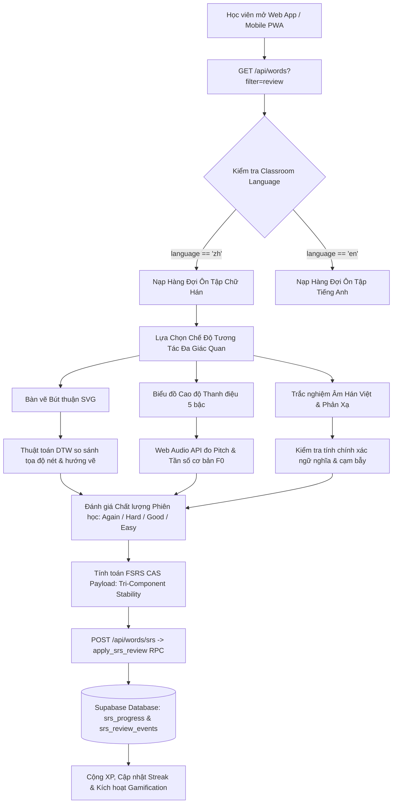
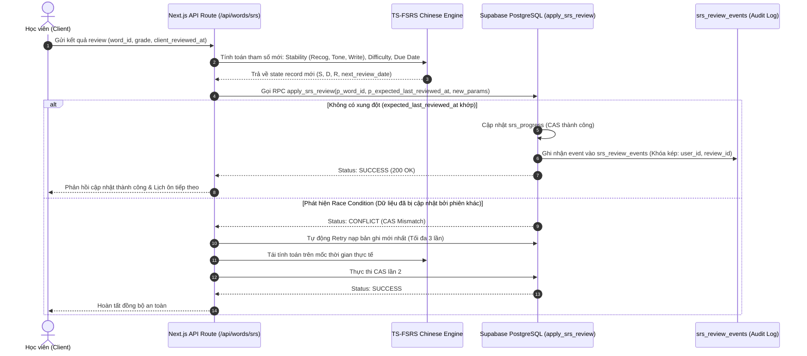
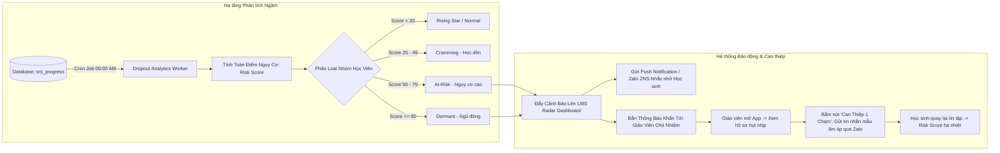

# ĐỀ ÁN HỢP TÁC CHIẾN LƯỢC TOÀN DIỆN
## CHUYỂN ĐỔI SỐ & GIA TỐC ĐÀO TẠO TIẾNG TRUNG (HSK 1-6 & HSKK) DỰA TRÊN NỀN TẢNG CÔNG NGHỆ LINGOPRO
### NỀN TẢNG TỰ ĐỘNG HÓA ÔN TẬP FSRS, CHẤM BÚT THUẬN CHỮ HÁN, LMS RADAR CẢNH BÁO HỤT NHỊP & CỖ MÁY MARKETING VIDEO REMOTION

---

**Cơ quan chủ trì đề án**: CÔNG TY CỔ PHẦN CÔNG NGHỆ GIÁO DỤC LINGOPRO (LINGOPRO EDTECH JSC)  
**Phân hệ chuyên trách**: Lingopro Chinese Division (HSK / HSKK Track)  
**Tài liệu**: Hồ sơ Đề án Hợp tác B2B & Thiết kế Kỹ thuật Chuyên biệt  
**Phiên bản**: 3.2.0 (Phát hành chính thức — Sẵn sàng In ấn & Ký kết)  
**Mã tài liệu**: `DE_AN_HOP_TAC_LINGOPRO_TRUNG_TAM_TIENG_TRUNG.md`  
**Thời gian phát hành**: Tháng 09/2026  
**Đối tượng thụ hưởng**: Ban Giám đốc, Trưởng phòng Đào tạo & Quản lý Học vụ các Trung tâm Tiếng Trung, Khoa Tiếng Trung Đại học trên toàn quốc  

---

```
  ██╗     ██╗███╗   ██╗ ██████╗  ██████╗ ██████╗ ██████╗  ██████╗ 
  ██║     ██║████╗  ██║██╔════╝ ██╔═══██╗██╔══██╗██╔══██╗██╔═══██╗
  ██║     ██║██╔██╗ ██║██║  ███╗██║   ██║██████╔╝██████╔╝██║   ██║
  ██║     ██║██║╚██╗██║██║   ██║██║   ██║██╔═══╝ ██╔══██╗██║   ██║
  ███████╗██║██║ ╚████║╚██████╔╝╚██████╔╝██║     ██║  ██║╚██████╔╝
  ╚══════╝╚═╝╚═╝  ╚═══╝ ╚═════╝  ╚═════╝ ╚═╝     ╚═╝  ╚═╝ ╚═════╝ 
             CHINESE ACCELERATION INFRASTRUCTURE (HSK/HSKK)
```

---

## MỤC LỤC TỔNG THỂ

1. **PHẦN 1: TUYÊN NGÔN & TẦM NHÌN CHIẾN LƯỢC LINGOPRO CHINESE**
   - 1.1. Bức tranh thị trường đào tạo HSK & HSKK tại Việt Nam (2024 - 2028)
   - 1.2. Điểm đau chí mạng: Cuộc khủng hoảng rơi rụng 35% - 50% học viên vỡ lòng
   - 1.3. Định vị giải pháp: Hạ tầng gia tốc Blended Learning đồng hành cùng Trung tâm
2. **PHẦN 2: KIẾN TRÚC GIẢI PHÁP TỔNG QUAN & THUẬT TOÁN FSRS CHỮ HÁN CHUYÊN BIỆT**
   - 2.1. Bản chất nhận thức: Sự phân tách Hình (形) - Âm (音) - Nghĩa (义)
   - 2.2. Lợi thế Âm Hán Việt và Cạm bẫy "Đồng âm dị nghĩa" (False Friends)
   - 2.3. Thuật toán FSRS chuyên biệt cho chữ tượng hình (Ideographic FSRS Model)
   - 2.4. Mô hình 3 thành phần Trí nhớ (Tri-Component Stability Architecture)
   - 2.5. Cơ chế phạt thanh điệu (Tone Penalty Engine) & 19 Tham số FSRS tinh chỉnh
3. **PHẦN 3: SƠ ĐỒ LUỒNG DỮ LIỆU TOÀN HỆ THỐNG (SYSTEM DATA FLOW DIAGRAMS)**
   - 3.1. Sơ đồ 1: Luồng Học viên Học tập & Tương tác Đa phương thức (Student Loop)
   - 3.2. Sơ đồ 2: Cơ chế Ghi nhận Điểm Idempotent CAS RPC & Tính chu kỳ Lặp lại FSRS
   - 3.3. Sơ đồ 3: Luồng LMS Radar Phân tích Nguy cơ & Can thiệp Hụt nhịp (At-Risk Intervention)
4. **PHẦN 4: AI CONTENT STUDIO: QUY TRÌNH BIÊN SOẠN GIÁO TRÌNH HSK 1-6 & HSKK TỰ ĐỘNG**
   - 4.1. Khai thác sức mạnh Lõi AI Zhipu GLM-4-flash tối ưu Hán ngữ
   - 4.2. Quy trình số hóa 15 phút: Từ giáo trình giấy thành học liệu tương tác
   - 4.3. Pipeline trích xuất 8 tầng dữ liệu từ vựng và ngữ pháp
   - 4.4. Cơ chế xuất bản chuẩn kép: Markdown Giáo án Giảng dạy & JSON Database
5. **PHẦN 5: LMS THÔNG MINH: QUẢN LÝ HỌC VIÊN & DROPOUT PREVENTION RADAR**
   - 5.1. 5 Phân nhóm học viên theo hành vi & chỉ số FSRS (Radar Segmentation)
   - 5.2. Công thức định lượng Chỉ số Nguy cơ Hụt nhịp (Dropout Risk Score)
   - 5.3. Quy trình can thiệp tự động 3 bước: Báo động -> Highlight -> Tin nhắn 1 chạm
   - 5.4. Dashboard quản trị cơ sở dành riêng cho Giám đốc & Phòng Học vụ
6. **PHẦN 6: 5 CƠ CHẾ HỌC TẬP ĐỘT PHÁ & GAMIFICATION TIẾNG TRUNG**
   - 6.1. Cơ chế 1: Phân tích phổ âm & Cao độ thanh điệu 5 bậc (Tone Pitch Contour)
   - 6.2. Cơ chế 2: Bàn vẽ tương tác nhận diện nét chữ SVG (Stroke Order DTW Engine)
   - 6.3. Cơ chế 3: Đấu trường Hán ngữ PvP theo cấp độ HSK (Realtime Arena)
   - 6.4. Cơ chế 4: Cầu nối giải nghĩa Âm Hán Việt & Cảnh báo bẫy ngữ nghĩa
   - 6.5. Cơ chế 5: Flashcard ngữ cảnh video/audio chuẩn phát âm Bắc Kinh
7. **PHẦN 7: HỆ THỐNG MARKETING & TUYỂN SINH TỰ ĐỘNG BẰNG REMOTION SHORT-FORM VIDEO**
   - 7.1. Phễu chuyển đổi tuyển sinh đa kênh TikTok / Facebook Reels / YouTube Shorts
   - 7.2. Cấu trúc Composition video dọc 9:16 (1080x1920 @ 30fps)
   - 7.3. Thiết kế 6 Layer đồ họa & Âm thanh động mang đậm phong vị Á Đông
   - 7.4. Pipeline Headless Batch Rendering tự động gắn thương hiệu riêng của trung tâm
8. **PHẦN 8: KỊCH BẢN ĐÀM PHÁN B2B: XỬ LÝ 5 TÌNH HUỐNG PHẢN BÁC KINH ĐIỂN**
   - 8.1. Phản bác 1: Giáo viên quen giáo trình giấy / Zalo, ngại học phần mềm mới
   - 8.2. Phản bác 2: Đã có Anki / Quizlet / HelloChinese / SuperChinese / Pleco trên mạng
   - 8.3. Phản bác 3: Chi phí phần mềm cao, biên lợi nhuận trung tâm đang mỏng
   - 8.4. Phản bác 4: Sợ học viên phụ thuộc app rồi bỏ học tại trung tâm
   - 8.5. Phản bác 5: Học viên lớn tuổi / người đi làm khó tiếp cận công nghệ (Xử lý WebView Zalo)
9. **PHẦN 9: BẢNG BIỂU PHÍ B2B & BÀI TOÁN HOÀN VỐN (ROI) ĐỊNH LƯỢNG**
   - 9.1. Cấu trúc 3 Gói bản quyền B2B (Per-Seat, Campus Pro, Enterprise Co-Branding)
   - 9.2. Mô hình toán học chứng minh hoàn vốn theo từng quy mô (Chỉ cần giảm 2% - 3% rơi rụng)
   - 9.3. Chiến lược biến phần mềm thành Trung tâm Tạo Lợi Nhuận (Độ nhạy thực tế +6M đến +10M VNĐ)
10. **PHẦN 10: LỘ TRÌNH TRIỂN KHAI KỸ THUẬT & TƯƠNG THÍCH NEXT.JS 16 + SUPABASE**
    - 10.1. Cam kết 0 Regression: Phân lập lớp học & Mở rộng schema đa hình
    - 10.2. Kiến trúc bảo mật đa tầng: Supabase RLS, Auth PKCE & CAS Concurrency
    - 10.3. Kế hoạch triển khai chuẩn hóa 4 tuần (4-Week Onboarding Blueprint)
11. **PHẦN 11: CAM KẾT CHẤT LƯỢNG DỊCH VỤ (SLA 99.5%) & BẢO MẬT DỮ LIỆU HỌC VIÊN**
    - 11.1. Cam kết chất lượng dịch vụ (Service Level Agreement - SLA 99.5% & Service Credits)
    - 11.2. Tuân thủ tuyệt đối Nghị định 13/2023/NĐ-CP về bảo vệ dữ liệu cá nhân
    - 11.3. Cơ chế mã hóa kép và cam kết tiêu hủy dữ liệu khi thanh lý hợp đồng
12. **PHẦN 12: PHỤ LỤC: MẪU BIÊN BẢN GHI NHỚ HỢP TÁC THÍ ĐIỂM 30 NGÀY (PILOT MOU)**
    - 12.1. Toàn văn Biên bản Ghi nhớ Thí điểm Pháp lý hoàn chỉnh
    - 12.2. Bảng 4 chỉ số KPI nghiệm thu định lượng
    - 12.3. Điều khoản chuyển đổi thương mại ưu đãi Đối tác Tiên phong (Early Adopter)

---

# PHẦN 1: TUYÊN NGÔN & TẦM NHÌN CHIẾN LƯỢC LINGOPRO CHINESE

## 1.1. Bức tranh thị trường đào tạo HSK & HSKK tại Việt Nam (2024 - 2028)

Việt Nam đang trải qua một giai đoạn bùng nổ chưa từng có về nhu cầu học tiếng Trung Quốc (Mandarin / 普通话), được thúc đẩy bởi ba làn sóng vĩ mô mang tính chiến lược:

```
┌────────────────────────────────────────────────────────────────────────────────────────┐
│                        3 ĐỘNG LỰC BÙNG NỔ THỊ TRƯỜNG TIẾNG TRUNG                       │
├──────────────────────────┬──────────────────────────┬──────────────────────────────────┤
│ 1. DỊCH CHUYỂN FDI CHUỖI │ 2. THƯƠNG MẠI ĐIỆN TỬ    │ 3. HỌC BỔNG & CHUẨN ĐẦU RA       │
│    CUNG ỨNG VÀ NHÀ MÁY   │    XUYÊN BIÊN GIỚI       │    TRƯỜNG ĐẠI HỌC TOÀN QUỐC      │
├──────────────────────────┼──────────────────────────┼──────────────────────────────────┤
│ Hơn 4.500 doanh nghiệp   │ Bùng nổ nhập hàng 1688,  │ HSK 3-4 trở thành chứng chỉ miễn │
│ Trung Quốc, Đài Loan đầu │ Taobao, Livestream bán   │ thi tốt nghiệp THPT và chuẩn đầu │
│ tư tại Bắc Ninh, Hải     │ hàng Douyin, logistics   │ ra bắt buộc của hơn 60 trường ĐH;│
│ Phòng, Bình Dương...     │ xuyên biên giới...       │ Săn học bổng CSC/CIS tăng 180%...│
└──────────────────────────┴──────────────────────────┴──────────────────────────────────┘
```

1. **Làn sóng FDI & Dịch chuyển Công nghiệp**: Các tập đoàn công nghệ và sản xuất hàng đầu thế giới (Foxconn, Luxshare, Goertek, BYD...) liên tục mở rộng nhà xưởng tại Việt Nam. Nhân sự biết tiếng Trung có mức lương khởi điểm cao hơn từ **30% đến 55%** so với nhân sự thông thường cùng vị trí.
2. **Thương mại Điện tử & Nhập khẩu Trực tiếp**: Làn sóng kinh doanh tự do, order hàng Quảng Châu, làm việc với nhà xưởng 1688 qua WeChat tạo ra hàng trăm nghìn người học giao tiếp thực chiến.
3. **Chuẩn hóa Khảo thí Quốc tế (HSK 3.0 & HSKK)**: Bộ Giáo dục & Đào tạo cho phép sử dụng chứng chỉ HSK 3 trở lên để miễn thi ngoại ngữ trong kỳ thi Tốt nghiệp THPT và quy đổi điểm 10 xét tuyển đại học. Đồng thời, Hanban áp dụng quy chế thi gộp: **Bắt buộc thi HSK kèm HSKK (Thi Khẩu ngữ)**, khiến áp lực luyện phát âm và phản xạ giao tiếp tăng vọt.

## 1.2. Điểm đau chí mạng: Cuộc khủng hoảng rơi rụng 35% - 50% học viên vỡ lòng

Bất chấp nhu cầu học tập khổng lồ, các chủ trung tâm tiếng Trung trên khắp Việt Nam đều đang đối mặt với một thực tế vận hành cay đắng:

> **NỖI ĐAU CỐT LÕI**: Cứ 100 học viên đăng ký khóa HSK 1 vỡ lòng, sau 4 đến 6 tuần đầu tiên chỉ còn lại khoảng 50 đến 65 học viên tiếp tục lên HSK 2. Tỷ lệ bỏ học (Churn Rate) lên tới **35% - 50%**!

Nguyên nhân sâu xa không nằm ở chất lượng giảng viên đứng lớp, mà bắt nguồn từ **Bản chất Thần kinh Nhận thức (Cognitive Overload)** đặc thù của chữ Hán:
- **"Bức tường Chữ Hán" (The Hanzi Wall)**: Khác với tiếng Anh hay tiếng Việt sử dụng bảng chữ cái Latinh ghép vần, chữ Hán là chữ tượng hình (Ideographic Script). Nhìn vào một chữ Hán, học viên hoàn toàn không có bất kỳ manh mối ngữ âm nào để đoán cách đọc. Học viên phải cùng lúc ghi nhớ 3 thực thể tách biệt: **Mặt chữ (Nét vẽ) - Pinyin (Phiên âm) - Ý nghĩa (Tiếng Việt)**.
- **"Bẫy Thanh Điệu" (Tone Pitch Trap)**: 4 thanh điệu tiếng Trung có cao độ khắt khe (Thanh 1 ngân cao phẳng [55], Thanh 4 rơi thẳng đứng dứt khoát [51]). Học viên Việt Nam thường dùng dấu thanh tiếng Việt để áp đặt một cách khiên cưỡng, dẫn đến phát âm sai lệch nghiêm trọng, sợ nói và trượt phần thi HSKK.
- **Giáo viên kiệt sức vì chấm bài thủ công (Teacher Burnout)**: Hiện tại, học viên viết chữ vào vở ô ly, chụp ảnh gửi qua nhóm Zalo. Một giáo viên phụ trách 3 lớp phải căng mắt nhìn hàng nghìn bức ảnh mờ mịt mỗi tuần, chỉ có thể thả tim đối phó chứ không thể biết học sinh viết đúng bút thuận hay vẽ sai thứ tự nét.

Hậu quả kinh doanh: **Chi phí chạy quảng cáo Facebook/TikTok để tuyển 1 học viên mới (CAC) ngày càng đắt đỏ (từ 500.000 đến 1.200.000 VNĐ)**. Mất 40% học viên sau khóa đầu tiên đồng nghĩa với việc trung tâm **mất trắng toàn bộ Giá trị Trọn đời Học viên (LTV) từ 15 đến 25 triệu đồng** của các khóa HSK 2, 3, 4, 5 tiếp theo!

## 1.3. Định vị giải pháp: Hạ tầng gia tốc Blended Learning đồng hành cùng Trung tâm

Lingopro Chinese kiên định với một tuyên ngôn triết lý:

```
┌────────────────────────────────────────────────────────────────────────────────────────┐
│                        TUYÊN NGÔN GIÁ TRỊ CỐT LÕI CỦA LINGOPRO                         │
├────────────────────────────────────────────────────────────────────────────────────────┤
│ "Lingopro KHÔNG BAO GIỜ thay thế người Thầy.                                           │
│  Lingopro là Phòng Tập Gym rèn luyện trí nhớ và phản xạ tự học mỗi ngày.               │
│  Giáo viên trên lớp chính là Huấn Luyện Viên Cá Nhân (PT) đẳng cấp cao."               │
└────────────────────────────────────────────────────────────────────────────────────────┘
```

Trong mô hình Học tập Kết hợp (Blended Learning):
1. **Ở nhà (Vận hành bởi Lingopro)**: Học viên luyện nạp từ vựng bằng thuật toán FSRS tối ưu cho chữ tượng hình, vẽ bút thuận từng nét trên màn hình cảm ứng, luyện thanh điệu qua biểu đồ cao độ sóng âm và tham gia đấu trường PvP. Mọi lỗ hổng ghi nhớ được xử lý triệt để trước khi đến lớp.
2. **Trên lớp (Vận hành bởi Giáo viên Trung tâm)**: Giáo viên không còn phải mất 45 phút đứng gõ bảng từng nét chữ thô sơ, mà dành 100% thời lượng quý báu để: Rèn luyện hội thoại phản xạ HSKK thực chiến, phân tích chuyên sâu cấu trúc ngữ pháp, sửa khẩu hình chi tiết và truyền cảm hứng văn hóa.
3. **Phòng Học vụ & Ban Giám đốc**: Nắm trong tay Hệ thống LMS Radar cảnh báo hụt nhịp (Dropout Prevention Radar), phát hiện chính xác học sinh nào đang chán nản hay bỏ bê bài tập từ 3 ngày trước để can thiệp kịp thời, giữ vững tỷ lệ tái ghi danh trên 90%.

---

# PHẦN 2: KIẾN TRÚC GIẢI PHÁP TỔNG QUAN & THUẬT TOÁN FSRS CHUYÊN BIỆT CHO TIẾNG TRUNG

## 2.1. Bản chất nhận thức: Sự phân tách Hình (形) - Âm (音) - Nghĩa (义)

Hệ thống chữ cái Latinh (Tiếng Anh, Tiếng Việt) là hệ thống chữ viết ghi âm (Phonetic Orthography). Khi một đứa trẻ nhìn thấy chữ `cat` hay `học tập`, hệ thống thị giác lập tức kích hoạt mạng lưới giải mã ngữ âm (Phonological Decoding) để suy ra cách đọc.

Ngược lại, chữ Hán (Hanzi 汉字) là hệ chữ biểu ý - tượng hình (Logographic / Ideographic System). Trong não bộ người học, con chữ tồn tại dưới dạng một bộ ba phân ly:

```
                          ┌────────────────────────┐
                          │     HÌNH (形 - FORM)   │
                          │   Mặt chữ & Bút thuận  │
                          │        Ví dụ: 学       │
                          └───────────┬────────────┘
                                     / \
                                    /   \
          [Không có liên kết ngữ âm]     [Liên kết biểu ý trừu tượng]
                                  /       \
                                 /         \
    ┌───────────────────────────┐           ┌───────────────────────────┐
    │     ÂM (音 - SOUND)       │           │    NGHĨA (义 - MEANING)   │
    │  Pinyin & Cao độ thanh 2  │           │      Học tập, bắt chước   │
    │        Ví dụ: xué         ├───────────┤     Âm Hán Việt: HỌC      │
    └───────────────────────────┘           └───────────────────────────┘
```

Nếu một phần mềm học từ vựng chỉ áp dụng thuật toán lật thẻ Flashcard thông thường (như Anki hay Quizlet dành cho tiếng Anh), học viên sẽ gặp phải hiện tượng **Quên lãng bất đối xứng (Asymmetric Memory Decay)**: Nhớ mang máng nghĩa tiếng Việt nhưng hoàn toàn không nhớ thanh điệu, hoặc đọc được Pinyin nhưng khi cầm bút đặt xuống giấy thì bất lực không thể viết ra nét chữ.

## 2.2. Lợi thế Âm Hán Việt và Cạm bẫy "Đồng âm dị nghĩa" (False Friends)

### 2.2.1. Lợi thế độc quyền của người Việt: Kho tàng Âm Hán Việt (>65%)
Hơn 65% vốn từ vựng tiếng Việt là từ Hán Việt có nguồn gốc từ tiếng Hán trung cổ. Đây là "siêu năng lực" độc nhất vô nhị giúp học viên Việt Nam vượt trội hoàn toàn so với học viên phương Tây khi học HSK:

$$\text{Guójiā (国家)} \rightarrow \text{Quốc Gia} \rightarrow \text{Đất nước}$$
$$\text{Jīngjì (经济)} \rightarrow \text{Kinh Tế} \rightarrow \text{Nền kinh tế}$$
$$\text{Tàidu (态度)} \rightarrow \text{Thái Độ} \rightarrow \text{Thái độ cư xử}$$

Lingopro tích hợp sẵn trường dữ liệu **Sino-Vietnamese Bridge**, kích hoạt trực tiếp vùng ngôn ngữ mẹ đẻ trong não bộ, giúp rút ngắn **60% đến 75%** thời gian nạp nghĩa từ vựng mới.

### 2.2.2. Cạm bẫy chí mạng: Từ giả đồng nghĩa (Semantic False Friends)
Tuy nhiên, sự biến đổi ngữ nghĩa qua hàng nghìn năm đã tạo ra những cái bẫy ngôn ngữ nguy hiểm nếu học sinh suy diễn máy móc:

| Từ Chữ Hán | Pinyin | Âm Hán Việt | Nghĩa Tiếng Trung Thực Tế | Ngộ Nhận Tai Hại Của Học Viên | Cảnh Báo Sư Phạm Lingopro |
|:---:|:---:|:---:|---|---|---|
| **走** | zǒu | Tẩu | **Đi bộ (To walk)** | Chạy trốn, tẩu thoát | `走` là đi bộ thong thả; còn chạy là `跑` (pǎo)! |
| **跑** | pǎo | Bào | **Chạy (To run)** | Bào chế, chạy đôn chạy đáo | Từ hiện đại dùng `跑` để chỉ hành động chạy bộ. |
| **东西** | dōngxi | Đông Tây | **Đồ vật, đồ đạc** | Hướng Đông và hướng Tây | `买东西` là đi mua sắm đồ, không phải đi về hai hướng! |
| **马上** | mǎshàng | Mã thượng | **Ngay lập tức, tức khắc** | Trên lưng ngựa / Thượng võ | Phó từ tần suất cực cao trong đề thi HSK. |
| **告诉** | gàosu | Cáo tố | **Nói cho biết, thông báo** | Đi kiện tụng, tố cáo ra tòa | `我告诉你` đơn giản là "Tôi nói cho bạn biết". |
| **方便** | fāngbiàn | Phương tiện | **Tiện lợi, thuận tiện** | Xe cộ đi lại (Phương tiện) | Tính từ chỉ sự tiện lợi; xe cộ là `交通工具`. |
| **爱人** | àiren | Ái nhân | **Vợ hoặc Chồng hợp pháp** | Người tình bí mật, bồ nhí | Tại Trung Quốc, `爱人` là bạn đời chính thức! |
| **困难** | kùnnan | Khốn nạn | **Khó khăn, gian khổ** | Đốn mạt, xấu xa về nhân cách | `生活很困难` = Cuộc sống rất vất vả, khó khăn. |

Hệ thống Lingopro trang bị **Visual Warning Badges (Thẻ cảnh báo nguy hiểm màu đỏ)** xuất hiện ngay trong bài học đối với các từ này, đập tan định kiến sai lầm ngay từ lần đầu chạm mắt.

## 2.3. Thuật toán FSRS chuyên biệt cho chữ tượng hình (Ideographic FSRS Model)

Hệ thống Lingopro nâng cấp thuật toán FSRS v5 (Free Spaced Repetition Scheduler) với công thức tính **Độ khó Ban đầu Khách quan của Chữ Hán ($D_{0,\text{Hanzi}}$)** thay vì chỉ dựa vào cảm tính chủ quan của người học:

$$D_{0,\text{Hanzi}}(G, C) = \text{clamp}\left( D_0(G) + \Delta D_{\text{strokes}}(C) + \Delta D_{\text{struct}}(C) + \Delta D_{\text{ortho}}(C) + \Delta D_{\text{tone}}(C) - \Delta D_{\text{SinoViet}}(C), 1.0, 10.0 \right)$$

Trong đó:
1. **$D_0(G)$**: Điểm khó cơ bản theo đánh giá của người học ($G \in \{1:\text{Again}, 2:\text{Hard}, 3:\text{Good}, 4:\text{Easy}\}$):
   $$D_0(G) = w_4 - e^{(G-1) \cdot w_5} + 1$$
2. **$\Delta D_{\text{strokes}}$ (Gia số số nét)**: Phạt lũy tiến theo số lượng nét vẽ vượt quá ngưỡng nhận thức (4 nét):
   $$\Delta D_{\text{strokes}} = 0.45 \cdot \ln(1 + \max(0, N_{\text{strokes}} - 4))$$
3. **$\Delta D_{\text{struct}}$ (Gia số kết cấu hình học)**:
   - Chữ độc thể (独体字: 人, 口, 日): $+0.00$.
   - Chữ trái phải (左右: 你, 好) / Trên dưới (上下: 早, 字): $+0.20 \rightarrow +0.30$.
   - Chữ nửa bao vây (半包围: 过, 居): $+0.55$.
   - Chữ bao vây toàn phần hoặc tam giác (全包围: 园, 国, 品): $+0.80$.
4. **$\Delta D_{\text{ortho}}$ (Nhiễu loạn chữ gần giống - 形近字)**: Tăng độ khó khi gặp các cặp chữ dễ nhầm lẫn (như `已 - 己 - 巳`, `戊 - 戌 - 戍`, `盲 - 育`).
5. **$\Delta D_{\text{SinoViet}}$ (Hệ số gia tốc Hán Việt)**: Giảm mạnh độ khó nếu là từ đồng âm đồng nghĩa tuyệt đối ($-1.20$), nhưng cộng phạt ($+0.85$) nếu rơi vào nhóm Cạm bẫy "Đồng âm dị nghĩa" (False Friends).

## 2.4. Mô hình 3 thành phần Trí nhớ (Tri-Component Stability Architecture)

Nhằm khắc phục triệt để lỗi "Đánh đồng trí nhớ" (Single-Stability Trap), Lingopro thiết kế mô hình **Vector 3 chiều Độ bền Trí nhớ (Tri-Component Stability)**:

```
                            ┌───────────────────────────────┐
                            │    VÉC-TƠ TRÍ NHỚ CHỮ HÁN     │
                            │  [ S_recog , S_tone , S_write ]
                            └───────────────┬───────────────┘
                                            │
         ┌──────────────────────────────────┼──────────────────────────────────┐
         ▼                                  ▼                                  ▼
┌─────────────────────────┐        ┌─────────────────────────┐        ┌─────────────────────────┐
│  S_recog (Nhận Diện)    │        │    S_tone (Thanh Điệu)  │        │   S_write (Bút Thuận)   │
├─────────────────────────┤        ├─────────────────────────┤        ├─────────────────────────┤
│ Nhìn Hanzi -> Hiểu nghĩa│        │ Nghe âm -> Bắt thanh    │        │ Nhớ và viết đúng nét    │
│ Tốc độ quên: Chuẩn      │        │ Tốc độ quên: Nhanh 1.8x │        │ Tốc độ quên: Nhanh 2.8x │
│ Chu kỳ: 1 -> 4 -> 12 ng │        │ Chu kỳ: Cần nhắc dày hơn│        │ Chu kỳ: Cần luyện cơ tay│
└─────────────────────────┘        └─────────────────────────┘        └─────────────────────────┘
```

Xác suất truy hồi tổng hợp (Composite Retrieval Probability) tại thời điểm $t$ ngày sau khi học:
$$R_{\text{composite}}(t) = \left[R_{\text{recog}}(t)\right]^{0.50} \times \left[R_{\text{tone}}(t)\right]^{0.30} \times \left[R_{\text{write}}(t)\right]^{0.20}$$

## 2.5. Cơ chế phạt thanh điệu (Tone Penalty Engine) & 19 Tham số FSRS tinh chỉnh

Khi học viên làm bài trắc nghiệm phát âm: Nếu nhận diện đúng âm tiết phụ âm/nguyên âm (ví dụ: chọn đúng `ma`) nhưng **chọn sai thanh điệu** (chọn Thanh 1 thay vì Thanh 3):
- Hệ thống **KHÔNG XÓA SỔ** toàn bộ trí nhớ của từ (không ép đánh tụt Stability về 0 như Anki).
- Kích hoạt **Hàm phạt thanh điệu độc lập**:
  $$S_{\text{tone}}^\prime = S_{\text{tone}} \times \left(1 - \beta_{\text{tone}} \cdot \frac{D}{10}\right) \quad (\beta_{\text{tone}} = 0.50)$$
- $S_{\text{recog}}$ chỉ bị chiết khấu nhẹ $10\%$, trong khi hàng đợi sẽ tự động kích hoạt một mini-game **Tone Drill (Luyện thanh điệu 2 phút)** để củng cố ngay lập tức.

### Bảng đối chiếu 19 Tham số FSRS ($w_0$ - $w_{18}$) tối ưu riêng cho Chữ Hán:

| Tham số | Ý nghĩa toán học | Tiếng Anh / TOEIC | Chữ Hán / HSK | Chênh lệch (%) | Cơ sở Sư phạm & Ngôn ngữ học |
|:---:|---|:---:|:---:|:---:|---|
| **$w_0$** | $S_0(\text{Again})$: Độ bền sau khi bấm Quên | `0.2120` | `0.1400` | **-34.0%** | Quên chữ Hán chứng tỏ chưa khắc sâu hình thái; cần ôn lại sau ~3.3 giờ. |
| **$w_1$** | $S_0(\text{Hard})$: Độ bền sau khi thấy Khó | `1.2931` | `0.7500` | **-42.0%** | Nhớ ngập ngừng chữ Hán sẽ bay màu ngay sau giấc ngủ; cần giữ dưới 1 ngày. |
| **$w_2$** | $S_0(\text{Good})$: Độ bền sau khi Nhớ Tốt | `2.3065` | `1.6000` | **-30.6%** | Chữ Hán cần tái củng cố sau 36-40 giờ thay vì để dãn cách hơn 2 ngày. |
| **$w_3$** | $S_0(\text{Easy})$: Độ bền sau khi Rất Dễ | `8.2956` | `5.2000` | **-37.3%** | Chặn việc nhảy cóc quá xa; dù thấy dễ vẫn phải kiểm tra lại sau 5 ngày. |
| **$w_4$** | $D_0(\text{Good})$: Mức độ khó nền tảng | `6.4133` | `7.3500` | **+14.6%** | Chữ tượng hình có entropy nhận thức thị giác cao hơn bảng chữ cái Latinh. |
| **$w_5$** | Hệ số nhạy cảm đánh giá độ khó | `0.8334` | `0.9800` | **+17.6%** | Phản ứng nhanh nhạy hơn khi học sinh gặp trục trặc ghi nhớ. |
| **$w_6$** | Hệ số biến thiên $\Delta D$ | `3.0194` | `2.6500` | **-12.2%** | Giảm thiểu dao động quá mức một khi độ khó đã được định hình. |
| **$w_7$** | Trọng số hồi quy trung bình | `0.0010` | `0.0250` | **+2400%** | Kéo độ khó về mức trung bình của quần thể chữ HSK tương đương. |
| **$w_8$** | Cơ số tăng trưởng độ bền $e^{w_8}$ | `1.8722` | `1.5200` | **-18.8%** | Tăng trưởng dãn cách thận trọng ($e^{1.52} \approx 4.57$ so với $6.50$ của tiếng Anh). |
| **$w_9$** | Số mũ độ khó lên độ bền | `0.1666` | `0.2200` | **+32.0%** | Các chữ Hán nhiều nét/phức tạp sẽ tăng khoảng cách ôn tập chậm hơn. |
| **$w_{10}$** | Hệ số khả năng truy hồi ($R$) | `0.7960` | `0.8500` | **+6.8%** | Tối ưu hóa điểm rơi ghi nhớ ở ngưỡng thử thách nhận thức (Desirable Difficulty). |
| **$w_{11}$** | Hệ số suy giảm khi quên ($S_f^\prime$) | `1.4835` | `1.1500` | **-22.5%** | Khi quên mặt chữ Hán, cấu trúc nét chữ bị vỡ hoàn toàn, cần làm lại từ đầu. |
| **$w_{12}$** | Lũy thừa độ khó khi quên | `0.0614` | `0.0950` | **+54.7%** | Chữ khó khi quên sẽ bị tụt giảm độ bền nghiêm trọng hơn. |
| **$w_{13}$** | Lũy thừa độ bền tích lũy | `0.2629` | `0.2300` | **-12.5%** | Lịch sử nhớ lâu trước đó ít bảo vệ hơn đối với chữ tượng hình nếu bỏ bẵng. |
| **$w_{14}$** | Số mũ truy hồi khi quên | `1.6483` | `1.5500` | **-6.0%** | Chuẩn hóa đường cong suy giảm trí nhớ sau sự cố lapse. |
| **$w_{15}$** | Hệ số phạt khi bấm "Hard" | `0.6014` | `0.4800` | **-20.2%** | Phạt nặng hơn khi ngập ngừng: khoảng cách ôn tập chỉ tăng phân nửa. |
| **$w_{16}$** | Hệ số thưởng khi bấm "Easy" | `1.8729` | `1.4200` | **-24.2%** | Hãm đà tự tin thái quá, ngăn chặn dồn lịch quá thưa thớt. |
| **$w_{17}$** | Hệ số độ bền bước ngắn hạn | `0.5425` | `0.6200` | **+14.3%** | Tăng cường độ ghi nhớ trong chuỗi bước học ngắn hạn trong ngày. |
| **$w_{18}$** | Hệ số bù trừ bước ngắn hạn | `0.0912` | `0.0750` | **-17.8%** | Tinh chỉnh thời gian ôn tập ngay trong ngày đầu tiên tiếp xúc con chữ. |

---

# PHẦN 3: SƠ ĐỒ LUỒNG DỮ LIỆU TOÀN HỆ THỐNG

## 3.1. Sơ đồ 1: Luồng Học viên Học tập & Tương tác Đa phương thức (Student Loop)

Sơ đồ thể hiện chu trình khép kín: Từ lúc học viên mở phiên học trên thiết bị di động, tương tác qua vẽ nét chữ cảm ứng và giọng nói, đến việc xử lý thuật toán tại client và ghi nhận bảo mật lên CSDL:



## 3.2. Sơ đồ 2: Cơ chế Ghi nhận Điểm Idempotent CAS RPC & Tính chu kỳ Lặp lại FSRS

Để đảm bảo tuyệt đối không bị race condition (ghi đè kết quả khi học sinh thao tác nhanh hoặc mất mạng tạm thời), hệ thống sử dụng cơ chế Compare-And-Swap (CAS) thông qua PostgreSQL Stored Procedure:



## 3.3. Sơ đồ 3: Luồng LMS Radar Phân tích Nguy cơ & Can thiệp Hụt nhịp (At-Risk Intervention)

Hệ thống tự động phát hiện học sinh có dấu hiệu nản chí hoặc bỏ cuộc, giúp giáo viên can thiệp kịp thời:



---

# PHẦN 4: AI CONTENT STUDIO: QUY TRÌNH BIÊN SOẠN GIÁO TRÌNH HSK 1-6 & HSKK TỰ ĐỘNG

## 4.1. Khai thác sức mạnh Lõi AI Zhipu GLM-4-flash tối ưu Hán ngữ

Điểm phát hiện kỹ thuật đột phá trong kiến trúc của Lingopro (`src/lib/ai-router.ts`) là hệ thống đã tích hợp sẵn và ưu tiên định tuyến tới **Zhipu AI (`glm-4-flash`)** — mô hình ngôn ngữ lớn (LLM) hàng đầu của Trung Quốc do Đại học Thanh Hoa (Tsinghua University) bảo trợ công nghệ.

```
┌────────────────────────────────────────────────────────────────────────────────────────┐
│                        ƯU THẾ TUYỆT ĐỐI CỦA ZHIPU GLM-4-FLASH                          │
├────────────────────────────────────────────────────────────────────────────────────────┤
│ 1. Bản xứ hóa 100%: Thấu hiểu sâu sắc ngữ pháp, phân tích bộ thủ và tự nguyên chữ Hán.│
│ 2. Chi phí API: Cực kỳ tối ưu, tốc độ phản hồi cực nhanh (Time-To-First-Token < 400ms).│
│ 3. Cầu nối Hán - Việt hoàn hảo: Khả năng bóc tách âm Hán Việt chuẩn mực và giải nghĩa.│
└────────────────────────────────────────────────────────────────────────────────────────┘
```

## 4.2. Quy trình số hóa 15 phút: Từ giáo trình giấy thành học liệu tương tác

Trung tâm không cần thay đổi giáo trình giảng dạy hiện tại (Dù đang dạy Giáo trình Hán ngữ 6 cuốn, Boya, MSutong hay HSK Tiêu chuẩn Jiang Liping). Toàn bộ quá trình số hóa một bài học chỉ diễn ra trong đúng **15 phút**:

```
┌────────────────────────────────────────────────────────────────────────────────────────┐
│                     QUY TRÌNH SỐ HÓA BÀI HỌC 4 BƯỚC TRONG 15 PHÚT                      │
├────────────────────────────────────────────────────────────────────────────────────────┤
│ Bước 1: Nạp Văn bản Thô (Raw Input) - 2 phút                                           │
│         Giáo viên chụp ảnh trang sách hoặc copy danh sách từ vựng bài học vào Studio.  │
│ Bước 2: AI Phân tích Tự Động (Zhipu GLM-4 Pipeline) - 3 phút                           │
│         Hệ thống bóc tách: Giản thể, Phồn thể, Pinyin, Thanh điệu, Âm Hán Việt, Bộ thủ. │
│ Bước 3: Đồng bộ Vector Bút Thuận & Audio Giọng Đọc Bản Xứ - 5 phút                     │
│         Khớp mã MakeMeAHanzi SVG và tạo file audio phát âm chuẩn Bắc Kinh.             │
│ Bước 4: Kiểm duyệt & Xuất bản 1 Chạm (Approve & Publish) - 5 phút                      │
│         Giáo viên xem lại bản xem trước, bấm xuất bản -> Toàn bộ lớp học nhận bài tập. │
└────────────────────────────────────────────────────────────────────────────────────────┘
```

## 4.3. Pipeline trích xuất 8 tầng dữ liệu từ vựng và ngữ pháp

Mỗi chữ Hán khi đi qua Content Studio được làm giàu thành một thực thể tri thức hoàn chỉnh:

```json
{
  "hanzi": "学",
  "traditional": "學",
  "pinyin": "xué",
  "pinyin_clean": "xue2",
  "sino_vietnamese": "HỌC",
  "pos": "Động từ",
  "meaning_vi": "Học tập, tiếp thu kiến thức, bắt chước",
  "radical": "子",
  "radical_meaning": "Tử (Đứa con, thế hệ sau)",
  "radical_position": "bottom",
  "stroke_count": 8,
  "stroke_order_svg": {
    "strokes": [
      "M 315 780 C 310 750 ... Z",
      "M 280 620 C 285 580 ... Z"
    ],
    "medians": [[[315, 780], [290, 710]], [[280, 620], [285, 450]]]
  },
  "hsk_level": 1,
  "false_friend_alert": null,
  "example_sentence": {
    "zh": "我们都在努力学中文。",
    "pinyin": "Wǒmen dōu zài nǔlì xué zhōngwén.",
    "sino_vi": "Ngã môn đô tại nỗ lực học Trung văn.",
    "vi": "Chúng tôi đều đang nỗ lực học tiếng Trung."
  }
}
```

## 4.4. Cơ chế xuất bản chuẩn kép: Markdown Giáo án Giảng dạy & JSON Database

- **Định dạng Markdown (`.md`)**: Được thiết kế đồng bộ với kịch bản giảng dạy trên lớp cho giáo viên. Tích hợp đầy đủ: Hook mở đầu bài học, Mindmap bộ thủ, Bảng giải nghĩa Hán Việt, Các bẫy ngữ pháp thường gặp và Thần chú ghi nhớ nét chữ.
- **Định dạng JSON (`.json`)**: Đồng bộ trực tiếp vào cơ sở dữ liệu `words` và `chinese_characters` trên Supabase, lập tức sẵn sàng cho học viên ôn tập trên Web và App mà không cần thao tác IT phức tạp.

---

# PHẦN 5: LMS THÔNG MINH: QUẢN LÝ HỌC VIÊN & DROPOUT PREVENTION RADAR

## 5.1. 5 Phân nhóm học viên theo hành vi & chỉ số FSRS (Radar Segmentation)

Radar của Lingopro chia toàn bộ học viên của trung tâm thành 5 nhóm trạng thái rõ rệt dựa trên dữ liệu học tập thời gian thực:

```
┌────────────────────────────────────────────────────────────────────────────────────────┐
│                          5 PHÂN NHÓM HỌC VIÊN TRÊN LMS RADAR                           │
├─────────────────────┬───────────────────┬──────────────────────────────────────────────┤
│ PHÂN NHÓM           │ MÀU RADAR         │ ĐẶC ĐIỂM HÀNH VI & CHỈ SỐ FSRS               │
├─────────────────────┼───────────────────┼──────────────────────────────────────────────┤
│ 1. RISING STAR      │ Xanh Lục Bảo      │ Streak đều đặn, Retention > 92%, Stability   │
│    (Ngôi sao sáng)  │ (#10B981)         │ tăng trưởng liên tục. Tiềm năng học liên     │
│                     │                   │ thông lên các khóa HSK cao hơn rất lớn.      │
├─────────────────────┼───────────────────┼──────────────────────────────────────────────┤
│ 2. NORMAL           │ Xanh Da Trời      │ Duy trì tiến độ học bài, hoàn thành >80% bài │
│    (Ổn định)        │ (#0284C7)         │ tập trước khi đến lớp, điểm Retention ~88%.  │
├─────────────────────┼───────────────────┼──────────────────────────────────────────────┤
│ 3. CRAMMING         │ Vàng Hổ Phách     │ Dồn toàn bộ bài tập vào tối trước ngày học;  │
│    (Học dồn/đối phó)│ (#F59E0B)         │ Stability rất thấp dù số lượt làm bài cao;   │
│                     │                   │ nguy cơ quên sạch sau bài kiểm tra.          │
├─────────────────────┼───────────────────┼──────────────────────────────────────────────┤
│ 4. AT-RISK          │ Cam Đậm           │ Tồn đọng > 40 từ đến hạn chưa ôn; Lapses     │
│    (Nguy cơ bỏ học) │ (#EA580C)         │ (tỷ lệ quên) tăng đột biến > 45%; 3 ngày     │
│                     │                   │ liên tiếp không mở app.                      │
├─────────────────────┼───────────────────┼──────────────────────────────────────────────┤
│ 5. DORMANT          │ Đỏ Còi Báo Động   │ Không truy cập hệ thống >= 7 ngày; tỷ lệ rơi │
│    (Ngủ đông/bỏ rơi)│ (#DC2626)         │ rụng học viên ước tính > 90% nếu không can   │
│                     │                   │ thiệp trong vòng 24 giờ.                     │
└─────────────────────┴───────────────────┴──────────────────────────────────────────────┘
```

## 5.2. Công thức định lượng Chỉ số Nguy cơ Hụt nhịp (Dropout Risk Score)

Mỗi học viên được tính toán một điểm số nguy cơ từ $0$ đến $100$ điểm mỗi sáng:

$$\text{RiskScore} = \text{clamp}\left( 25 \cdot \text{InactivityDays} + 1.2 \cdot \frac{N_{\text{overdue\_words}}}{\max(1, N_{\text{total\_words}})} \cdot 100 + 40 \cdot \left(\frac{\text{Lapses}_{7d}}{\max(1, \text{Reps}_{7d})}\right) - 15 \cdot \text{StreakBonus}, 0, 100 \right)$$

- Khi $\text{RiskScore} \ge 50$: Học viên chuyển sang trạng thái **At-Risk (Cam)**.
- Khi $\text{RiskScore} \ge 80$: Học viên rơi vào vùng **Dormant (Đỏ báo động)**.

## 5.3. Quy trình can thiệp tự động 3 bước: Báo động -> Highlight -> Tin nhắn 1 chạm

Thay vì để giáo viên phải tự mò mẫm danh sách hàng trăm học sinh:
1. **Bước 1 (Hệ thống tự động)**: Gửi Push Notification thông minh kèm câu khích lệ nhẹ nhàng vào khung giờ vàng buổi tối (20:00 - 21:00) tới điện thoại học viên.
2. **Bước 2 (Giao diện Giáo viên)**: Danh sách học viên At-Risk được gom lên đầu trang Dashboard lớp học kèm lý do chi tiết: *"Em Lan đang kẹt ở 15 chữ nhiều nét bài 4, tỷ lệ quên thanh điệu 60%"*.
3. **Bước 3 (Can thiệp 1 chạm)**: Giáo viên chỉ cần bấm nút **"Nhắn tin chăm sóc"**, hệ thống tự động soạn sẵn tin nhắn Zalo ấm áp cá nhân hóa:
   > *"Lan ơi, cô thấy mấy chữ Hán bài 4 hơi nhiều nét làm Lan vất vả đúng không? Tối nay cô trò mình dành 10 phút trước giờ học cô chỉ cho mẹo nhớ bộ thủ cực dễ nhé, đừng nản nha em!"*

## 5.4. Dashboard quản trị cơ sở dành riêng cho Giám đốc & Phòng Học vụ

- **Báo cáo Sức khỏe Lớp học (Class Retention Index)**: Đo lường tỷ lệ duy trì học viên theo từng giáo viên và từng cơ sở.
- **Biểu đồ Dự báo Tái Ghi Danh (Renewal Prediction Chart)**: Dự báo chính xác bao nhiêu phần trăm học viên sẽ đăng ký tiếp khóa học sau dựa trên mức độ chuyên cần thực tế.
- **Xuất báo cáo định lượng**: Dễ dàng xuất file PDF/Excel gửi phụ huynh học sinh chứng minh sự tiến bộ vượt bậc của con em.

---

# PHẦN 6: 5 CƠ CHẾ HỌC TẬP ĐỘT PHÁ & GAMIFICATION TIẾNG TRUNG

## 6.1. Cơ chế 1: Phân tích phổ âm & Cao độ thanh điệu 5 bậc (Tone Pitch Contour)

"Bẫy thanh điệu" là nỗi khiếp sợ lớn nhất của học viên HSK vỡ lòng. Lingopro đưa vào hệ thống đồ thị thanh điệu trực quan theo **Hệ thống thang 5 bậc của nhà ngôn ngữ học Triệu Nguyên Nhiệm (Zhao Yuanren 5-degree Tone Pitch Scale)**:

```
    Cao độ [5] ────────────────────── Thanh 1 [55]: Cao phẳng (ā)
                \             /       Thanh 2 [35]: Bay vút lên (á)
    Cao độ [3] ──\───────────/─────── 
                  \         /         Thanh 3 [214]: Võng sâu rồi vút (ǎ)
    Cao độ [1] ────\_______/───────── Thanh 4 [51]: Chém thẳng dốc (à)
```

- **Công nghệ Phân tích Âm thanh Real-time**: Khi học viên phát âm vào microphone, thuật toán YIN / Autocorrelation bóc tách tần số cơ bản ($F_0$), vẽ đè đường cong giọng nói thực tế của học viên lên đường mẫu chuẩn của người bản xứ.
- **Phản hồi tức thì**: Nếu học viên phát âm Thanh 4 mà bị hụt hơi ở lưng chừng (chưa xuống hết bậc 1), hệ thống hiển thị gợi ý: *"Hãy dứt khoát hạ giọng như khi bạn đang ra lệnh!"*.

## 6.2. Cơ chế 2: Bàn vẽ tương tác nhận diện nét chữ SVG (Stroke Order DTW Engine)

Khác biệt hoàn toàn với việc nhìn thẻ chữ tĩnh trên màn hình:

```
┌────────────────────────────────────────────────────────────┐
│                    BÀN VẼ Ô MỄ TỰ CÁCH (米)                 │
│  ┌──────────────────────────────────────────────────────┐  │
│  │   \                    |                    /        │  │
│  │    \                   |                   /         │  │
│  │     \   (Nét 1: Chấm)  |   (Nét 2: Phẩy)  /          │  │
│  │      \        •        |        •        /           │  │
│  │  ─────┼────────────────┼────────────────┼─────       │  │
│  │      /        \        |        /        \           │  │
│  │     /          \       |       /          \          │  │
│  │    /            \      |      /            \         │  │
│  │   /              \     |     /              \        │  │
│  └──────────────────────────────────────────────────────┘  │
│   Đang vẽ chữ: 学 (Học) - Nét 3/8: Mác                     │
└────────────────────────────────────────────────────────────┘
```

- **Mô phỏng Bút Lông Thư Pháp**: Nét vẽ có độ dày mỏng tùy biến theo tốc độ di chuyển của ngón tay, tạo cảm giác như đang viết bút lông trên giấy xuyến chỉ.
- **Thuật toán Dynamic Time Warping (DTW) & Cosine Direction Check**: So sánh tọa độ vẽ của học viên với đường tim chuẩn (Medians) của font MakeMeAHanzi. Nếu học sinh viết nét ngang từ phải sang trái, hệ thống phát hiện ngay lỗi ngược hướng và yêu cầu viết lại đúng quy tắc bút thuận.

## 6.3. Cơ chế 3: Đấu trường Hán ngữ PvP theo cấp độ HSK (Realtime Arena)

Biến việc học từ vựng thành những cuộc so tài nảy lửa:
- **Đấu trường 1v1 hoặc Đấu trường Cả Lớp**: Học sinh cùng lớp thách đấu nhau trong 60 giây. Màn hình xuất hiện chữ Hán, hai bên bấm chọn Pinyin hoặc nghĩa Hán Việt cực nhanh.
- **Hệ thống Xếp Hạng Đấu Sĩ (Rank Tier)**: Từ *Đồng Khởi Điểm* $\rightarrow$ *Bạc Nhập Môn* $\rightarrow$ *Vàng Tinh Anh* $\rightarrow$ *Bạch Kim Hán Ngữ* $\rightarrow$ *Kim Cương Trạng Nguyên*.
- **Hiệu ứng Gamification kích thích Dopamine**: Điểm kinh nghiệm (XP), chuỗi ngày học liên tục (Streak lửa cháy rực rỡ), huy hiệu thành tựu (Bộ sưu tập 214 Bộ Thủ) tạo sự ganh đua học tập vô cùng sôi nổi.

## 6.4. Cơ chế 4: Cầu nối giải nghĩa Âm Hán Việt & Cảnh báo bẫy ngữ nghĩa

- Mỗi từ vựng đều được giải mã cội nguồn chiết tự: Chữ gồm những bộ thủ nào hợp thành, mang ý nghĩa tượng hình hay hội ý gì.
- Phân tích âm Hán Việt tương ứng để học viên liên hệ ngay với từ vựng tiếng Việt đang dùng hàng ngày.
- Tự động hiển thị cảnh báo đỏ nổi bật đối với các từ "Đồng âm dị nghĩa" nguy hiểm (như `走`, `东西`, `困难`, `爱人`).

## 6.5. Cơ chế 5: Flashcard ngữ cảnh video/audio chuẩn phát âm Bắc Kinh

- Mỗi thẻ từ vựng đều tích hợp đoạn phát âm chuẩn của phát thanh viên Đài Truyền hình Trung ương Trung Quốc (CCTV / CMG).
- Đi kèm câu ví dụ thực tế trích xuất trực tiếp từ các đề thi HSK thật của các năm gần nhất, kèm bản dịch song ngữ chuẩn xác.
- Hỗ trợ xem chữ Hán ở cả hai chế độ: Giản thể (Simplified) và Phồn thể (Traditional) với công nghệ chuyển đổi OpenCC không sai sót ngữ cảnh.

---

# PHẦN 7: HỆ THỐNG MARKETING & TUYỂN SINH TỰ ĐỘNG BẰNG REMOTION SHORT-FORM VIDEO

## 7.1. Phễu chuyển đổi tuyển sinh đa kênh TikTok / Facebook Reels / YouTube Shorts

Một trong những giá trị gia tăng vượt bậc mà Lingopro mang lại cho đối tác B2B là **Cỗ máy Tự động hóa Video Tuyển sinh Remotion**:

```
┌────────────────────────────────────────────────────────────────────────────────────────┐
│                        PHỄU TUYỂN SINH TỰ ĐỘNG BẰNG VIDEO 9:16                         │
├────────────────────────────────────────────────────────────────────────────────────────┤
│ 1. Hút Traffic Khổng Lồ: Hàng trăm video giải mã chữ Hán viral trên TikTok / Reels.   │
│ 2. Nhận Diện Đẳng Cấp: Video hiển thị sắc nét logo, tên và hotline riêng của Trung tâm.│
│ 3. Lời Kêu Gọi Chuyển Đổi (CTA): Kêu gọi học viên đăng ký nhận trọn bộ tài liệu HSK.  │
│ 4. Chuyển Đổi Thực Tế: Học viên click link Zalo/Web -> Nhận mã học thử -> Nhập học. │
└────────────────────────────────────────────────────────────────────────────────────────┘
```

Trung tâm hoàn toàn **không cần thuê đội ngũ quay dựng video đắt đỏ** (tiết kiệm từ 15 đến 30 triệu đồng chi phí marketing mỗi tháng).

## 7.2. Cấu trúc Composition video dọc 9:16 (1080x1920 @ 30fps)

- **Độ phân giải**: $1080 \times 1920\text{ pixels}$ (Tỷ lệ khung hình dọc chuẩn di động 9:16).
- **Tốc độ khung hình**: $30\text{ fps}$ mượt mà.
- **Thời lượng**: $15 - 25\text{ giây}$ ($450 - 750\text{ frames}$), điểm rơi vàng giữ chân người xem theo thuật toán gợi ý của TikTok.
- **Phân bổ Vùng An Toàn (Safe Zone Compliance)**:
  - Tránh bị che bởi thanh tìm kiếm trên đỉnh ($160\text{ px}$).
  - Tránh bị che bởi tên kênh, caption và nút xoay nhạc ở đáy ($320\text{ px}$).
  - Tránh bị che bởi dàn nút Like, Comment, Share ở mép phải ($140\text{ px}$).

## 7.3. Thiết kế 6 Layer đồ họa & Âm thanh động mang đậm phong vị Á Đông

```
┌────────────────────────────────────────────────────────────────────────┐
│ [LAYER 5: LOGO & THƯƠNG HIỆU TRUNG TÂM + WATERMARK ĐỘNG]               │
├────────────────────────────────────────────────────────────────────────┤
│                                                                        │
│  [LAYER 3: PINYIN & ĐƯỜNG CONG THANH ĐIỆU PHÁT SÁNG]                  │
│   xué  ─── (Thanh 2: Đường cong vút dốc từ bậc 3 lên bậc 5)            │
│                                                                        │
│  ┌──────────────────────────────────────────────────────────────┐      │
│  │ [LAYER 1: KHUNG Ô MỄ TỰ CÁCH THƯ PHÁP VIỀN ĐỎ SON]           │      │
│  │   \                        |                        /        │      │
│  │    \                       |                       /         │      │
│  │     \   [LAYER 2: HOẠT HỌA BÚT THUẬN SVG NÉT VẼ ĐỘNG]     /  │      │
│  │      \    Từng nét chữ Hán vẽ uốn lượn kèm đầu bút lông   /   │      │
│  │  ─────┼────────────────────┼────────────────────┼─────       │      │
│  │      /                     |                     \           │      │
│  │     /                      |                      \          │      │
│  │    /                       |                       \         │      │
│  └──────────────────────────────────────────────────────────────┘      │
│                                                                        │
│  [LAYER 4: CẦU NỐI ÂM HÁN VIỆT & VÍ DỤ NGỮ CẢNH HSK]                   │
│  ÂM HÁN VIỆT: HỌC | Nghĩa: Học tập, nghiên cứu                         │
│  Ví dụ: 我爱学中文。(Tôi yêu học tiếng Trung.)                         │
│  [WAVEFORM: Sóng âm thanh giọng đọc bản xứ nảy đồng bộ]                │
│                                                                        │
├────────────────────────────────────────────────────────────────────────┤
│ [LAYER 6: BANNER KÊU GỌI HÀNH ĐỘNG (CTA) + HOTLINE & ĐỊA CHỈ CƠ SỞ]    │
└────────────────────────────────────────────────────────────────────────┘
```

## 7.4. Pipeline Headless Batch Rendering tự động gắn thương hiệu riêng của trung tâm

Trung tâm chỉ cần chọn danh sách từ vựng HSK cần làm chiến dịch tuyển sinh, bấm nút trên giao diện quản trị:

```bash
# Lệnh CLI nội bộ chạy tự động trên nền máy chủ:
npm run video:chinese:batch -- --hskLevel=1 --centerId="trung_tam_anh_duong" --concurrency=2
```

Hệ thống tự động biên dịch, gắn logo, render ra định dạng chuẩn H.264 MP4 dung lượng siêu nhẹ ($4 - 7\text{ MB}$), tự động đẩy lên thư viện media của trung tâm để nhân viên tuyển sinh tải về đăng ngay lên TikTok, Facebook Reels và YouTube Shorts!

---

# PHẦN 8: KỊCH BẢN ĐÀM PHÁN B2B: XỬ LÝ 5 TÌNH HUỐNG PHẢN BÁC KINH ĐIỂN

Mỗi kịch bản được xây dựng theo **Quy trình Đàm phán 4 Bước Chuẩn mực**:
1. **Acknowledge & Validate (Thấu cảm & Công nhận)**: Xóa bỏ hàng rào phòng thủ tâm lý của đối tác.
2. **Reframe the Core Issue (Tái định hình vấn đề)**: Chuyển hướng từ chi phí sang bài toán sống còn về kinh doanh và danh tiếng.
3. **Concrete Evidence (Bằng chứng Sư phạm & Công nghệ)**: Đưa ra dữ liệu và đối chiếu trực quan thuyết phục.
4. **Low-Risk Trial CTA (Kêu gọi dùng thử không rủi ro)**: Đưa đối tác vào Biên bản Thí điểm 30 ngày (Pilot MOU) hoàn toàn miễn phí.

---

### 8.1. Phản bác 1: Giáo viên quen giáo trình giấy / Zalo, ngại học phần mềm mới

```
┌────────────────────────────────────────────────────────────────────────────────────────┐
│ BỐI CẢNH TÂM LÝ: Chủ trung tâm sợ giáo viên phản kháng, sợ xáo trộn quy trình đang có. │
└────────────────────────────────────────────────────────────────────────────────────────┘
```

- **Chuyên viên Lingopro đối thoại trực tiếp**:
  > *"Em hoàn toàn thấu hiểu nỗi băn khoăn của Thầy/Cô. Bất kỳ một công cụ nào mà bắt giáo viên phải mất thêm hàng giờ mỗi ngày để soạn bài hay học cách sử dụng phức tạp thì chắc chắn sẽ thất bại ngay từ tuần đầu tiên.*
  > 
  > *Nhưng thưa Thầy/Cô, Lingopro ra đời không phải để 'giao thêm việc' cho giáo viên, mà là để **'CỨU' giáo viên khỏi việc kiệt sức vì chấm bài thủ công mỗi tối!** Hiện tại, giáo viên của trung tâm sau khi đứng lớp mệt mỏi vẫn phải mở Zalo, căng mắt soi hàng trăm bức ảnh chụp vở ô ly mờ mờ. Nhưng thực chất giáo viên chỉ nhìn thấy thành phẩm tĩnh, không thể nào biết học sinh viết đúng bút thuận hay vẽ nét ngược.*
  > 
  > *Với Lingopro, toàn bộ giáo trình của trung tâm đã được số hóa sẵn 100%. Giáo viên chỉ cần đúng 1 chạm: Chọn bài hôm nay và bấm 'Giao bài'. Học sinh viết trực tiếp trên màn hình, AI tự động chấm nét bút thuận và cao độ thanh điệu từng giây. Sáng hôm sau, giáo viên chỉ cần mở LMS trong 2 phút là biết ngay em nào chăm, em nào viết sai nét nào để vào lớp sửa đúng điểm đó.*
  > 
  > *Toàn bộ buổi hướng dẫn giáo viên chỉ gói gọn trong **đúng 15 phút qua Zoom**. Chúng em xin cam kết: Cho các Thầy/Cô trong tổ chuyên môn dùng thử 1 tuần. Nếu giáo viên phản ánh tốn thời gian hơn Zalo, Thầy/Cô có thể dừng ngay lập tức mà không mất bất kỳ một đồng chi phí nào!"*

---

### 8.2. Phản bác 2: Đã có Anki / Quizlet miễn phí hoặc các app tự học như HelloChinese, SuperChinese, Pleco

```
┌────────────────────────────────────────────────────────────────────────────────────────┐
│ BỐI CẢNH TÂM LÝ: Đánh đồng flashcard cá nhân và app B2C với giải pháp hạ tầng học viện │
│ B2B; lo ngại app tự học bên ngoài làm phân tán học sinh hoặc gây mất học viên.         │
└────────────────────────────────────────────────────────────────────────────────────────┘
```

- **Chuyên viên Lingopro đối thoại trực tiếp**:
  > *"Dạ đúng là Anki, Quizlet hay các ứng dụng tự học tiếng Trung như HelloChinese, SuperChinese, Pleco rất phổ biến với người tự học cá nhân. Tuy nhiên, khi một trung tâm đào tạo chuyên nghiệp cân nhắc đưa công nghệ vào giảng dạy, việc dựa dẫm vào các công cụ B2C này sẽ gặp phải **3 rào cản chí mạng** ảnh hưởng trực tiếp đến sự sống còn của trung tâm:*
  > 
  > 1. *Rào cản 1 — **Nguy cơ mất học viên (Student Churn) & Mất quyền kiểm soát thể chế (Zero Institutional Control)**:  
  >    HelloChinese hay SuperChinese là các sản phẩm B2C kinh doanh bằng cách bán gói thuê bao tự học cho cá nhân. Nếu thầy/cô khuyên học viên tải các app này, trung tâm vô tình 'tiếp thị miễn phí' cho ứng dụng ngoài, kích hoạt tâm lý so sánh nguy hiểm: 'Ở nhà tự cày app cũng đủ, cần gì đóng hàng triệu học phí đến lớp?'. Học viên bị cuốn vào hệ sinh thái của họ và dần bỏ trung tâm. Ngược lại, **Lingopro là hạ tầng công nghệ B2B nhãn trắng (Co-Branded/White-Label)**. Toàn bộ logo, nhận diện thương hiệu và bản quyền thuộc về Trung tâm. Ứng dụng đóng vai trò là 'Phòng tập số độc quyền' của riêng trung tâm, gia tăng giá trị cho khóa học và giữ chân học viên gắn bó trọn đời.*
  > 
  > 2. *Rào cản 2 — **Lệch pha giáo trình đào tạo (Zero Custom Syllabus Alignment)**:  
  >    Các app B2C có cây kỹ năng (Skill Tree) cố định đóng khung theo giáo trình riêng của họ. Trong khi đó, trung tâm giảng dạy theo Giáo trình Hán ngữ 6 cuốn, Boya, MSK, hay bộ giáo án độc quyền do trung tâm dày công biên soạn. Nếu dùng app ngoài, học sinh bị rơi vào tình trạng 'học một đằng, bài tập một nẻo' (trên lớp dạy Bài 5 Hán ngữ nhưng app bắt mở khóa từ vựng Bài 1). Học sinh bị quá tải nhận thức và nản lòng. Với Lingopro, nhờ **AI Content Studio**, toàn bộ giáo trình độc quyền của trung tâm được số hóa thành bài tập tương tác, chuẩn hóa bút thuận và âm Hán Việt chuẩn 100% chỉ trong 15 phút!*
  > 
  > 3. *Rào cản 3 — **Mù thông tin học vụ (Black Box) & Thiếu LMS giám sát bài tập về nhà (No Teacher-Monitored Homework)**:  
  >    Với Pleco (chỉ là từ điển tra cứu) hay HelloChinese/Quizlet, giáo viên hoàn toàn không có cách nào biết tối qua học sinh ở nhà có học không, viết sai nét nào, phát âm thanh mấy, ai đang chuẩn bị bỏ học. Trong khi đó, Lingopro cung cấp **LMS Dashboard quản trị thời gian thực** và **Radar cảnh báo hụt nhịp (Dropout Prevention Radar)**: Giáo viên chỉ cần 2 phút mỗi sáng là nắm rõ tiến độ cả lớp, tự động phát hiện học sinh nghỉ ôn 3 ngày liên tiếp để can thiệp kịp thời.*
  > 
  > 4. *Rào cản 4 — **Bản chất nhận thức chữ tượng hình**:  
  >    Flashcard Anki/Quizlet chỉ là lật thẻ mặt chữ tĩnh, hoàn toàn 'câm điếc' về cao độ thanh điệu và không thể rèn cơ tay viết bút thuận. Lingopro tích hợp bàn vẽ SVG nhận diện nét bút thuận theo thời gian thực (DTW Engine) và phân tích cao độ thanh điệu 5 bậc chuẩn kỳ thi HSKK.*
  > 
  > *Tóm lại, trang bị Lingopro là **sự khẳng định vị thế và đẳng cấp đào tạo chuyên nghiệp của trung tâm** với giải pháp công nghệ độc quyền, bảo vệ học viên của trung tâm thay vì đẩy các em sang các nền tảng tự học bên ngoài!"*

---

### 8.3. Phản bác 3: Chi phí phần mềm cao, biên lợi nhuận trung tâm đang mỏng

```
┌────────────────────────────────────────────────────────────────────────────────────────┐
│ BỐI CẢNH TÂM LÝ: Nhìn nhận phần mềm như một 'Khoản chi phí' thay vì 'Đòn bẩy doanh thu'│
└────────────────────────────────────────────────────────────────────────────────────────┘
```

- **Chuyên viên Lingopro đối thoại trực tiếp**:
  > *"Em rất chia sẻ với Thầy/Cô, trong bối cảnh chi phí mặt bằng và vận hành trung tâm ngày một đắt đỏ, mỗi đồng chi ra đều phải cân nhắc kỹ lưỡng. Nhưng em xin phép cùng Thầy/Cô làm một phép tính kinh tế rất đơn giản:*
  > 
  > *Chi phí của Lingopro khi chia đều ra chỉ khoảng **1.500 đến 2.000 VNĐ / học viên / ngày** — tức là chưa bằng một phần tư cốc trà đá.*
  > 
  > *Và đây là bài toán hoàn vốn thực tế:*
  > - *Một học viên đóng học phí 4.500.000 VNĐ cho một khóa học (2.5 tháng). Nếu học viên đó nản lòng vì chữ Hán và bỏ học sau khóa 1, trung tâm mất trắng học phí của các khóa 2, 3, 4, 5 — tức là trung tâm **mất đi 15 đến 20 triệu đồng tiền doanh thu trọn đời**.*
  > - *Trong một lớp 15 học viên, bình thường trung tâm rơi rụng 5-7 bạn. Chỉ cần cứu vãn được **1 học viên duy nhất**, toàn bộ học phí khóa đó đã chi trả được gần **một nửa chi phí phần mềm của cả cơ sở trong cả khóa học**; và nếu giữ chân được **3 bạn**, trung tâm đã chính thức hòa vốn phần mềm cho 150 học viên của toàn trường!*
  > 
  > *Chưa kể, trung tâm hoàn toàn có thể triển khai phụ phí học liệu số tương tác (Digital Workbook) 200.000 - 250.000đ/học viên khi nhập học. Khi đó, phần mềm không những không tốn chi phí ngân sách mà còn tạo thêm dòng lãi ròng tiền mặt ngay ngày khai giảng!*"*

---

### 8.4. Phản bác 4: Sợ học viên phụ thuộc app rồi bỏ học tại trung tâm

```
┌────────────────────────────────────────────────────────────────────────────────────────┐
│ BỐI CẢNH TÂM LÝ: Nỗi sợ công nghệ sẽ thay thế vai trò của người thầy và trung tâm.   │
└────────────────────────────────────────────────────────────────────────────────────────┘
```

- **Chuyên viên Lingopro đối thoại trực tiếp**:
  > *"Đây là một băn khoăn rất nhân văn của những người làm giáo dục có tâm. Em xin khẳng định một nguyên lý cốt lõi: **Ứng dụng công nghệ vĩnh viễn không bao giờ có thể thay thế được người Thầy!**
  > 
  > *Mô hình của chúng ta là **Học kết hợp (Blended Learning)**, tương tự như môn Thể hình:*
  > - *Lingopro đóng vai trò là **Phòng tập Gym**: Nơi học viên tự đến rèn luyện 'cơ bắp cơ bản' mỗi ngày (thuộc mặt chữ, thuộc thanh điệu, nạp đủ từ vựng).*
  > - *Giáo viên trên lớp chính là **Huấn luyện viên cá nhân (PT đẳng cấp cao)**: Thầy/Cô không cần mất 45 phút đứng viết bảng những nét chữ cơ bản, mà dành trọn thời gian để rèn phản xạ giao tiếp, sửa khẩu hình chi tiết, phân tích ngữ pháp thực chiến và truyền cảm hứng văn hóa.*
  > 
  > *Khi học viên đã thuộc làu từ vựng ở nhà, lên lớp học sinh tiếp thu bài cực nhanh, cảm thấy buổi học của Thầy/Cô vô cùng giá trị. Chính cảm giác 'mình tiến bộ thần tốc' đó là sợi dây thắt chặt học sinh gắn bó trung thành với trung tâm, không bao giờ có chuyện tự học ở nhà mà thi đỗ được HSK hay nói lưu loát được!"*

---

### 8.5. Phản bác 5: Học viên lớn tuổi / người đi làm khó tiếp cận công nghệ (Giải pháp xử lý triệt để rào cản WebView Zalo)

```
┌────────────────────────────────────────────────────────────────────────────────────────┐
│ BỐI CẢNH TÂM LÝ: Ngại rào cản thao tác phức tạp, sợ học viên lớn tuổi không biết dùng, │
│ sợ lỗi kỹ thuật khi gửi link qua Zalo (lỗi Google OAuth 403, lỗi chặn Micro ghi âm).    │
└────────────────────────────────────────────────────────────────────────────────────────┘
```

- **Chuyên viên Lingopro đối thoại trực tiếp**:
  > *"Dạ thưa Thầy/Cô, đây chính là nhóm học viên mà đội ngũ kỹ sư Lingopro trăn trở và thiết kế tối ưu nhất! Những người đi làm bận rộn hay các cô chú lớn tuổi thường có 2 đặc điểm: **Rất sợ nhớ chữ Hán vì trí nhớ không còn như hồi trẻ**, và **cực kỳ sợ các thao tác công nghệ cài đặt phức tạp hay bị lỗi khi đăng nhập**.*
  > 
  > *Nhiều trung tâm từng gặp sự cố khi dùng phần mềm khác: gửi link vào nhóm Zalo, học sinh bấm vào thì bị trình duyệt trong ứng dụng Zalo (In-App WebView) chặn quyền Micro không thu âm được thanh điệu, hoặc Google báo lỗi 403 `disallowed_useragent` không cho đăng nhập. Hiểu rất rõ điều này, Lingopro đã xây dựng giải pháp công nghệ **Zero-Friction (Không rào cản)** đa tầng:*
  > 
  > 1. *Cơ chế Tự động thoát WebView Zalo sang Trình duyệt Gốc (Automatic External Intent Redirect):*  
  >    *Hệ thống tích hợp sẵn bộ nhận diện trình duyệt in-app. Khi học viên bấm link trong nhóm Zalo của lớp, Lingopro tự động chuyển tiếp (intent redirect) mở thẳng bằng Google Chrome trên Android hoặc đưa chỉ dẫn 1 chạm mở Safari trên iOS. Nhờ đó, học viên được cấp đầy đủ quyền Micro phân tích âm thanh chuẩn xác và không bao giờ bị xung đột cử chỉ vuốt khi vẽ nét chữ Hán.*
  > 
  > 2. *Đăng nhập Siêu Tốc bằng Mã PIN / Số Điện Thoại (Guest PIN Login — Không bắt buộc Google OAuth):*  
  >    *Với các cô chú không nhớ mật khẩu tài khoản Google hay ngại đăng nhập phức tạp, Lingopro hỗ trợ cơ chế đăng nhập 1 chạm bằng **Mã PIN học viên 6 chữ số** hoặc số điện thoại do trung tâm cấp sẵn. Chỉ cần nhập đúng 1 lần, hệ thống tự động ghi nhớ phiên học (persistent session), những lần sau mở ra là học được ngay mà không cần đăng nhập lại.*
  > 
  > 3. *Công nghệ PWA (Progressive Web App) — Thêm ra màn hình chính không cần App Store:*  
  >    *Không bắt buộc phải lên App Store hay Google Play tải ứng dụng cồng kềnh, không lo nặng máy hay phải nhập mật khẩu Apple ID. Học viên chỉ cần chạm vào nút 'Thêm vào Màn hình chính' (Add to Home Screen), ứng dụng sẽ xuất hiện như một biểu tượng app chuyên nghiệp của riêng Trung tâm, chạy toàn màn hình mượt mà.*
  > 
  > 4. *Giao diện thiết kế theo chuẩn sư phạm Á Đông:*  
  >    *Chữ viết to bản, độ tương phản cao, thao tác trên màn hình chỉ có 2 việc: Lấy ngón tay vẽ theo nét chữ hướng dẫn và nghe loa phát âm.*
  > 
  > *Thực tế kiểm nghiệm tại các lớp thí điểm cho thấy: Các cô chú 45-55 tuổi học tiếng Trung buôn bán còn tích cực mở app viết chữ hơn cả học sinh trẻ, vì việc viết từng nét chữ Hán trên màn hình mang lại cảm giác thư thái, tĩnh tâm như luyện thư pháp giải tỏa stress sau một ngày làm việc bận rộn!"*

---

# PHẦN 9: BẢNG BIỂU PHÍ B2B & BÀI TOÁN HOÀN VỐN (ROI) ĐỊNH LƯỢNG

## 9.1. Cấu trúc 3 Gói bản quyền B2B (Per-Seat, Campus Pro, Enterprise Co-Branding)

Lingopro thiết kế 3 gói dịch vụ thương mại linh hoạt, đáp ứng trọn vẹn từ trung tâm quy mô nhỏ đến hệ thống chuỗi nhiều cơ sở:

```
┌────────────────────────────────────────────────────────────────────────────────────────┐
│                                 BẢNG SO SÁNH 3 GÓI BẢN QUYỀN B2B                       │
├───────────────────────────────┬───────────────────────────────┬────────────────────────┤
│ GÓI 1: STANDARD (PER-SEAT)    │ GÓI 2: PROFESSIONAL (CAMPUS)  │ GÓI 3: ENTERPRISE CO-BRAND│
├───────────────────────────────┼───────────────────────────────┼────────────────────────┤
│ • Dành cho: 30 - 99 học viên  │ • Dành cho: 100 - 299 học viên│ • Dành cho: 300 - 1.000+ hv│
│ • Đơn giá: 59.000 đ/hv/tháng  │ • Đơn giá: 4.900.000 đ/cơ sở  │ • Đơn giá: 9.900.000 đ/cơ sở│
│ • Đầy đủ FSRS & Bàn vẽ SVG    │ • Tương đương ~25.000 đ/hv/th │ • Tương đương ~15.000 đ/hv/th│
│ • LMS Giáo viên cơ bản        │ • Không giới hạn Giáo viên/Lớp│ • Tên miền & App logo riêng│
│ • 10 Video Remotion 9:16/tháng│ • 50 Video Remotion 9:16/tháng│ • Không giới hạn Video Render│
└───────────────────────────────┴───────────────────────────────┴────────────────────────┘
```

### Bảng chi tiết tính năng và quyền lợi:

| Hạng mục quyền lợi | Gói Standard (Per-Seat) | Gói Professional (Campus Pro) | Gói Enterprise / Co-Branding |
|---|:---:|:---:|:---:|
| **Quy mô học viên hoạt động** | 30 – 99 học viên | 100 – 299 học viên | 300 – 1.000+ học viên |
| **Giá niêm yết (Thanh toán theo tháng)** | **59.000 VNĐ** / hv / tháng | **4.900.000 VNĐ** / cơ sở / tháng | **9.900.000 VNĐ** / hệ thống / tháng |
| **Giá ưu đãi (Thanh toán theo năm - Giảm 25%)** | **44.000 VNĐ** / hv / tháng | **3.675.000 VNĐ** / tháng *(44.100.000 đ/năm)* | **7.425.000 VNĐ** / tháng *(89.100.000 đ/năm)* |
| **Thuật toán FSRS Chữ Hán chuyên biệt** | Có (19 tham số chuẩn) | Có (Tối ưu hóa theo giáo trình) | Có (Tùy chỉnh tham số riêng) |
| **Bàn vẽ nhận diện nét chữ SVG real-time** | Có | Có | Có |
| **Phân tích cao độ thanh điệu 5 bậc** | Có | Có | Có |
| **Hệ thống LMS & Radar cảnh báo hụt nhịp** | 1 Tài khoản Giáo viên | Không giới hạn Giáo viên & Học vụ | Đầy đủ Phân quyền Quản trị đa cơ sở |
| **Số hóa giáo trình độc quyền của Trung tâm** | Kho giáo trình chuẩn HSK 1-6 | Hỗ trợ số hóa 02 giáo trình riêng | Số hóa trọn gói toàn bộ học liệu |
| **Hệ thống Video Tuyển sinh Remotion 9:16** | 10 video / tháng | 50 video / tháng (Kèm hotline riêng) | Không giới hạn (Full pipeline) |
| **Tên miền & Thương hiệu riêng (White-Label)** | Dùng chung giao diện Lingopro | Gắn Logo trung tâm trong lớp học | Subdomain riêng (`hocvien.trungtam.edu.vn`) |
| **Cam kết hỗ trợ & SLA Kỹ thuật** | Email / Zalo (Hỗ trợ 8h/5d) | Nhóm Zalo VIP riêng (SLA 4h) | Kỹ sư trực 24/7, SLA 99.9% Uptime |

## 9.2. Mô hình toán học chứng minh hoàn vốn theo từng quy mô trung tâm

### Công thức kinh tế điểm hòa vốn (Breakeven Formula):
Gọi:
- $C_{\text{phần mềm}}$: Chi phí phần mềm hàng tháng của trung tâm.
- $P_{\text{học phí}}$: Học phí trung bình một khóa học (kéo dài 2.5 tháng) = $4.500.000 \text{ VNĐ}$ ($1.800.000 \text{ VNĐ/tháng/học viên}$).
- $M_{\text{lợi nhuận gộp}}$: Biên lợi nhuận gộp trên 1 học viên (sau khi trừ chi phí thuê giáo viên và mặt bằng) $\approx 65\%$.
- $V_{\text{học viên}}$: Lợi nhuận gộp do 1 học viên mang lại cho trung tâm trong 1 khóa = $4.500.000 \times 65\% = \mathbf{2.925.000 \text{ VNĐ}}$.
- $N_{\text{hòa vốn}}$: Số học viên cần giữ chân không bỏ học để bù đắp 100% chi phí phần mềm trong 1 khóa:

$$N_{\text{hòa vốn}} = \frac{C_{\text{phần mềm}} \times 2.5}{V_{\text{học viên}}}$$

### Bảng tính hòa vốn phân tầng theo từng quy mô trung tâm:

| Phân tầng Quy mô | Sĩ số Học viên | Gói dịch vụ đề xuất | Tổng chi phí phần mềm / Khóa (2.5 tháng) | Số học viên cần giữ chân để HÒA VỐN ($N_{\text{hòa vốn}}$) | Tỷ lệ Sĩ số Cần Giữ chân để Hòa vốn | Số học viên giữ chân KỲ VỌNG (Giảm 20% rơi rụng) | LỢI NHUẬN RÒNG TĂNG THÊM CHO TRUNG TÂM |
|:---|:---:|:---:|:---:|:---:|:---:|:---:|:---:|
| **Micro-Center (Cơ sở nhỏ)** | 30 – 50 hv | Standard (Per-seat) | $50 \times 44.000 \text{đ} \times 2.5 = \mathbf{5.500.000 \text{đ}}$ | **1 – 2 học viên** *(1.88 bạn)* | **2% – 4%** sĩ số | **8 – 10 học viên** | $\mathbf{+17.900.000 \text{ đến } +23.750.000 \text{ VNĐ}}$ |
| **Campus Pro (Cơ sở vừa)** | 100 – 150 hv | Professional (Campus) | $3.675.000 \text{đ} \times 2.5 = \mathbf{9.187.500 \text{đ}}$ | **3 – 4 học viên** *(3.14 bạn)* | **2% – 3%** tổng sĩ số | **20 – 30 học viên** | $\mathbf{+49.312.500 \text{ đến } +78.562.500 \text{ VNĐ}}$ |
| **Enterprise (Hệ thống lớn)** | 300 – 500 hv | Enterprise Co-Brand | $7.425.000 \text{đ} \times 2.5 = \mathbf{18.562.500 \text{đ}}$ | **6 – 8 học viên** *(6.34 bạn)* | **< 2%** tổng sĩ số | **60 – 100 học viên** | $\mathbf{+156.937.500 \text{ đến } +273.937.500 \text{ VNĐ}}$ |

👉 **KẾT LUẬN ĐANH THÉP**: 
> *"Chỉ cần giảm tỷ lệ rơi rụng từ 2% - 3%, hệ thống đã tự hòa vốn 100%!  
> Cụ thể: Đối với cơ sở nhỏ (30-50 hv), chỉ cần cứu vãn **1 – 2 học viên**; đối với cơ sở vừa (100-150 hv), chỉ cần giữ lại **3 – 4 học viên** (tương đương 2% – 3% tổng sĩ số); và với hệ thống chuỗi lớn (300-500 hv), chỉ cần **6 – 8 học viên** (< 2% sĩ số) không bỏ cuộc. Toàn bộ số học viên được giữ chân vượt qua ngưỡng hòa vốn này chính là **DÒNG TIỀN LÃI RÒNG NGUYÊN CHẤT** hàng chục đến hàng trăm triệu đồng bổ sung thẳng vào ngân quỹ của Trung tâm!"*

## 9.3. Chiến lược biến phần mềm thành Trung tâm Tạo Lợi Nhuận (Độ nhạy thực tế +6M đến +10M VNĐ trên mỗi 100 học viên)

Lingopro hướng dẫn trung tâm áp dụng chiến lược **"Phụ phí Học liệu Số Tương tác & Trợ lý Bút thuận AI (Digital Workbook Add-on)"** để thu tiền trực tiếp từ học viên ngay khi ghi danh:

```
┌────────────────────────────────────────────────────────────────────────────────────────┐
│               MÔ HÌNH BIẾN PHẦN MỀM THÀNH TRUNG TÂM TẠO LỢI NHUẬN                      │
├────────────────────────────────────────────────────────────────────────────────────────┤
│ 1. Trung tâm niêm yết học phí khóa học:                                                │
│    • Học phí đào tạo trực tiếp trên lớp: 4.250.000 VNĐ                                 │
│    • Phụ phí Học liệu Số & Trợ lý Bút thuận AI (Digital Workbook): +250.000 VNĐ        │
│    (Được tài trợ 70% từ quỹ công nghệ trung tâm, trị giá thực tế 800.000 VNĐ).         │
│ 2. Dòng tiền thực tế trên mỗi 100 học viên nhập học (Khóa 2.5 - 3 tháng):              │
│    • Tổng phụ phí thu từ học viên: 100 bạn x 250.000 VNĐ = +25.000.000 VNĐ             │
│    • Chi phí vận hành & trả Lingopro (Campus Pro):        -9.18M đến -14.7M VNĐ        │
│    • Trích quỹ hoa hồng giáo viên & phí cổng thanh toán:   -3.0M đến -3.5M VNĐ         │
│    • LÃI RÒNG TIỀN MẶT THỰC TẾ CỦA TRUNG TÂM:             = +6.0M đến +10.0M VNĐ!      │
└────────────────────────────────────────────────────────────────────────────────────────┘
```

### Bảng phân tích độ nhạy tài chính thực tế (Financial Sensitivity Matrix):
Nhằm đảm bảo tính minh bạch và khả thi tuyệt đối khi trình Ban Giám đốc, bảng dưới đây phân tích các kịch bản thực tế khi tính đầy đủ: **Phí cổng thanh toán / ngân hàng (2%)**, **Hoa hồng khuyến khích giáo viên & trợ giảng đồng hành quản lý LMS (30.000 đ/học viên)**, và **Tỷ lệ thu thực tế (Opt-in Friction 85% - 100%)**:

| Kịch bản Phân tích | Tỷ lệ Thu (Opt-in) | Sĩ số nộp phí | Doanh thu gộp (250k/hv) | Phí Cổng TT (2%) | Thưởng GV LMS (30k/hv) | Chi phí Lingopro Campus Pro (Khóa học) | LÃI RÒNG TIỀN MẶT CỦA TRUNG TÂM | Đánh giá Khả thi |
|:---|:---:|:---:|:---:|:---:|:---:|:---:|:---:|:---:|
| **Kịch bản 1: Lý tưởng** *(Thu 100%, gói năm 2.5 tháng)* | 100% | 100 hv | 25.000.000 đ | 0 đ | 0 đ | 9.187.500 đ | **+15.812.500 VNĐ** | Lý thuyết tham chiếu |
| **Kịch bản 2: Vận hành Chuẩn** *(Thu 100%, có phí cổng & hoa hồng GV)* | 100% | 100 hv | 25.000.000 đ | -500.000 đ | -3.000.000 đ | 12.000.000 đ | **+9.500.000 VNĐ** | Rất cao |
| **Kịch bản 3: Thận trọng Khóa 2.5 tháng** *(Thu 85%, phí năm Campus Pro)* | 85% | 85 hv | 21.250.000 đ | -425.000 đ | -2.550.000 đ | 9.187.500 đ | **+9.087.500 VNĐ** | Thực tế khuyến nghị |
| **Kịch bản 4: Thận trọng Khóa 3 tháng** *(Thu 85%, Campus Pro chuẩn)* | 85% | 85 hv | 21.250.000 đ | -425.000 đ | -2.550.000 đ | 12.000.000 đ | **+6.275.000 VNĐ** | An toàn tuyệt đối |

👉 **KẾT LUẬN TÀI CHÍNH**: 
> *"Ngay cả trong kịch bản thận trọng nhất (chỉ 85% học viên tham gia, trích thưởng 30.000 đ/học viên cho giáo viên đứng lớp và khấu trừ 2% phí chuyển khoản), trung tâm vẫn tạo ra dòng **LÃI RÒNG TIỀN MẶT TỪ +6.000.000 ĐẾN +10.000.000 VNĐ trên mỗi 100 học viên** ngay ngày khai giảng.  
> Công nghệ không còn là một khoản chi phí cần 'xin duyệt ngân sách', mà chính thức trở thành **Trung tâm Tạo Lợi Nhuận (Profit Center)** gia tăng biên lợi nhuận ròng cho toàn cơ sở!"*

---

# PHẦN 10: LỘ TRÌNH TRIỂN KHAI KỸ THUẬT & TƯƠNG THÍCH NEXT.JS 16 + SUPABASE

## 10.1. Cam kết 0 Regression: Phân lập lớp học & Mở rộng schema đa hình

Nền tảng Lingopro hiện đang vận hành ổn định cho các chương trình Tiếng Anh / TOEIC / IELTS. Việc mở rộng phân hệ tiếng Trung cam kết **tuyệt đối không gây hồi quy (Zero Regression 100%)**:

```
                       ┌────────────────────────────────────────┐
                       │     HỆ THỐNG CLASSROOMS HIỆN HÀNH      │
                       │   language: 'en' (Mặc định) | 'zh'     │
                       └───────────────────┬────────────────────┘
                                           │
                 ┌─────────────────────────┴─────────────────────────┐
                 ▼                                                   ▼
     ┌───────────────────────┐                           ┌───────────────────────┐
     │  LỚP TIẾNG ANH/TOEIC  │                           │    LỚP TIẾNG TRUNG    │
     │  - language = 'en'    │                           │    - language = 'zh'  │
     │  - FSRS D0: 5.0       │                           │    - FSRS D0: 7.35    │
     │  - Các trường cũ      │                           │    - Bổ sung metadata │
     │    giữ nguyên 100%    │                           │      Pinyin, Hán Việt │
     └───────────────────────┘                           └───────────────────────┘
```

1. **Phân lập ở tầng Lớp học (Classroom-level Scoping)**: Trường `language` trên bảng `classrooms` quyết định toàn bộ luồng hiển thị giao diện và thuật toán ôn tập. Các lớp học tiếng Anh cũ không bị ảnh hưởng dù chỉ một dòng code.
2. **Mở rộng Schema Đa hình (Polymorphic Migration)**: Bảng `words` được bổ sung các cột nullable: `pinyin`, `sino_vietnamese`, `radical`, `stroke_count`, `stroke_order_svg`, `hsk_level`. Khi truy vấn từ vựng tiếng Anh, các trường này mang giá trị `NULL` và hoàn toàn không làm sai lệch logic hiện tại.

## 10.2. Kiến trúc bảo mật đa tầng: Supabase RLS, Auth PKCE & CAS Concurrency

- **Row-Level Security (RLS)**: Dữ liệu học viên trung tâm này được cô lập vật lý với trung tâm khác thông qua chính sách RLS trên PostgreSQL:
  ```sql
  CREATE POLICY "Center Isolation Policy" ON public.words
    FOR ALL USING (
      classroom_id IN (
        SELECT id FROM public.classrooms WHERE teacher_id = auth.uid()
      )
    );
  ```
- **Supabase Auth PKCE**: Cơ chế xác thực an toàn tuyệt đối, chống tấn công Man-in-the-Middle, hỗ trợ đăng nhập 1 chạm mượt mà trên di động.
- **Idempotent CAS Concurrency Control**: Thủ tục `apply_srs_review` bảo vệ an toàn dữ liệu ôn tập khi học sinh thao tác với tần suất cao, tự động loại trừ mọi xung đột ghi đè.

## 10.3. Kế hoạch triển khai chuẩn hóa 4 tuần (4-Week Onboarding Blueprint)

```
┌────────────────────────────────────────────────────────────────────────────────────────┐
│                        LỘ TRÌNH 4 TUẦN ĐƯA VÀO VẬN HÀNH CHÍNH THỨC                     │
├─────────────┬──────────────────────────────────────────────────────────────────────────┤
│ TUẦN 1      │ THIẾT LẬP WORKSPACE & KHỞI TẠO CƠ SỞ DỮ LIỆU                              │
│             │ • Khởi tạo không gian số riêng cho Trung tâm trên hệ thống Lingopro.    │
│             │ • Cấu hình nhận diện thương hiệu: Logo, màu sắc chủ đạo, tên miền phụ.   │
├─────────────┼──────────────────────────────────────────────────────────────────────────┤
│ TUẦN 2      │ SỐ HÓA HỌC LIỆU & ĐÀO TẠO GIÁO VIÊN BẢN XỨ                               │
│             │ • Đội ngũ Lingopro hỗ trợ số hóa 100% giáo trình trung tâm đang dạy.    │
│             │ • Tổ chức 01 buổi Onboarding Zoom 30 phút cho toàn bộ giáo viên đứng lớp. │
├─────────────┼──────────────────────────────────────────────────────────────────────────┤
│ TUẦN 3      │ VẬN HÀNH THỬ NGHIỆM TRÊN LỚP THÍ ĐIỂM (PILOT LAUNCH)                     │
│             │ • Học viên lớp thí điểm bắt đầu làm bài tập về nhà trên app.             │
│             │ • Kỹ sư Lingopro túc trực hỗ trợ 1-1 trong nhóm Zalo lớp học.            │
├─────────────┼──────────────────────────────────────────────────────────────────────────┤
│ TUẦN 4      │ NGHIỆM THU ĐỊNH LƯỢNG & NHÂN RỘNG TOÀN CƠ SỞ                             │
│             │ • Đối soát 4 chỉ số KPI nghiệm thu định lượng (WAU, Retention, CSAT...). │
│             │ • Ký kết Hợp đồng thương mại và kích hoạt đồng loạt cho toàn bộ trung tâm.│
└─────────────┴──────────────────────────────────────────────────────────────────────────┘
```

---

# PHẦN 11: CAM KẾT CHẤT LƯỢNG DỊCH VỤ (SLA 99.5%) & BẢO MẬT DỮ LIỆU HỌC VIÊN

## 11.1. Cam kết chất lượng dịch vụ (Service Level Agreement - SLA 99.5% & Service Credits)

Lingopro cam kết bằng văn bản hợp đồng mức độ sẵn sàng của hệ thống đạt tối thiểu **99.5% Uptime** hàng tháng (không tính các khoảng thời gian bảo trì hạ tầng định kỳ được thông báo trước ít nhất 48 giờ vào khung giờ thấp điểm 02:00 – 05:00 sáng):

```
┌────────────────────────────────────────────────────────────────────────────────────────┐
│                             CAM KẾT THỜI GIAN ĐÁP ỨNG HỖ TRỢ                           │
├───────────────────────────────────┬────────────────────────────────────────────────────┤
│ SỰ CỐ MỨC ĐỘ 1 (KHẨN CẤP):        │ Phản hồi trong 15 phút, nỗ lực khắc phục trong     │
│ Hệ thống gián đoạn hoàn toàn      │ 02 - 04 giờ (Kênh hotline & kỹ thuật trực tiếp).   │
├───────────────────────────────────┼────────────────────────────────────────────────────┤
│ SỰ CỐ MỨC ĐỘ 2 (TRUNG BÌNH):      │ Phản hồi trong 30 - 60 phút, khắc phục trong vòng  │
│ Tính năng học tập bị gián đoạn    │ 04 - 08 giờ làm việc.                              │
├───────────────────────────────────┼────────────────────────────────────────────────────┤
│ YÊU CẦU HỖ TRỢ NGHIỆP VỤ:         │ Phản hồi và hướng dẫn trong vòng 02 - 04 giờ       │
│ Thắc mắc vận hành, thêm học liệu  │ trong giờ hành chính.                              │
└───────────────────────────────────┴────────────────────────────────────────────────────┘
```

### Chính sách Tín dụng Dịch vụ Chuẩn Quốc tế (Standard SaaS Service Credits):
Nếu chỉ số Uptime trong tháng không đạt mức cam kết vì lỗi hạ tầng thuộc trách nhiệm của Lingopro, trung tâm đối tác sẽ được cấp **Tín dụng Dịch vụ (Service Credit)** cấn trừ trực tiếp vào hóa đơn kỳ tiếp theo theo thang bậc:
- **Uptime đạt từ 99.0% đến dưới 99.5%**: Giảm trừ **10%** tổng phí dịch vụ của tháng tiếp theo.
- **Uptime đạt từ 98.0% đến dưới 99.0%**: Giảm trừ **25%** tổng phí dịch vụ của tháng tiếp theo.
- **Uptime dưới 98.0%**: Giảm trừ **50%** tổng phí dịch vụ của tháng tiếp theo.

## 11.2. Tuân thủ tuyệt đối Nghị định 13/2023/NĐ-CP về bảo vệ dữ liệu cá nhân

Lingopro tuân thủ nghiêm ngặt khung pháp lý bảo vệ dữ liệu cá nhân của Chính phủ Việt Nam:
- **Quyền sở hữu duy nhất thuộc về Trung tâm**: Trung tâm là Bên Kiểm Soát Dữ Liệu (Data Controller); Lingopro chỉ đóng vai trò là Bên Xử Lý Dữ Liệu (Data Processor) phục vụ mục đích đào tạo.
- **Cam kết Không Thương Mại Hóa Dữ Liệu**: Tuyệt đối không chia sẻ, bán, hoặc khai thác dữ liệu danh bạ, số điện thoại, email học viên cho bất kỳ bên thứ ba nào vì mục đích quảng cáo.
- **Tiêu chuẩn Mã hóa Ngân hàng**: Toàn bộ dữ liệu truyền dẫn được mã hóa qua TLS 1.3; cơ sở dữ liệu Supabase được mã hóa AES-256 ở trạng thái lưu trữ (Database-at-Rest Encryption).

## 11.3. Cơ chế mã hóa kép và cam kết tiêu hủy dữ liệu khi thanh lý hợp đồng

Trong trường hợp hai bên kết thúc hợp đồng hợp tác:
- Trong vòng **07 ngày làm việc**, Lingopro có trách nhiệm xuất toàn bộ lịch sử học tập, bảng điểm của học viên dưới dạng file Excel/CSV bàn giao đầy đủ cho Trung tâm.
- Tiến hành thực thi lệnh **Xóa Vĩnh Viễn Không Thể Phục Hồi (Cryptographic Hard Delete)** toàn bộ thông tin định danh học viên trên máy chủ và cấp Biên bản Xác nhận Tiêu hủy Dữ liệu có chữ ký số của Đại diện Pháp luật Lingopro.

---

# PHẦN 12: PHỤ LỤC: MẪU BIÊN BẢN GHI NHỚ HỢP TÁC THÍ ĐIỂM 30 NGÀY (PILOT MOU)

Tài liệu dưới đây được soạn thảo đầy đủ tư cách pháp lý, sẵn sàng in ấn và ký kết trực tiếp giữa hai bên:

```
                      CỘNG HÒA XÃ HỘI CHỦ NGHĨA VIỆT NAM
                          Độc lập – Tự do – Hạnh phúc
                                  ---o0o---

                     BIÊN BẢN GHI NHỚ HỢP TÁC THÍ ĐIỂM
               ỨNG DỤNG NỀN TẢNG CÔNG NGHỆ LINGOPRO CHINESE
                       TRONG ĐÀO TẠO TIẾNG TRUNG HSK
                   (Số: ......./2026/MOU/LINGOPRO-PARTNER)

- Căn cứ Bộ luật Dân sự số 91/2015/QH13 được Quốc hội ban hành ngày 24/11/2015;
- Căn cứ Luật Thương mại số 36/2005/QH11 được Quốc hội ban hành ngày 14/06/2005;
- Căn cứ Nghị định 13/2023/NĐ-CP của Chính phủ về Bảo vệ Dữ liệu Cá nhân;
- Căn cứ vào nhu cầu chuyển đổi số nâng cao chất lượng đào tạo và năng lực công nghệ của hai bên.

Hôm nay, ngày ...... tháng ...... năm 2026, tại văn phòng đại diện, chúng tôi gồm có:

BÊN A: CÔNG TY CỔ PHẦN CÔNG NGHỆ GIÁO DỤC LINGOPRO (LINGOPRO EDTECH JSC)
- Địa chỉ trụ sở: Tầng 6, Tòa nhà Công nghệ Cao, Cầu Giấy, TP. Hà Nội.
- Mã số thuế: 0110xxxxxx
- Đại diện bởi: Ông/Bà .....................................................
- Chức vụ: Giám đốc Điều hành (CEO)
- Điện thoại: ................................. Email: contact@lingopro.online

BÊN B: TRUNG TÂM NGOẠI NGỮ / DOANH NGHIỆP ....................................
- Địa chỉ: ................................................................
- Mã số thuế / Quyết định thành lập số: ....................................
- Đại diện bởi: Ông/Bà .....................................................
- Chức vụ: Giám đốc Trung tâm
- Điện thoại: ................................. Email: .....................

Hai bên cùng thống nhất ký kết Biên bản Ghi nhớ Hợp tác Thí điểm (Pilot MOU) với các điều khoản sau:

ĐIỀU 1: PHẠM VI VÀ MỤC ĐÍCH HỢP TÁC THÍ ĐIỂM
1.1. Bên A đồng ý cung cấp miễn phí 100% bản quyền nền tảng công nghệ Lingopro Chinese cho Bên B triển khai thử nghiệm trên quy mô từ 01 đến 02 lớp học (khoảng 15 đến 35 học viên), cấp độ HSK 1, HSK 2 hoặc HSK 3.
1.2. Thời gian thí điểm: 30 (ba mươi) ngày liên tục kể từ ngày bàn giao hệ thống và hoàn thành buổi đào tạo giáo viên.
1.3. Chi phí trong giai đoạn thí điểm: 0 VNĐ (Không phát sinh bất kỳ khoản phí nào).

ĐIỀU 2: TRÁCH NHIỆM CỦA BÊN A (LINGOPRO)
2.1. Cấu hình không gian lớp học số riêng biệt mang logo của Bên B trên hệ sinh thái Lingopro.
2.2. Hỗ trợ số hóa toàn bộ từ vựng, ngữ pháp và chữ Hán theo đúng giáo trình Bên B đang giảng dạy trong vòng 48 giờ.
2.3. Tổ chức 01 buổi hướng dẫn nghiệp vụ LMS (30 phút) cho giáo viên và trợ giảng của Bên B qua Zoom hoặc trực tiếp.
2.4. Cung cấp 01 Kỹ sư Hỗ trợ Kỹ thuật thường trực trong nhóm Zalo hỗ trợ giải đáp mọi thắc mắc của học viên và giáo viên trong suốt 30 ngày.
2.5. Tặng miễn phí gói 10 video tuyển sinh Remotion 9:16 có gắn logo và hotline của Bên B để chạy thử nghiệm truyền thông.

ĐIỀU 3: TRÁCH NHIỆM CỦA BÊN B (TRUNG TÂM)
3.1. Chỉ định 01 cán bộ học vụ làm đầu mối phối hợp và cử giáo viên phụ trách lớp thí điểm tham gia buổi đào tạo ban đầu.
3.2. Hướng dẫn học viên trong lớp thí điểm truy cập app và thực hiện ôn tập bài tập về nhà hàng ngày trên hệ thống.
3.3. Phối hợp với Bên A theo dõi các chỉ số chuyên cần của học viên và phản hồi ý kiến chuyên môn định kỳ sau mỗi 10 ngày.

ĐIỀU 4: BẢO VỆ DỮ LIỆU & AN TOÀN THÔNG TIN (NGHỊ ĐỊNH 13/2023/NĐ-CP)
4.1. Bên B sở hữu 100% và độc quyền dữ liệu danh sách học viên và kết quả học tập.
4.2. Bên A cam kết tuyệt đối không sử dụng thông tin học viên của Bên B cho bất kỳ mục đích thương mại nào khác ngoài phạm vi đào tạo của đề án này.
4.3. Kết thúc thời gian thí điểm, nếu Bên B quyết định không tiếp tục ký hợp đồng thương mại, Bên A có trách nhiệm trích xuất toàn bộ dữ liệu bàn giao cho Bên B và xóa sạch vĩnh viễn (Hard Delete) thông tin học viên trên hệ thống trong vòng 07 ngày làm việc.
4.4. Tuân thủ bảo vệ dữ liệu cá nhân người học dưới 16 tuổi: Bên B cam kết và bảo đảm đã thu thập sự đồng ý hợp lệ của người học (hoặc văn bản chấp thuận của cha mẹ/người giám hộ hợp pháp đối với học viên dưới 16 tuổi) theo đúng quy định tại Điều 20 Nghị định 13/2023/NĐ-CP trước khi cung cấp thông tin hoặc nạp dữ liệu lên hệ thống Lingopro. Bên A chỉ đóng vai trò là Bên Xử Lý Dữ Liệu (Data Processor) theo đúng ủy quyền và mục đích phục vụ đào tạo.

ĐIỀU 5: TIÊU CHÍ NGHIỆM THU ĐỊNH LƯỢNG (SUCCESS KPIS)
Chương trình thí điểm được đánh giá là thành công vượt mong đợi khi đạt tối thiểu 3/4 chỉ số định lượng sau:
1. Tỷ lệ Học viên Kích hoạt & Duy trì (Retention Rate): >= 60% học viên duy trì ôn tập đều đặn ít nhất 3 ngày/tuần trong suốt 30 ngày thí điểm.
2. Tỷ lệ Hoàn thành Bài tập về nhà trên App (Task Completion Rate): Đạt >= 65% tổng số bài tập và nét chữ được giáo viên giao trên hệ thống.
3. Đánh giá Tối ưu Thời gian của Giáo viên (Teacher Time-Saving & Efficiency): Giáo viên phụ trách xác nhận qua khảo sát định tính rằng hệ thống giúp tiết kiệm đáng kể thời gian chấm bài và quản lý học vụ trực quan, hiệu quả hơn phương thức truyền thống.
4. Mức độ Hài lòng của Học viên (Student CSAT): >= 80% học viên tham gia đánh giá đạt mức Hài lòng trở lên (từ 4 sao trở lên).

ĐIỀU 6: ƯU ĐÃI CHUYỂN TIẾP THƯƠNG MẠI (EARLY ADOPTER PRIVILEGE)
Nếu đạt các tiêu chí nghiệm thu tại Điều 5 và Bên B ký kết Hợp đồng Cung cấp Dịch vụ Thương mại trong vòng 07 ngày sau khi kết thúc thí điểm, Bên B được hưởng chính sách Đối Tác Tiên Phong:
- Giảm vĩnh viễn 20% phí thuê bao hàng tháng cho toàn bộ thời hạn hợp đồng.
- Nâng cấp gói Video Marketing Remotion lên mức Không Giới Hạn sản lượng video.
- Bảo toàn nguyên vẹn 100% chuỗi ngày học liên tục (Streak) và dữ liệu FSRS của toàn bộ học viên.

Biên bản này được lập thành 02 (hai) bản có giá trị pháp lý như nhau, mỗi bên giữ 01 bản để thực hiện.

          ĐẠI DIỆN BÊN A                                   ĐẠI DIỆN BÊN B
  GIÁM ĐỐC ĐIỀU HÀNH LINGOPRO                     GIÁM ĐỐC TRUNG TÂM NGOẠI NGỮ
        (Ký, ghi rõ họ tên và đóng dấu)                  (Ký, ghi rõ họ tên và đóng dấu)
```

---

# LỜI KẾT & CAM KẾT HÀNH ĐỘNG

Kỷ nguyên của việc dạy và học tiếng Trung bằng các phương pháp thủ công, đối phó qua ảnh chụp Zalo mờ mịt và chứng kiến hàng chục phần trăm học viên rơi rụng mỗi tháng đã chính thức khép lại.

Nền tảng **Lingopro Chinese** không chỉ là một phần mềm luyện từ vựng, mà là một **Cuộc Cách Mạng Về Mô Hình Kinh Doanh & Trải Nghiệm Giáo Dục Hán Ngữ Toàn Diện**. Chúng tôi mang đến cho Quý Trung tâm một cỗ máy công nghệ hoàn chỉnh: Từ giải phóng giáo viên, bảo vệ dòng doanh thu học viên, đến tự động hóa tuyển sinh bằng video ngắn triệu view.

Lingopro trân trọng kính mời Quý Ban Giám đốc cùng chúng tôi đặt bút ký kết **Biên bản Ghi nhớ Thí điểm 30 ngày**, cùng mở ra một chương mới rực rỡ và bền vững cho sự phát triển của Quý Trung tâm!

---
*Tài liệu thuộc sở hữu trí tuệ của Công ty Cổ phần Công nghệ Giáo dục Lingopro. Mọi hành vi sao chép không được sự đồng ý bằng văn bản đều là vi phạm pháp luật.*
