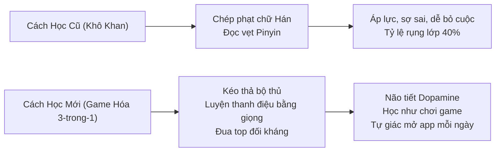

# HỆ THỐNG GAME HÓA & CÁCH HỌC TIẾNG TRUNG ĐỘT PHÁ: MÔ HÌNH "3-TRONG-1"
## *Dùng Để Dạy Trên Lớp – Tạo Content Viral Mạng Xã Hội – Thu Hút Lead Tuyển Sinh 0 Đồng*

---

> **Mục tiêu tài liệu:** Cung cấp 6 ý tưởng Game / Mini-App và Phương pháp học tiếng Trung "gây nghiện" nhất, giải quyết đồng thời 3 bài toán lớn của Chủ trung tâm:
> 1. **Dạy trên lớp:** Học sinh hào hứng, không ngủ gật, xóa bỏ nỗi sợ chữ Hán khô khan.
> 2. **Tạo Content:** Sản xuất video TikTok/Reels/Shorts hài hước, thị giác cao, dễ lên xu hướng mà không tốn chi phí diễn viên/quay dựng.
> 3. **Hút Lead Tuyển sinh:** Người xem tương tác mini-game, để lại Số điện thoại/Zalo để nhận quà và học bổng.

---

## MỤC LỤC
1. [Triết Lý Sư Phạm Game Hóa: Vì Sao Game Giúp Bẻ Gãy Rào Cản Chữ Hán?](#1-triết-lý-sư-phạm-game-hóa-vì-sao-game-giúp-bẻ-gãy-rào-cản-chữ-hán)
2. [Chi Tiết 6 Giải Pháp Game / App "3-Trong-1" Đột Phá](#2-chi-tiết-6-giải-pháp-game--app-3-trong-1-đột-phá)
   * 2.1. Game 1: "Thuật Giả Kim Chữ Hán" (Hanzi Alchemy / Ghép Bộ Thủ)
   * 2.2. Game 2: "Flappy Bird Thanh Điệu" (Tone Pitch Bird - Chơi Game Bằng Giọng Nói)
   * 2.3. Game 3: "Ai Là Triệu Phú Hán - Việt" (Sino-Vietnamese Word Match)
   * 2.4. Game 4: "Mắt Thần Soi Nét" (Spot the Impostor Stroke - Bắt Lỗi Chữ Hán Na Ná)
   * 2.5. Game 5: "Đấu Trường Lồng Tiếng Phim" (Drama Dubbing Arena)
   * 2.6. Game 6: "Đấu Trường Đối Kháng Hanzi Battle Royale" (Live Classroom PvP)
3. [Bảng Ma Trận Tích Hợp: 1 Game – 3 Mục Đích](#3-bảng-ma-trận-tích-hợp-1-game--3-mục-đích)
4. [Kịch Bản Demo Thực Chiến Sáng Nay Khi Gặp Chủ Trung Tâm](#4-kịch-bản-demo-thực-chiến-sáng-nay-khi-gặp-chủ-trung-tâm)

---

## 1. TRIẾT LÝ SƯ PHẠM GAME HÓA: VÌ SAO GAME GIÚP BẺ GÃY RÀO CẢN CHỮ HÁN?

Tiếng Trung có 2 nỗi sợ lớn nhất: **Mặt chữ Hán như "vẽ bùa"** và **4 Thanh điệu dễ ngọng**. Nếu dạy theo lối truyền thống (chép phạt 10 lần, đọc đồng thanh), học sinh sẽ rơi vào trạng thái mệt mỏi và bỏ học.

Khi đưa game vào hệ sinh thái Lingopro:
* **Học sinh** có trải nghiệm hào hứng, khoe điểm lên mạng xã hội.
* **Giáo viên** làm chủ lớp học nhẹ nhàng, không cần hò hét nhắc nhở.
* **Trung tâm** có ngay kho tư liệu video thực tế vô tận để kéo khách hàng mới về phễu tuyển sinh.

---

## 2. CHI TIẾT 6 GIẢI PHÁP GAME / APP "3-TRONG-1" ĐỘT PHÁ

### 2.1. Game 1: "Thuật Giả Kim Chữ Hán" (Hanzi Alchemy / Ghép Bộ Thủ)

* **Cơ chế Game:** Lấy cảm hứng từ game "Little Alchemy". Người chơi được cho các bộ thủ nguyên bản, kéo thả 2 bộ vào nhau để ghép thành chữ Hán mới.
  * Nhật (日 - Mặt trời) + Nguyệt (月 - Mặt trăng) = **Minh (明 - Tươi sáng)**.
  * Nữ (女 - Phụ nữ) + Tử (子 - Đứa con) = **Hảo (好 - Tốt đẹp)**.
  * Mộc (木 - Cây) + Mộc (木) = **Lâm (林 - Rừng nhỏ)**; thêm một cây nữa = **Sâm (森 - Rừng rậm)**.
  * Khẩu (口 - Miệng) + Điểu (鸟 - Con chim) = **Minh (鸣 - Chim hót)**.
* **Dùng để dạy trên lớp:** Đầu giờ, giáo viên bật máy chiếu, chia lớp thành 2 đội thi ghép 10 chữ trong 3 phút. Học sinh lập tức hiểu bản chất logic hình tượng của chữ Hán, không còn cảm giác học vẹt.
* **Dùng tạo Content Viral:** Video ngắn TikTok/Reels: Quay màn hình ghép chữ kèm âm thanh biến hình ma thuật: *"Bạn có biết ghép 3 cái cây thì ra chữ gì không?"*. Dạng video này kích thích người xem comment đáp án cực khủng, thuật toán TikTok sẽ đẩy lên xu hướng tự nhiên.
* **Dùng để hút Lead:** Mini-game trên Web-app: *"Thử tài ghép 15 chữ Hán trong 60 giây"*. Chơi xong hiện kết quả: *"Bạn có tư duy hình tượng đạt 95/100, cực kỳ hợp học tiếng Trung!"* $\rightarrow$ Điền SĐT Zalo để nhận Sổ tay giải mã 214 Bộ thủ & Voucher 500k.

---

### 2.2. Game 2: "Flappy Bird Thanh Điệu" (Tone Pitch Bird - Chơi Game Bằng Giọng Nói)

* **Cơ chế Game:** Sử dụng Web Audio API phân tích cao độ giọng nói (Pitch Recognition) theo thang âm 5 bậc Zhao Yuanren:
  * **Thanh 1 (`55` - Cao bằng phẳng):** Người chơi ngân dài âm *ā* ở tông cao để chim bay thẳng qua khe hẹp.
  * **Thanh 2 (`35` - Vút lên):** Phát âm *á* sắc nhọn để chim bay vút lên né chướng ngại vật dưới đất.
  * **Thanh 3 (`214` - Xuống rồi lên):** Phát âm *ǎ* lượn xuống rồi bay lên để ăn đồng xu vàng.
  * **Thanh 4 (`51` - Rơi dứt khoát):** Quát *à!* dứt khoát để chim hạ cánh cắm cờ.
* **Dùng để dạy trên lớp:** Cả lớp cười nghiêng ngả khi từng học viên đứng lên "hét" để điều khiển con chim bay qua màn. Học sinh tự khắc chỉnh được cao độ của thanh 1 và lực rơi của thanh 4 mà không cần giáo viên nhắc mỏi miệng.
* **Dùng tạo Content Viral:** Clip quay học sinh hoặc giáo viên đang chơi game với biểu cảm hài hước, cố gắng hét thanh 4 để chim không đâm vào ống cống. Loại content này luôn đạt hàng triệu view trên Douyin và TikTok vì tính độc lạ và giải trí cao.
* **Dùng để hút Lead:** Treo thử thách trên Landing Page: *"Vượt qua 5 chướng ngại vật bằng giọng nói của bạn"*. Khách hàng chơi thử thấy vui và nhận ra mình phát âm thanh 4 hay bị rớt $\rightarrow$ Đăng ký nhận buổi chỉnh âm 1-1 miễn phí tại trung tâm.

---

### 2.3. Game 3: "Ai Là Triệu Phú Hán - Việt" (Sino-Vietnamese Word Match)

* **Cơ chế Game:** Trắc nghiệm đối chiếu từ vựng tiếng Trung hiện đại với kho tàng âm Hán - Việt của người Việt:
  * Từ 银行 (*Yín háng*) $\rightarrow$ Ngân hàng.
  * Từ 态度 (*Tài dù*) $\rightarrow$ Thái độ.
  * Từ 结婚 (*Jié hūn*) $\rightarrow$ Kết hôn.
  * Gài thêm các câu "bẫy" hài hước: 东西 (*Dōng xī*) $\rightarrow$ Nghĩa là Đồ đạc (chứ không phải Đông Tây); 方便 (*Fāng biàn*) $\rightarrow$ Thuận tiện (chứ không phải Phương tiện).
* **Dùng để dạy trên lớp:** Dùng làm trò khởi động (Warm-up). Giúp học viên nhận ra: *"Hóa ra mình đã biết sẵn 70% từ vựng tiếng Trung mà không hề hay biết!"* $\rightarrow$ Đập tan hoàn toàn nỗi sợ học ngoại ngữ mới.
* **Dùng tạo Content Viral:** Series video ngắn: *"Đố người qua đường đoán nghĩa tiếng Trung qua âm Hán Việt"*. Người xem liên tục dừng lại xem và tự đoán trong đầu $\rightarrow$ Giữ chân người xem (Retention rate) của video đạt trên 60%, giúp kênh tăng follower chóng mặt.
* **Dùng để hút Lead:** Bài Test trắc nghiệm 8 câu: *"Đo mức độ nhạy bén âm Hán - Việt của bạn"*. Cuối bài thông báo: *"Bạn đã nắm sẵn 1.500 từ vựng tiềm ẩn, chỉ cần 2 tháng là giao tiếp trôi chảy!"* $\rightarrow$ Kêu gọi để lại số Zalo để nhận Lộ trình kích hoạt vốn từ Hán Việt.

---

### 2.4. Game 4: "Mắt Thần Soi Nét" (Spot the Impostor Stroke - Bắt Chữ Hán Na Ná)

* **Cơ chế Game:** Lấy cảm hứng từ game "Tìm điểm khác biệt". Màn hình hiển thị 4 chữ Hán nhìn gần như giống hệt nhau, người chơi phải tìm ra chữ bị sai nét hoặc tìm chữ đúng theo yêu cầu trong 5 giây:
  * Đại (大) vs Thái (太 - thêm dấu chấm dưới) vs Khuyển (犬 - thêm dấu chấm trên đầu).
  * Thiên (天 - nét trên dài hơn) vs Phu (夫 - nét sổ đâm thẳng lên trên).
  * Vương (王) vs Ngọc (玉 - thêm hạt ngọc).
  * Thổ (土 - nét dưới dài) vs Sĩ (士 - nét trên dài).
  * Ô (乌 - Đen/Quạ) vs Điểu (鸟 - Con chim có thêm con mắt).
* **Dùng để dạy trên lớp:** Rèn luyện phản xạ thị giác cực mạnh, giúp học viên không bao giờ viết sai chính tả hay nhầm lẫn các nét chấm/phẩy hiểm hóc.
* **Dùng tạo Content Viral:** Ảnh Carousel đa khung hình trên Facebook/Instagram hoặc Video ngắn: *"99% người mới học tiếng Trung nhìn không ra điểm khác biệt giữa 3 chữ này!"*. Bài post kích thích hàng nghìn bình luận tranh cãi và chia sẻ về trang cá nhân.
* **Dùng để hút Lead:** Mini-game *"Thử thách Mắt thần 30 giây"* trên app $\rightarrow$ Đạt điểm tuyệt đối được tặng Sổ tay mẹo phân biệt 100 cặp chữ Hán song sinh tại trung tâm.

---

### 2.5. Game 5: "Đấu Trường Lồng Tiếng Phim" (Drama Dubbing Arena)

* **Cơ chế Game:** Tích hợp trích đoạn ngắn 15 - 30 giây từ các bộ phim kinh điển (Tây Du Ký, Hoàn Châu Cách Cách, phim ngôn tình Douyin, bài hát hot trend).
  * Lời thoại gốc được tắt đi, hiển thị phụ đề Pinyin và chữ Hán chạy karaoke.
  * Học viên bấm mic đọc lồng tiếng cho nhân vật.
  * Hệ thống tự động ghép giọng nói của học viên vào phim kèm nhạc nền và xuất ra video hoàn chỉnh.
* **Dùng để dạy trên lớp:** Làm bài tập thuyết trình hoặc hoạt động nhóm cuối tuần. Học sinh nhập vai nhân vật (Tôn Ngộ Không, Tiểu Yến Tử, Tổng tài), rèn luyện phản xạ ngữ điệu cảm xúc tự nhiên như người bản xứ.
* **Dùng tạo Content Viral:** Học viên tự hào tải video lồng tiếng có giọng của chính mình đăng lên trang cá nhân hoặc TikTok gắn hashtag của Trung tâm $\rightarrow$ Tạo hiệu ứng lan tỏa (UGC - User Generated Content) hoàn toàn miễn phí.
* **Dùng để hút Lead:** Tổ chức cuộc thi online: *"Thử tài lồng tiếng phim Trung nhận học bổng toàn phần"*. Thí sinh tham gia phải tải app hoặc vào web của trung tâm để thu âm $\rightarrow$ Thu thập hàng nghìn data học sinh, sinh viên yêu thích văn hóa Trung Quốc.

---

### 2.6. Game 6: "Đấu Trường Đối Kháng Hanzi Battle Royale" (Live Classroom PvP)

* **Cơ chế Game:** Mô hình tương tự Kahoot nhưng được nâng cấp đồ họa chiến đấu kiểu game RPG:
  * Giáo viên bật màn hình chính trên máy chiếu trong lớp học (hoặc qua Zoom).
  * Toàn bộ học sinh dùng điện thoại cá nhân quét mã QR để vào phòng đấu.
  * Màn hình hiện câu đố từ vựng/ngữ pháp HSK. Học sinh trả lời đúng và nhanh sẽ "tung chưởng" trừ điểm thanh máu của đối thủ hoặc quái vật chung của cả lớp.
  * Bảng xếp hạng Live Leaderboard nhảy điểm theo từng mili-giây, có âm thanh reo hò, hiệu ứng rung màn hình cực kỳ kích thích.
* **Dùng để dạy trên lớp:** Cứ 15 phút cuối buổi học tổ chức 1 trận đấu để kiểm tra kiến thức của buổi. Học sinh không còn cảm giác bị "kiểm tra bài cũ" mà như đang tham gia trận đấu eSports.
* **Dùng tạo Content Viral:** Quay lại khoảnh khắc học sinh trong lớp hò reo, đập bàn phấn khích khi leo top 1 bảng xếp hạng $\rightarrow$ Đăng lên Fanpage với caption: *"Đi học tiếng Trung mà tưởng đi đánh giải game"* $\rightarrow$ Tạo hình ảnh trung tâm trẻ trung, hiện đại, thu hút học sinh Gen Z.
* **Dùng để hút Lead:** Tổ chức giải đấu online hàng tuần *"Đấu trường Hán ngữ Open Cup"* vào tối Chủ Nhật dành cho cả người ngoài trung tâm $\rightarrow$ Hút 200 - 500 người tham gia mỗi tuần để lọc ra tệp khách hàng tiềm năng nóng nhất.

---

## 3. BẢNG MA TRẬN TÍCH HỢP: 1 GAME – 3 MỤC ĐÍCH

| Game / Tính năng | Ứng dụng khi DẠY TRÊN LỚP | Ứng dụng LÀM CONTENT MẠNG XÃ HỘI | Ứng dụng HÚT LEAD TUYỂN SINH |
|---|---|---|---|
| **1. Thuật Giả Kim (Ghép bộ)** | Khởi động bài mới, hiểu bản chất chiết tự | Video ngắn biến hình bộ thủ lên xu hướng | Mini-game test tư duy hình tượng, tặng cẩm nang |
| **2. Flappy Bird Thanh Điệu** | Luyện phát âm vui nhộn, chỉnh cao độ | Video học sinh hét chơi game triệu view | Test phát âm bằng giọng nói, tặng buổi sửa âm 1-1 |
| **3. Ai Là Triệu Phú Hán-Việt** | Kích hoạt sự tự tin, giải mã từ vựng nhanh | Video đố người qua đường đoán nghĩa | Trắc nghiệm đo vốn từ tiềm ẩn, chốt khóa học |
| **4. Mắt Thần Soi Nét** | Luyện mắt tinh, không viết sai nét chữ | Ảnh Carousel đố vui kích thích tương tác | Mini-game đổi quà tặng hiện vật tại cơ sở |
| **5. Đấu Trường Lồng Tiếng** | Luyện ngữ điệu thực tế, phản xạ giao tiếp | Clip học viên lồng tiếng phim viral tự nhiên | Cuộc thi lồng tiếng online thu thập data |
| **6. Hanzi Battle Royale** | Ôn tập cuối giờ, kích thích thi đua trong lớp | Video không khí lớp học hào hứng Gen Z | Giải đấu online hàng tuần hút data sinh viên |

---

## 4. KỊCH BẢN DEMO THỰC CHIẾN SÁNG NAY KHI GẶP CHỦ TRUNG TÂM

Để chủ trung tâm "mắt sáng rực" và thấy ngay tương lai tuyển sinh bùng nổ, hãy mang theo điện thoại/laptop và thực hiện **quy trình demo 3 phút** này:

### Bước 1: Cho chủ trung tâm trải nghiệm trực tiếp
> *"Thầy/Cô ơi, trước giờ ai cũng nghĩ học chữ Hán là phải ngồi chép tay mỏi rã rời. Thầy/Cô mở điện thoại thử lướt qua cái này với em 30 giây:
> Em đố Thầy/Cô chữ 日 (Mặt trời) ghép với chữ 月 (Mặt trăng) thì ra chữ gì? $\rightarrow$ Kéo vào nhau hiện ra chữ 明 (Tươi sáng) kèm hiệu ứng âm thanh ăn mừng.
> Thầy/Cô thấy không? Học sinh vừa nhìn là hiểu ngay nguyên lý chiết tự trong 3 giây mà không cần giải thích dài dòng."*

### Bước 2: Liên kết sang bài toán Content Tuyển Sinh (Viral Hook)
> *"Thầy/Cô thử tưởng tượng: Nếu trung tâm mình quay clip ngắn một bạn học sinh đứng chơi game hét 'Thanh 4' để điều khiển con chim né chướng ngại vật, hoặc clip đố người qua đường đoán chữ Hán qua âm Hán Việt... Video này đăng lên TikTok/Reels thì học sinh Gen Z có share điên đảo không ạ? 
> Mình không cần tốn tiền thuê diễn viên, chính các trò chơi này là mỏ vàng content tự nhiên để kênh của trung tâm lên hàng trăm nghìn follow."*

### Bước 3: Khóa lại bằng bài toán Hút Lead (Conversion)
> *"Và quan trọng nhất: Ở cuối mỗi video, mình chỉ cần kêu gọi: 'Bấm vào link bio để chơi thử game và nhận học bổng 500k của Trung tâm'.
> Khách hàng vào chơi, để lại số Zalo để lưu điểm nhận quà. Đội tư vấn của trung tâm chỉ việc gọi điện dựa trên điểm số game của khách hàng để chốt vào lớp.
> **Đây chính là cỗ máy vừa giúp giáo viên dạy nhàn, vừa giúp trung tâm giải quyết triệt để bài toán thiếu lead tuyển sinh!**"*

---

> **Tài liệu xây dựng bởi Đội ngũ Chiến lược Lingopro**  
> **Hotline / Zalo hỗ trợ kỹ thuật:** `0949 317 036` (Mr Phong)
