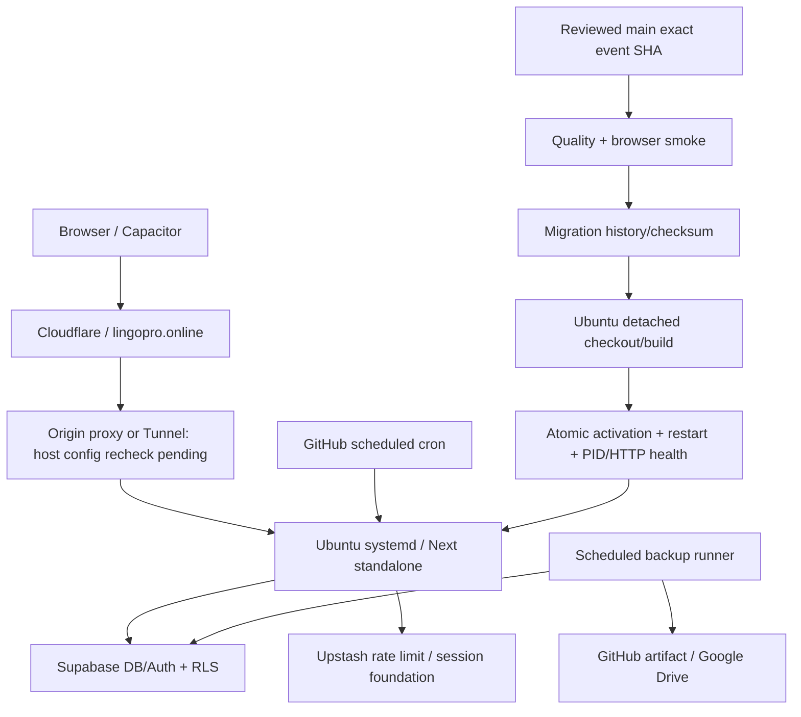

> Áp dụng khi vận hành LingoPro. Mục đích: kiến trúc từ active workflow/config và evidence hiện có.

# Production architecture

| Thành phần | Hiện tại / bằng chứng |
|---|---|
| Public URL | `https://lingopro.online`; Cloudflare edge đã thấy ở probes; origin Tunnel/proxy config cần read-only host check khi Tailscale hoạt động |
| Host/runtime | Ubuntu, systemd `lingopro.service`, Node/Next standalone; canonical run `36749311479` PASS tại main `905d9bbb` |
| Directories | `$HOME/Vocab-build` checkout/build exact SHA; `$HOME/Vocab` live bundle/env; `.next/.release-commit` là runtime marker, live checkout HEAD không phải release identity |
| Management | Tailscale + SSH; `100.104.5.79`; operator đã bật lại, read-only preflight restored, service/config/Redis PING PASS |
| Database/auth | Supabase PostgreSQL + RLS/Auth; PR #20 đã merge tại `44ad7c92`, canonical cutover `36784213532` đang chạy; browser smoke còn pending |
| Rate limit / session foundation | Upstash Redis REST; quota atomic Lua; encrypted opaque session vault Stage A; cutover giữ user JWT trên server và user-context RLS BFF |
| Background | GitHub `push-cron.yml` gọi cron API với credential riêng; Firebase Cloud Messaging, Gemini multi-key server logic; root cron/timer inventory theo checkpoint, không suy ra từ code |
| Payments | SePay webhook dedicated billing secret + server verification/idempotency; không dùng cron secret chung |
| Mobile | `capacitor.config.ts`: Android/iOS WebView `https://lingopro.online`, cleartext=false; build workflow riêng, không một backend mobile độc lập |
| Backup | `db-backup.yml`: pg_dump SQL/gzip → artifact 30 ngày + Drive OAuth/rclone; SHA-256 sidecar/optional age xem backup runbook |

Deploy chỉ `deploy-server.yml`: main → quality → migrations → exact-SHA build → activation → restart → health → independent release marker verification. Failure dừng; không manual SSH deploy/PM2/git pull. Health `/api/health` chỉ HTTP/process, chưa chứng minh DB/login/payment.

## Historical / unverified

PC server, Vercel, PM2/Hetzner/Caddy/Docker Compose hướng dẫn/script cũ là **LEGACY / NON-CANONICAL**; user xác nhận không dùng Vercel. Không xóa legacy infra chỉ vì tồn tại trong repo. Cloudflare Tunnel có historical evidence nhưng current origin config chưa kiểm tra được trong lượt này; không khẳng định tunnel đang active.

Rollback mock safety tests đã PASS; không có live fault-injection rollback proof. `.next-previous.*` retention/cleanup và auth C02 live login/navigation/logout/persistence còn pending. Không hủy production preflight gates để đi tiếp các phase độc lập.
