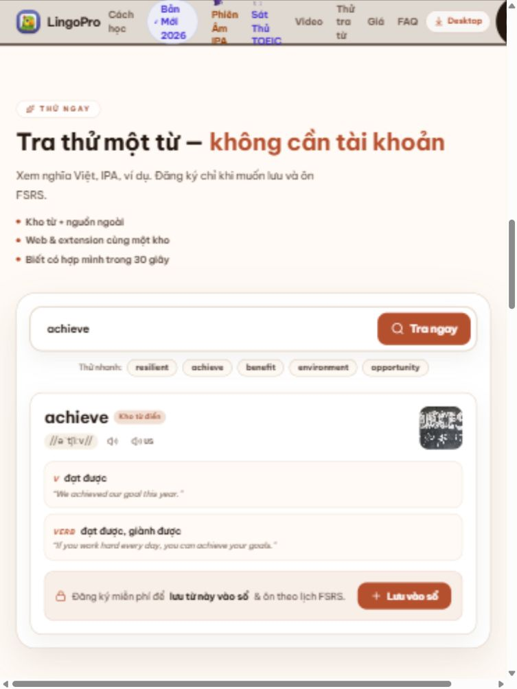
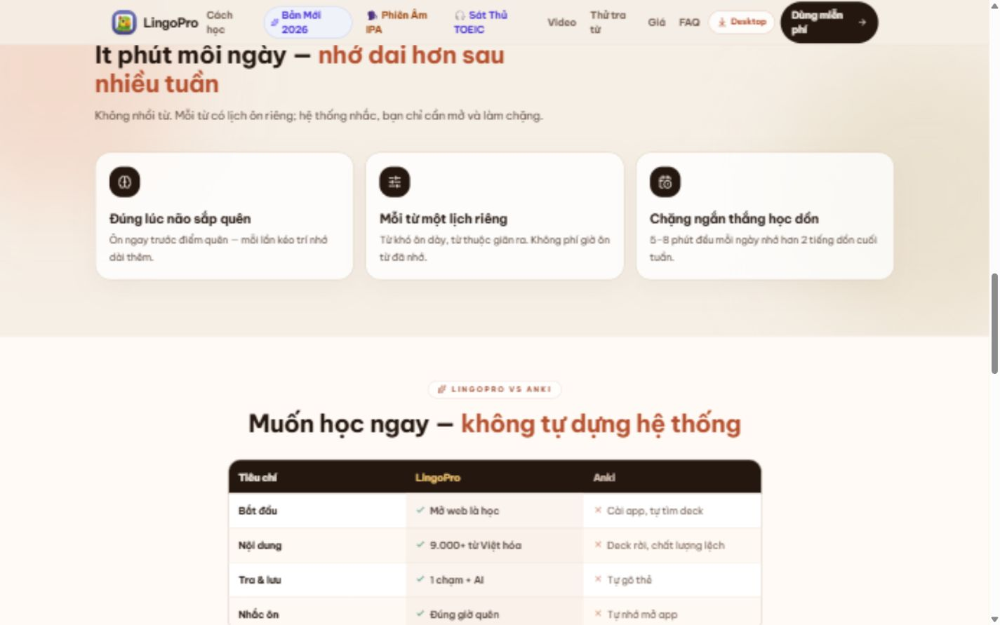
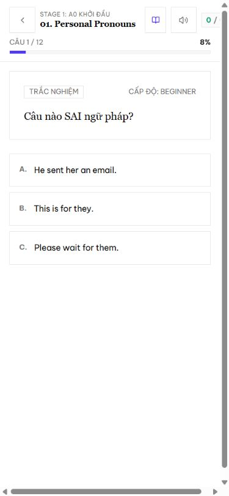

# Teamwork preview — LingoPro — 08/10/2026

Đánh giá production `https://lingopro.online/` và luồng học ngữ pháp công khai. Bốn vai AI: UI/UX, giáo viên kiêm SEO, học sinh mô phỏng, tester. Không phải khảo sát người dùng thật. Chỉ tạo báo cáo và ảnh; không sửa ứng dụng hoặc deploy.

## Quyết định đề xuất

**Ưu tiên sửa lỗi hiển thị và điều hướng; sau đó đưa trải nghiệm học lên trước phần giới thiệu.** Trang dài chưa đủ để kết luận gây hoang mang; bằng chứng đáng chú ý là ý lặp, nhiều lựa chọn ngang hàng và việc người mới chưa tìm được bài học công khai từ CTA trang chủ.

| Vai | Kết luận |
|---|---|
| UI | Home có hero + 8 H2; mobile mất menu, tablet menu quá chật. Đưa tra thử vào hero và gom còn 5 khối. |
| Giáo viên/SEO | Lặp tra/lưu/ôn, thời lượng, miễn phí. Rút nhãn phụ; giữ ví dụ, nghĩa, giới hạn Free. Đổi “đúng lúc quên” thành “ôn theo lịch cá nhân”. |
| Học sinh mô phỏng | Luyện tập từng câu dễ theo. Bài lý thuyết đầu có 5 tab, 7 thẻ/28 ví dụ, 5 accordion; chưa rõ phần tối thiểu phải học. |
| Tester | Có lỗi kích thước nhỏ và thao tác bàn phím modal. Kết quả chi tiết ở báo cáo kiểm thử riêng. |

## Hai phương án bố cục

| | A — Tra thử ngay, khuyến nghị | B — Chọn mục tiêu học |
|---|---|---|
| Desktop | Hero trái, tra từ thật phải. Dưới: cách dùng, bằng chứng, giá, FAQ. | Bộ chọn mục tiêu trái, bài học đề xuất phải. Dưới: cách dùng, bằng chứng, giá, FAQ. |
| Mobile | Tiêu đề → một câu → input + 3 từ mẫu → kết quả + CTA lưu. Video mở tùy chọn. | 3 mục tiêu → một bài đề xuất → CTA học thử. Nội dung nâng cao mở thêm. |
| Ưu điểm | Tận dụng chức năng đang công khai; bước đầu rõ. | Phù hợp người muốn ngữ pháp/thi/giao tiếp. |
| Điều kiện | Sửa form, ảnh và vùng chạm trước. | Có bài thử công khai thật và đường vào rõ; không đưa CTA học thử tới đăng nhập. |

Trang học: **Hiểu một điểm → xem hai ví dụ → làm ba câu**. Tra cứu đầy đủ, video và quy tắc sâu mở trong “Xem thêm”. Giữ accordion đóng mặc định.

## Lỗi live điều phối tái hiện

| Mức | Điều kiện / bằng chứng | Hành động đề xuất |
|---|---|---|
| P1 | Home 360×800: viewport360, clientWidth345, scrollWidth371; vùng demo rộng355.2px, mép phải369.6px. Screenshot có thanh cuộn ngang. Input tự giữ236px. | `min-w-0` cho input và grid item, nút không co; kiểm tra lại cả trạng thái kết quả. Nguồn `src/app/_components/DictionaryDemo.tsx:114`, `src/app/page.tsx:500`. |
| P1 | Home 768×1024: clientWidth753, scrollWidth827; CTA header mép phải825.6px, chữ menu cao tới80px trong header64px. | Menu gọn dưới1024px; desktop giữ 3 link chính. Nguồn `src/app/page.tsx:253`, `:266`. |
| P1 | Modal ngữ pháp: tester xác nhận Escape không đóng, focus có thể đi tới nền. | Dùng dialog có focus trap, Escape và trả focus khi đóng. Chi tiết và bước tái hiện trong báo cáo tester. |
| P1 | Grammar practice390×844 lúc vào câu1: client375px, scrollWidth391px; cụm điểm bị cắt và có thanh cuộn ngang. | Co header, title `min-w-0`, điểm có nhãn và xuống dòng khi cần; kiểm tra có/không scrollbar. Câu2 có trạng thái vừa màn390px, không suy rộng mọi câu. |
| P1 | Học sinh mô phỏng gặp lời mời cài app che CTA chuyển sang luyện trên desktop. | Hoãn lời mời tới sau bài đầu hoặc không phủ CTA trong modal. Tái hiện theo trạng thái popup, không khẳng định luôn xảy ra. |
| P2 | 390px: chip mẫu cao25.59px; loa28px; nút search icon không có accessible name khi chữ bị ẩn. | Mở vùng chạm tới44px, thêm `aria-label="Tra từ"`. |
| P2 | `resilient`: ảnh đã tải xong nhưng naturalWidth0, không có fallback hữu ích. `benefit`: nghĩa lợi ích/có lợi, ảnh son mỹ phẩm. | Fallback ảnh hỏng; chọn theo từ + nghĩa + ngữ cảnh. Brand Benefit là suy luận, không phải nguyên nhân đã chứng minh. |
| P2 | Học sinh thấy `1 / 0`, `2 / 0` không nhãn; nhiều tab và bảng tra cứu rộng trên mobile. | Đổi `Đúng 2 · Sai 0`; ưu tiên bài học/luyện tập, bảng đầy đủ mở thêm. |
| P3 | Intro modal lộ `**...**`, `*...*`. | Định dạng hoặc bỏ ký hiệu Markdown ở phần tóm tắt. |

## Ma trận kiểm tra home

| Kiểm tra | Kết quả | Giới hạn |
|---|---|---|
| Desktop1440×900 | Không overflow: client/scroll1425px; chiều cao đầu5057px | Một trang/state quan sát; chiều cao tăng khi có kết quả demo. |
| Mobile390×844 | Home không overflow ngang: scroll375px | Vùng chạm nhỏ; không có menu thay thế. |
| Mobile360×800 | FAIL: scroll371px > client345px | Tái hiện sau kết quả tra từ. |
| Tablet768×1024 | FAIL: scroll827px > client753px | Header cắt CTA, menu xuống nhiều dòng. |
| Anchor video/tra thử/FAQ | Điều hướng tới đúng fragment | Chưa chứng nhận mọi anchor không bị sticky header che. |
| Video | PASS tải và phát sau khi tới vùng video: cả hai readyState4, error=null, paused=false | Trạng thái đầu “Unable to play media” là trước lazy loading; không kết luận video hỏng. Không nghe âm thanh bằng tai. |
| Từ mẫu resilient/benefit | PASS trả nghĩa và ví dụ | Ảnh gặp lỗi/không sát nghĩa như trên. |
| Nhập achieve + Enter | PASS trả kết quả achieve | Chưa test mọi query/nguồn ngoài. |
| Loa UK | Click thực hiện được | Không chứng nhận phát âm nghe đúng. |
| FAQ Free mobile | PASS mở đáp án và trạng thái expanded | Dùng summary; selector role button của DOM runtime không khớp, đây không phải lỗi nút. |
| Console home | Không ghi nhận warn/error trong lượt đã bắt | Không thay cho giám sát toàn production. |

## Kiểm tra mã local

- `npm run type-check`: PASS, exit0.
- `npx tsx tests/grammar/test-unified-grammar-roadmap.ts`: 42/42 PASS, exit0. Chủ yếu contract/schema/logic, không chứng minh responsive hoặc accessibility của production.
- ESLint `src/app/page.tsx`, `src/app/_components/DictionaryDemo.tsx`, `src/app/grammar/page.tsx`: exit0, 0 lỗi, 3 cảnh báo hiện có tại grammar (unused Info; hai setState trong effect).
- Không chạy production build vì không thay đổi ứng dụng. Local và production không được chứng minh cùng commit; source được dùng để khoanh vị trí cần sửa.

## Tester: luồng học ngữ pháp live

Tester dùng viewport390×844 và1440×900: lọc A0 còn6 bài; mở/đóng bằng X; chuyển tới luyện; chọn sai nhận giải thích; tiếp tục câu sau; chọn đúng; mở bảng tra, đổi thẻ/bảng và đóng; desktop điền `me` + Enter; quay lại danh mục; search không có kết quả rồi khôi phục. Các thao tác này PASS trong phạm vi mẫu.

FAIL: modal không có role dialog, focus còn ở nền sau khi mở; Escape không đóng trên cả hai kích thước; Shift+Tab từ X đi ra nền; header câu1 mobile tràn; Markdown lộ trong tóm tắt. Không tái hiện lỗi âm thanh; chưa kiểm chứng chất lượng nghe.

Console lượt grammar: một cảnh báo cấu hình FCM thiếu một phần, không có error đã bắt. Không đổi cấu hình hoặc xin quyền thông báo. Xem báo cáo tester để đọc bước tái hiện, ảnh và giới hạn.

## Báo cáo từng vai

- [UI/UX](teamwork-preview-2026-10-08-ui.md)
- [Giáo viên/SEO và bảng từ thừa](teamwork-preview-2026-10-08-copy.md)
- [Học sinh mô phỏng](teamwork-preview-2026-10-08-student.md)
- [Tester](teamwork-preview-2026-10-08-test.md)

## Ảnh live

Mobile360px: form/kết quả vượt chiều rộng, thanh cuộn ngang.

Tablet768px: CTA bên phải bị cắt, menu vượt chiều cao header.

Desktop1440px: kết quả tra từ và header.

Bài tập ngữ pháp mobile390px: header điểm bị cắt khi có scrollbar dọc.

## Chưa kiểm chứng

Thiết bị điện thoại thật, Safari, phiên đăng nhập/tài khoản, mọi bài trong62 chủ điểm, checkout, thông báo push, chất lượng âm thanh và conversion. Không có điểm tải nhận thức định lượng từ nghiên cứu người dùng thật.
