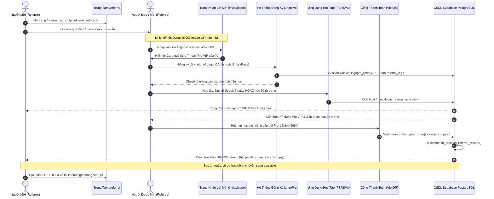
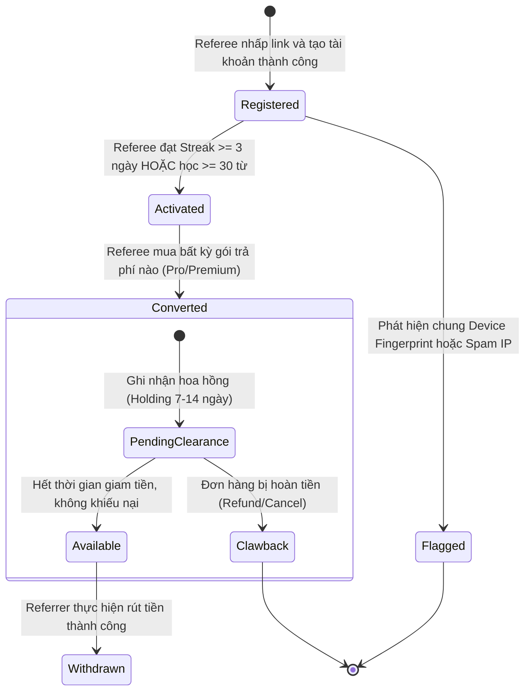

# 04. THIẾT KẾ TRẢI NGHIỆM NGƯỜI DÙNG & GIAO DIỆN (R4)
## (UX/UI Journey, State Diagrams, Wireframes & Gamification Architecture)
### Dự án: Hệ Thống Giới Thiệu & Tiếp Thị Liên Kết (Referral & Affiliate Program) — LingoPro
**Ngày ban hành:** 18/09/2026  
**Phiên bản:** 1.0.0  
**Tác giả:** Worker 1 — Technical & Business Specification Lead  
**Vị trí tài liệu:** `docs/proposals/referral-system/04_UX_UI_FLOW.md`

---

## 1. Hành Trình Người Dùng Toàn Diện (End-to-End User Journey)

Hệ thống kết nối mượt mà trải nghiệm giữa **Người Mời (Referrer)** và **Người Được Mời (Referee)** qua chuỗi tương tác đa điểm chạm:



---

## 2. Biểu Đồ Trạng Thái Quan Hệ Giới Thiệu (Referral State Machine)

Một bản ghi trong bảng `referral_logs` và `reward_transactions` sẽ trải qua các trạng thái tuần tự sau:



---

## 3. Bản Vẽ Wireframe Chi Tiết (Technical Minimalist UI Wireframes)

Thiết kế tuân thủ 100% ngôn ngữ thiết kế của LingoPro: bo góc nhẹ dứt khoát `rounded-md` (tối đa 6px), icon nét thanh mảnh `lucide-react`, màu chủ đạo Indigo phối Amber cho điểm thưởng.

### 3.1. Giao Diện Trung Tâm Giới Thiệu (`src/app/referral/page.tsx`)

```
+-----------------------------------------------------------------------------------------------+
| LingoPro  [ Học & Lộ trình ]  [ Kỹ năng ]  [ Khảo thí ]   🔥 12   ⭐ 1,450   [ Avatar Phong ] |
+-----------------------------------------------------------------------------------------------+
|                                                                                               |
|  🎁 CHƯƠNG TRÌNH ĐẠI SỨ LINGOPRO                                                              |
|  Mời bạn bè cùng bứt phá tiếng Anh — Cả hai cùng nhận quà VIP                                 |
|                                                                                               |
|  +-----------------------------------------------------------------------------------------+  |
|  | KHUNG CHIA SẺ NHANH (SHARE WIDGET)                                                      |  |
|  | Mã của bạn:   [ PHONGVIP88 ] [ Sao chép mã ]                                            |  |
|  | Link mời:     [ https://lingopro.online/invite/PHONGVIP88 ] [ Sao chép link ] [ QR Code]|  |
|  | Chia sẻ ngay: [ 💬 Zalo ]  [ 📘 Facebook ]  [ ✈️ Telegram ]  [ ✉️ Email ]                |  |
|  +-----------------------------------------------------------------------------------------+  |
|                                                                                               |
|  4 THỐNG KÊ THEN CHỐT (METRICS CARDS)                                                         |
|  +--------------------+ +--------------------+ +--------------------+ +--------------------+  |
|  | 👥 BẠN BÈ ĐÃ MỜI   | | ⚡ ĐÃ KÍCH HOẠT    | | 🎁 NGÀY PRO ĐÃ NHẬN| | 💰 HOA HỒNG KHẢ DỤNG|  |
|  |      14 bạn        | |      9 bạn         | |     +63 Ngày Pro   | |     269.550 VNĐ     |  |
|  | (+2 tuần này)      | | (Đạt mốc học tập)  | | (Hạn đến 11/2026)  | | [ Yêu cầu rút tiền]|  |
|  +--------------------+ +--------------------+ +--------------------+ +--------------------+  |
|                                                                                               |
|  +-----------------------------------------------------------------------------------------+  |
|  | TIẾN ĐỘ THĂNG HẠNG ĐẠI SỨ (GAMIFICATION MILESTONE)                                      |  |
|  | Cấp bậc hiện tại: 🥈 ĐẠI SỨ BẠC (SILVER)                                                |  |
|  | Tiến trình: [████████████████████░░░░░░░░░░░░░░░░░░░░] 9/10 bạn                          |  |
|  | Chỉ cần thêm 1 bạn kích hoạt để thăng hạng 🥇 GOLD: Thưởng nóng 200.000đ + Hoa hồng 20%!   |  |
|  +-----------------------------------------------------------------------------------------+  |
|                                                                                               |
|  DANH SÁCH BẠN BÈ ĐÃ MỜI (REAL-TIME REFERRAL LOGS)                                            |
|  [ Tab: Danh sách bạn bè (14) ]    [ Tab: Lịch sử hoa hồng & Rút tiền (3) ]                   |
|  +---------------------+-------------------+-------------------+--------------------+------+  |
|  | HỌ TÊN BẠN BÈ       | NGÀY THAM GIA     | TIẾN ĐỘ HỌC TẬP   | TRẠNG THÁI THƯỞNG  | GÓI  |  |
|  +---------------------+-------------------+-------------------+--------------------+------+  |
|  | Nguyễn Minh Anh     | 16/09/2026        | 42 từ · Streak 4d | [ Đã nhận +7d Pro ]| Pro1Y|  |
|  | Trần Hải Đăng       | 15/09/2026        | 18 từ · Streak 2d | [ Đang học thử... ]| --   |  |
|  | Lê Hoàng Nam        | 14/09/2026        | 65 từ · Streak 5d | [ Đã nhận +7d Pro ]| Prem |  |
|  | Vũ Thảo Ly          | 12/09/2026        | 5 từ · Streak 1d  | [ Đang học thử... ]| --   |  |
|  +---------------------+-------------------+-------------------+--------------------+------+  |
|                                                                                               |
+-----------------------------------------------------------------------------------------------+
```

---

### 3.2. Giao Diện Tiếp Nhận Lời Mời (`src/app/invite/[code]/page.tsx`)

Trang đích dành cho người được mời khi nhấp vào liên kết chia sẻ từ mạng xã hội:

```
+-----------------------------------------------------------------------------------------------+
|                                          LingoPro                                             |
+-----------------------------------------------------------------------------------------------+
|                                                                                               |
|                    🎁 BẠN NHẬN ĐƯỢC MÓN QUÀ HỌC TIẾNG ANH ĐẶC BIỆT!                           |
|                                                                                               |
|         [ Avatar Tròn ]  Nguyễn Phong (taphong2002@gmail.com) đã tặng bạn:                    |
|                        ⭐ 7 NGÀY HỌC PRO VIP MIỄN PHÍ TẠI LINGOPRO ⭐                         |
|                                                                                               |
|  +-----------------------------------------------------------------------------------------+  |
|  | ĐẶC QUYỀN MỞ KHÓA NGAY KHI HOÀN THÀNH BÀI HỌC ĐẦU TIÊN:                                 |  |
|  | ✓ Tra từ AI phân tích ngữ cảnh không giới hạn (Gemini 2.5 Flash).                       |  |
|  | ✓ Ôn tập thông minh chống quên với thuật toán khoa học FSRS v5.                        |  |
|  | ✓ Luyện nghe 200+ Video đời sống thực tế kèm phụ đề song ngữ đồng bộ.                  |  |
|  | ✓ Phòng thi thử TOEIC ETS 990 & VSTEP chuẩn định dạng khảo thí máy tính.                |  |
|  +-----------------------------------------------------------------------------------------+  |
|                                                                                               |
|  ĐĂNG KÝ NHANH TRONG 10 GIÂY ĐỂ NHẬN QUÀ:                                                     |
|                                                                                               |
|  +-----------------------------------------------------------------------------------------+  |
|  |  [ 🌐 Đăng ký tức thì bằng Google (Tự động áp dụng mã: PHONGVIP88) ]                    |  |
|  +-----------------------------------------------------------------------------------------+  |
|                                         --- HOẶC ---                                          |
|  Họ và tên:    [ Nhập họ tên của bạn...                               ]                       |
|  Email:        [ email@example.com                                    ]                       |
|  Mật khẩu:     [ •••••••••••••                                        ]                       |
|  Mã ưu đãi:    [ PHONGVIP88                                           ] (Đã khóa mã)          |
|                                                                                               |
|  +-----------------------------------------------------------------------------------------+  |
|  |  [ NHẬN 7 NGÀY PRO VIP & BẮT ĐẦU HỌC NGAY ]                                             |  |
|  +-----------------------------------------------------------------------------------------+  |
|                                                                                               |
|  Cam kết 100% miễn phí · Không yêu cầu thẻ ngân hàng · Hơn 15,000 học viên tin dùng           |
+-----------------------------------------------------------------------------------------------+
```

---

### 3.3. Hộp Thoại Yêu Cầu Rút Tiền (`PayoutRequestModal`)

Khi học viên bấm nút `[ Yêu cầu rút tiền ]` trên Dashboard:

```
+------------------------------------------------------------------+
| YÊU CẦU RÚT TIỀN HOA HỒNG (VIETQR AUTO-PAYOUT)               [X] |
+------------------------------------------------------------------+
| Số dư khả dụng hiện tại: 269.550 VNĐ                             |
|                                                                  |
| Số tiền muốn rút:                                                |
| [ 200.000 VNĐ                                                  ] |
| (Tối thiểu 100.000đ · Tối đa 2.000.000đ/ngày)                    |
|                                                                  |
| Ngân hàng thụ hưởng:                                             |
| [ MB Bank (Ngân hàng Quân Đội)                                ▼] |
|                                                                  |
| Số tài khoản ngân hàng:                                          |
| [ 0369888999                                                   ] |
|                                                                  |
| Tên chủ tài khoản (Viết hoa không dấu):                          |
| [ NGUYEN HOANG PHONG                                           ] |
|                                                                  |
| Lưu ý:                                                           |
| • Tên tài khoản ngân hàng phải khớp với tên trong hồ sơ cá nhân. |
| • Tiền sẽ được chuyển qua cổng VietQR 24/7 trong 2h làm việc.    |
|                                                                  |
| [ Hủy bỏ ]                                [ Xác nhận rút tiền ]  |
+------------------------------------------------------------------+
```

---

## 4. Thiết Kế Ảnh Động Mạng Xã Hội (`/invite/[code]/opengraph-image.tsx`)

Khi liên kết mời được gửi vào Zalo, Facebook Messenger hoặc đăng lên mạng xã hội, crawler sẽ tự động tải ảnh OpenGraph được sinh động theo thời gian thực:

```
┌─────────────────────────────────────────────────────────────────────────────────────────────┐
│ 1200 x 630 DYNAMIC OPENGRAPH PREVIEW                                                        │
├─────────────────────────────────────────────────────────────────────────────────────────────┤
│                                                                                             │
│   🦜 LingoPro · Nền Tảng Học Tiếng Anh Thông Minh                                          │
│                                                                                             │
│   ┌─────────────────────────────────────────────────────────────────────────────────────┐   │
│   │ 🎁 QUÀ TẶNG BẠN MỚI TỪ ĐẠI SỨ                                                       │   │
│   └─────────────────────────────────────────────────────────────────────────────────────┘   │
│                                                                                             │
│        Nguyễn Phong tặng bạn 7 ngày học Pro VIP!                                            │
│                                                                                             │
│   Mở khóa toàn bộ:                                                                          │
│   ⚡ AI Tra Cứu Ngữ Cảnh  ·  🧠 Ghi Nhớ FSRS v5  ·  🎧 200+ Video Luyện Nghe Song Ngữ       │
│                                                                                             │
│   ───────────────────────────────────────────────────────────────────────────────────────   │
│   👉 Nhấp vào link để nhận quà ngay · 100% Miễn phí                                         │
│                                                                                             │
└─────────────────────────────────────────────────────────────────────────────────────────────┘
```

**Thông số kỹ thuật của Dynamic OG Image**:
- **Framework**: Next.js App Router Edge Runtime (`export const runtime = 'edge'`).
- **Thư viện**: `ImageResponse` từ `next/og`.
- **Kích thước**: Chuẩn mạng xã hội `1200 x 630 px`.
- **Cá nhân hóa**: Đọc `code` từ URL params $\to$ truy vấn metadata Người mời (`full_name`, `avatar_url`) $\to$ render trực tiếp tên học viên lên banner.

---

## 5. Kiến Trúc Game Hóa & Mốc Thưởng (Gamification & Leaderboard)

### 5.1. Bảng Cấp Bậc & Quyền Lợi (Ambassador Tiers)

```
┌─────────────────────────────────────────────────────────────────────────────────────────────┐
│                             HỆ THỐNG CẤP BẬC ĐẠI SỨ (AMBASSADOR)                            │
├───────────────┬──────────────┬─────────────────────────────┬────────────────────────────────┤
│ CẤP BẬC       │ SỐ BẠN MỜI   │ PHẦN THƯỞNG IN-APP          │ HOA HỒNG TIỀN MẶT              │
├───────────────┼──────────────┼─────────────────────────────┼────────────────────────────────┤
│ 🥉 Bronze     │ 1 bạn        │ +7 ngày Pro VIP             │ 15% hoa hồng cơ bản            │
├───────────────┼──────────────┼─────────────────────────────┼────────────────────────────────┤
│ 🥈 Silver     │ 3 bạn        │ Tặng thêm 30 ngày Pro VIP   │ 15% hoa hồng cơ bản            │
├───────────────┼──────────────┼─────────────────────────────┼────────────────────────────────┤
│ 🥇 Gold       │ 10 bạn       │ Thưởng nóng 200.000 VNĐ tiền│ Tăng vĩnh viễn lên 20% hoa hồng│
│               │              │ mặt + Huy hiệu Đại sứ Gold  │ Rút tiền ưu tiên < 2h          │
├───────────────┼──────────────┼─────────────────────────────┼────────────────────────────────┤
│ 💎 Diamond    │ 25+ bạn      │ Tặng 1 Năm Pro VIP (599k)   │ 20% - 25% hoa hồng VIP         │
│ (KOL Partner) │              │ + Khung đại diện Diamond    │ Hỗ trợ hợp đồng hợp tác chính  │
└───────────────┴──────────────┴─────────────────────────────┴────────────────────────────────┘
```

### 5.2. Bảng Xếp Hạng Đua Top Hàng Tháng (Monthly Referral Leaderboard)
- Nhằm kích thích tinh thần thi đua trong cộng đồng học viên, LingoPro tổ chức giải đấu **"Đại Sứ Lan Tỏa Tri Thức"** từ ngày 1 đến ngày cuối cùng của mỗi tháng:
  - **Top 1**: Thưởng **1.000.000 VNĐ** tiền mặt + 1 Năm Pro VIP + Cúp pha lê vinh danh.
  - **Top 2**: Thưởng **500.000 VNĐ** tiền mặt + 6 Tháng Pro VIP.
  - **Top 3**: Thưởng **300.000 VNĐ** tiền mặt + 3 Tháng Pro VIP.
  - **Top 4 - 10**: Thưởng **100.000 VNĐ** tiền mặt + 1 Tháng Pro VIP.
- Bảng xếp hạng được cập nhật tự động mỗi 15 phút tại tab `/referral/leaderboard`.
