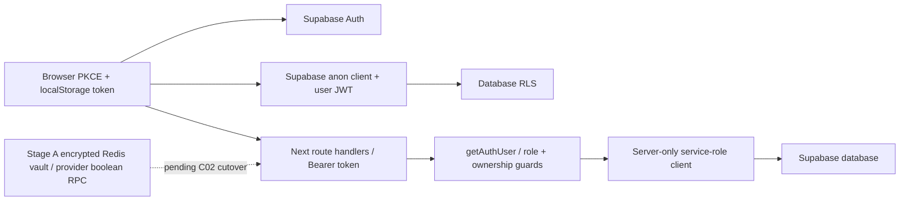

> Áp dụng khi sửa auth/dependencies. Mục đích: map main hiện tại và tách C02 cutover còn pending.

# Authentication stack

Audit main base `905d9bbb`: tracked-source search import/require/dynamic/types/scripts thấy bốn package chỉ được khai báo trong package.json/lock; không có usage runtime: `@auth/supabase-adapter`, `@supabase/auth-helpers-nextjs`, `@supabase/ssr`, `next-auth`. Loại cả bốn và transitive chỉ còn của chúng; giữ `@supabase/supabase-js` vì runtime đang dùng. Lock regenerated Node 22.23.2/npm 10.9.8; không unrelated upgrades.

Main không có active NextAuth cookie/SSR-helper middleware. Server routes dùng explicit auth guards, session refresh/OAuth callback hiện theo Supabase browser PKCE. Capacitor dùng production URL qua WebView, không auth stack khác. Foundation server opaque cookie/vault đã có nhưng PR #20 runtime cutover chưa merge; không gọi C02 CLOSED. Xem architecture/inventory Phase2C để tiếp tục cutover riêng.

Service key chỉ ở `src/lib/supabase-server.ts` và server `speaking/upload-audio` route; không NEXT_PUBLIC service-role env. Shared browser module chỉ public/anon config. `phase2a-medium.test.mjs` bảo vệ server/browser boundary và fail-closed missing config. Service-role bypass RLS: route phải check identity + role/ownership trước privileged user operations; public registration/referral, cron, extension/bot, SePay là các trust boundary khác, không thể gán “all authenticated” chỉ vì dùng shared helper.

**Followup review:** public `src/app/api/referral/resolve/route.ts` dùng service-role để resolve code, đọc referrer name và tăng click; không `getAuthUser` hoặc shared distributed rate-limit. Đây là public product lookup, cần quyết định data-minimization/abuse control và review riêng; dependency removal không đóng finding này. Không đổi referral semantics trong lượt cleanup auth.

Cookie refresh/logout/Google login, authenticated data/RLS và mobile smoke C02 vẫn pending preflight + operator test login. Dependency cleanup không chứng minh các journey này đã PASS production.
