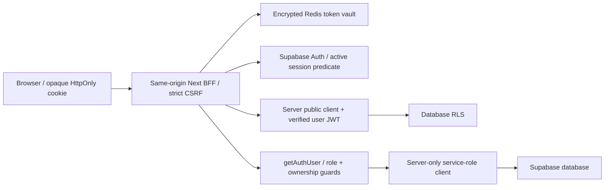

> Áp dụng khi sửa auth/dependencies. Mục đích: map cookie/session cutover đã phát hành và dependency cleanup.

# Authentication stack

Audit main base `905d9bbb`: tracked-source search import/require/dynamic/types/scripts thấy bốn package chỉ được khai báo trong package.json/lock; không có usage runtime: `@auth/supabase-adapter`, `@supabase/auth-helpers-nextjs`, `@supabase/ssr`, `next-auth`. Loại cả bốn và transitive chỉ còn của chúng; giữ `@supabase/supabase-js` vì runtime đang dùng. Lock regenerated Node 22.23.2/npm 10.9.8; không unrelated upgrades.

Main không có active NextAuth/SSR-helper middleware. PR #20 cookie cutover phát hành tại `44ad7c92`, canonical `36784213532` PASS. Refresh/Google PKCE/provider tokens ở server; browser nhận public user DTO, không reusable credentials. Server guards giữ role/ownership; BFF data dùng user JWT/RLS, không service-role data proxy. Capacitor dùng production URL qua WebView; device smoke riêng chưa kiểm chứng.

Service key chỉ ở `src/lib/supabase-server.ts` và server `speaking/upload-audio` route; không NEXT_PUBLIC service-role env. Shared browser module chỉ public/anon config. `phase2a-medium.test.mjs` bảo vệ server/browser boundary và fail-closed missing config. Service-role bypass RLS: route phải check identity + role/ownership trước privileged user operations; public registration/referral, cron, extension/bot, SePay là các trust boundary khác, không thể gán “all authenticated” chỉ vì dùng shared helper.

**Followup review:** public `src/app/api/referral/resolve/route.ts` dùng service-role để resolve code, đọc referrer name và tăng click; không `getAuthUser` hoặc shared distributed rate-limit. Đây là public product lookup, cần quyết định data-minimization/abuse control và review riêng; dependency removal không đóng finding này. Không đổi referral semantics trong lượt cleanup auth.

Dedicated production operator login/navigation/reload/user-context profile/cookie flags/storage/logout/old-cookie replay401 PASS; C02 CLOSED. Redis/PostgreSQL/refresh-race/OAuth/fixation/outage regression PASS trong isolated CI; không gọi fixture là live Google/mobile proof. Mobile và authenticated persisted lesson journey còn deferred. Dependency cleanup là scope riêng.
